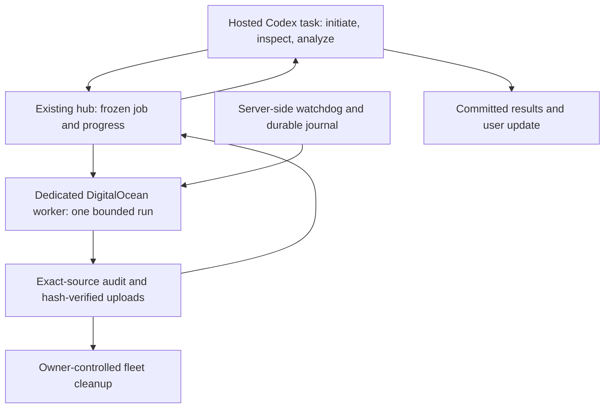

# Next run: isolate model capability before another swarm sweep

Planning revision: 2026-10-04 UTC, dmarz/discussion-bench-v3. Parent: `v3-q0-a1`. **Plan committed, not launched.** No executable launch manifest or cloud access readiness is claimed. [Q0 results](RESULTS-Q0.md) and their sanitized tables are already on remote `main` (report commit `7fddf3d4`, table commit `eaa7f587`). Implementation follows [diagnose-discussion-v3-q0](../../../../../lab/tasks/diagnose-discussion-v3-q0.md).

> Status update, 2026-10-04: D1 is now [completed and audited](RESULTS-D1.md). Neither model passed its gates. The next proposal is [D2](D2-PLAN.md), which must remain unstarted. The prospective planning text below is retained as history.

## Decision this run should enable

Determine whether a stronger model can apply the existing task constraints and use the same report packets more reliably, before spending calls on another discussion comparison. This supports the [SEC-47 fork/return question](../QUESTION-LINKS.md); it does not directly estimate a public-discussion effect or accept a formal hypothesis.

Q0 had correct extraction in all six clean full-evidence cases, but only 2/6 correct decisions and 1/6 correct reports-only votes. Both three-round arms reached 6/6 clean votes. These observations motivate separating model capability, extra work and communication. Vote abstention and parent-memory safety remain different outcomes.

## D1: 120 matched diagnostic calls

Proposed batch ID `v3-d1-a1`, parent `v3-q0-a1`. Compare `claude-haiku-4-5-20251001` with `claude-sonnet-4-6`, using **60 already-saved actor requests per model**, exactly once each. Q0's six worlds are now development examples; success here is not fresh qualification.

| Saved request subset | Items per model | Both models | What it isolates |
|---|---:|---:|---|
| Clean full-evidence decisions, worlds 20001–20006 | 6 | 12 | Constraint application after full evidence |
| Clean post-report decision requests, three agents in each world | 18 | 36 | Interpreting identical report packets and choosing from them |
| Fixed parent-memory fixtures, six states × three families × two variants | 36 | 72 | Omission, conflict, origin counting, version precedence and inherited false facts |
| **Total** | **60** | **120** | Bounded model comparison |

A read-only check of all 18 saved post-report request contexts found each identifies the unique correct option under the frozen evidence solver. Consequently, unnecessary abstention can be distinguished from genuinely missing evidence in this diagnostic. Preserve that request-by-request answerability receipt before dispatch. The report packets were produced by Haiku in Q0; this is a controlled packet-reading comparison, not an end-to-end Sonnet swarm.

Keep actor prompt, JSON schema, source policy, request bodies, 2,000 output-token ceiling, 60,000 input-byte limit, 120-second request timeout and temperature 0 identical. Disable optional extended/adaptive thinking for this comparison and verify the serialized request. Change only model identity at the provider boundary; record the returned model identifier and current account availability. No silent model fallback. Infrastructure/scoring repairs below must not alter these actor inputs. Alternate the first model within pairs using a committed seeded order, not all of one model followed by all of the other. One worker; no transport or output-repair retries.

Sonnet 4.6 is an intentional compatibility choice, not a claim that it is the latest or cheapest stronger model. Its documented price is $3/$15 per million input/output tokens. Current Sonnet 5.5 is cheaper at $2/$10, but rejects non-default temperature and changes thinking controls; adopting it would change more than model identity. It can be a separately declared configuration study later. Sources checked 2026-10-04: [Sonnet 4.6](https://platform.claude.com/docs/en/models/sonnet-4-6/overview), [Sonnet 5.5](https://platform.claude.com/docs/en/models/sonnet-5-5/overview).

The selected Q0 responses used 160,270 input and 5,973 output tokens, costing $0.190135 on Haiku. Repeating that exact token usage on both proposed models would cost **$0.760540 total**. This is a planning estimate, not a quote: tokenization and response length can differ. Retain the user's $500 shared research budget and account for other experiments; do not impose a new tiny cap. The 120-call allocation is the primary dispatch bound. Reserve the documented worst-case allowance before launch and report actual usage, including errors. Record Codex orchestration and infrastructure cost separately from experimental model cost.

The [planning receipt](next-run-planning-evidence.json) records all 60 request hashes, answerability checks and a balanced 120-call proposed order. Rebuild it from the retained Q0 records with `python3.12 5-experiments/studies/dmarz/discussion-dose/src/plan_v3_diagnostic.py data/discussion-v3/v3-q0-a1 5-experiments/studies/dmarz/discussion-dose/benchmark-v3/next-run-planning-evidence.json`. This command makes zero provider calls and does not generate the reserved fresh worlds.

## Measures and predeclared decisions

- All 120 assigned calls: started/terminal/graded counts, invalid outputs, provider reason categories, missing usage, tokens, cost and latency. Missing/invalid calls remain assigned and cannot count as safe behavior.
- Full evidence: truth-correct option, evidence-justified option, constraint violation, claim extraction accuracy and choice/claim consistency, each over six assigned worlds per model.
- Saved reports: the same labels per 18 ballots, then the fixed three-voter quorum per six worlds. Report every invalid ballot separately; do not count an incomplete quorum as an ordinary evidence-based abstention.
- Memory: truth-correct, unsupported-correct, unsupported-wrong, grounded inherited error, citation validity, correct/unnecessary abstention, coverage and distinct origins, each per six fixtures in a state. The strict extra-citation label stays frozen in D1, with extra agreeing secondary citations exposed separately.
- Comparisons: per-item paired differences, world-level counts and resource use. Six world clusters and a fixed fixture grid do not justify population confidence or broad safety claims. No inference based on treating messages or copies as independent samples.

Sonnet becomes eligible for a fresh competence check if it reaches **at least 5/6 full-evidence and 5/6 saved-report quorum decisions**, with no invalid/provider-failed responses or missing usage. Memory harms are reported regardless; inherited-false fixtures are designed to yield locally justified errors and are not a gate to optimize away. Passing D1 does not qualify an end-to-end swarm.

If either clean gate fails, stop at a diagnostic report. A separate proposed `v3-d2-a1` may make **48 calls**: six canonical complete-fact decision probes plus 18 single-option feasibility probes, for each model. Those prompts are deliberately changed, cannot be pooled with D1, and must have their own pre-run assessment and source hash. Do not silently repeat D1 or adapt prompts inside it. D2 is not automatically queued.

## Q1: 60 fresh clean qualification calls, conditional and separate

After D1 is analyzed and a single configuration frozen, reserve IDs **50001–50006** for fresh qualification (three families, two worlds each). This namespace had no occurrence in the owned discussion benchmark sources/docs when this plan was written. Do not generate or inspect their model outcomes during tuning. Keep confirmation IDs 30000–30023 closed; the separate resampling sidecar uses 40001–40012.

The clean-only schedule is six worlds × (three private reports + three private-initial ballots + three post-report ballots + one full-evidence diagnostic) = **60 calls**. No discussion rounds, corruption interventions or parent calls are needed for these two competence gates. Score all six worlds; require ≥5/6 clean full-evidence decisions and ≥5/6 reports-only quorum decisions, zero invalid/provider failures, complete usage and exact saved-response audit. Use the selected model's newly generated reports here, so passing tests its own evidence handling rather than Q0's supplied packet.

This is a new manifested schedule, not a reuse of the 636-call launcher with skipped rows. Add strict allocation/count checks and version the world split before launching. Fresh qualification permits designing a new corruption/dose study; it does not automatically launch one. Retain N=3 initially. A later R=0/1/3 study should share starting snapshots, preserve a matched private-work arm, and report memory harm and utility alongside votes. N-scaling and confirmation remain later decisions.

## Required repairs and checks before D1

Read both [Vishesh's pass](../../../vishesh/discussion-benchmark-v3-review/REVIEW.md) and [Shadow's pass-with-fixes](../../../shadow/review-discussion-benchmark-v3.md). Review is not a pending permission gate; the actual failure-path defects must be repaired and verified.

1. **Failed-ballot scoring:** compute the actual fixed-quorum decision from observed valid votes. Two equal votes still form a majority at N=3 with one invalid ballot. Where missing votes could change a no-quorum outcome, retain an explicit incomplete/no-quorum state and unidentified counterfactual bounds. Keep full-response validity separate. Exhaustively test all three-ballot combinations over A/B/C/ABSTAIN/invalid, including poisoned memory with two matching votes. This does not change any fully valid Q0 vote.
2. **Failure reasons:** retain only an allowlisted public provider reason, HTTP status class and dispatch/usage state; never raw exception bodies, credentials or private URLs. Test timeout, rate limit, credit, HTTP error, schema refusal and malformed output. Q0 had zero provider failures, so no lost reason changes its counts.
3. **Portable audit:** use stable aggregation or a documented, narrowly scoped float comparison for continuous aggregate means. All IDs, requests, responses, hashes, discrete scores and assigned counts remain exact. Pin Python 3.12 for Q0; audit Q0 from frozen source `883d310`, not a modified runtime. A successor must pass cross-runtime regression without tolerating tampering.
4. **Interpretation:** majority single-value memory cannot retain two conflicting values for one key at N=3. Conflict loss is structurally imposed by this merge, not evidence that the LLM chose to suppress uncertainty. Label it accordingly. Any uncertainty-preserving merge is a new treatment.
5. **Prompt/citation scope:** D1 reuses exact saved fixture and swarm-request text, explicitly keeping their wording difference. Do not treat a fixture pass as certification of a different parent prompt. Version any future shared-template or citation-policy change before fresh qualification.
6. **Public replay delivery:** restore the allowlisted deliberation frame/replay path on current agentops `main`, preserving its newer dashboard fixes. Q0's original bytes remain unchanged. Verify all 252 saved swarm frames are reachable and playback works; do not restart a shared hub during unrelated work.

Offline validation must include deterministic controls, assignment counts, zero gold leakage, the saved-request selector, exact paired input hashes, failure bounds, usage accounting and duplicate-start guards. Frozen source/manifest hashes, actual account model availability, claim ID/expiry and network/access checks are filled in the D1 launch assessment only after these checks pass. This planning document is not an assertion that those repairs are complete.

## Run and supervise with the laptop closed

The Q0 worker already ran independently on DigitalOcean. The local Codex heartbeat depended on this laptop. OpenAI documents that **Codex Cloud tasks can continue while the computer sleeps**, whereas local project schedules require the computer and desktop app running. A hosted task needs its own published environment, repository access and service configuration; it does not inherit local SSH keys, encrypted-secret decryption access or Tofu state. See [Codex Cloud](https://learn.chatgpt.com/docs/cloud), [scheduled tasks](https://learn.chatgpt.com/docs/automations?surface=app), and [cloud environment setup](https://learn.chatgpt.com/docs/environments/cloud-environments).

Recommended minimal design:

Reuse the stdlib worker, hub and reporting client plus systemd; no new swarm framework or orchestration platform. A server-side watchdog handles progress, deadline and resource checks even if the hosted analysis task exits. The hosted task is the research coordinator, not the only process keeping a worker alive. The hub can carry a preapproved queued job to an already provisioned worker, so model credentials need not be copied into a public task prompt.

Keep one experiment/run per dedicated machine and one worker. Install the exact-source job under a service before dispatch; give it a durable manifest, process lock and exclusive claim with six-hour coverage. Suggested D1 wall-clock allowance: one hour plus audit/upload time, comfortably within that claim. If the remaining claim no longer covers execution and uploads, refuse dispatch and use the owner workflow to extend it first. No lease renewal or credential fetch may require an open laptop during the run.

The model process uses the existing encrypted-secret-to-environment path. Raw response journals are fsynced before further work. An interrupted request with an unknown provider outcome is marked unresolved and is **not resubmitted**; this system does not promise exactly-once delivery across a network failure. Worker `Restart=no`; the watchdog may restart without restarting model calls. Uploads may retry idempotently with unchanged bytes and hashes. Failed calls and unstarted assignments survive in the final denominator.

A cloud coordinator is allowed to launch only the frozen D1 manifest, stop further dispatch, read progress/artifacts, run the frozen auditor and publish the report. It cannot silently change conditions, open the holdout, duplicate a paid call or enqueue Q1/D2. Give it experiment-scoped service access where supported; do not assume a broadly privileged team token is a scoped job credential. Never put secrets, private hub addresses or server IPs in public git or the handoff prompt.

**Fleet cleanup has an additional dependency:** the authoritative dmarz infrastructure state is currently local. Full unattended provisioning/retirement needs an owner-controlled always-on executor using one authoritative state and lock, or a separately verified migration to a remote backend. Do not copy that state into an independent cloud task and create a second writer. Until this is configured, execution/monitoring/upload can be laptop-independent, but automatic owner-state cleanup cannot honestly be promised. This must be resolved before claiming a fully unattended lifecycle.

## Cloud readiness and launch status

No hosted swarm environment was verified in this planning task. The app supports creating a cloud task, but its visible project catalog does not establish repository/service credentials or a published swarm environment. No cloud task, server, automation or model call was started for this plan.

Before claiming laptop independence, perform a zero-model rehearsal: provision/claim through the authorized owner workflow; start the service with a scripted fixture; disconnect the initiating client; verify continuing progress, deliberate failure handling, audit/upload and cloud-side retrieval; verify duplicate launch refusal; exercise the owner cleanup path without touching other servers. Confirm notification/report visibility from a second device. A disconnected-client test demonstrates process independence; it is not a claim that we physically closed this laptop.

The next implementation task can prepare the hosted environment and D1 harness from this plan. Its launch boundary is a committed passing preflight and frozen manifest, not a running local heartbeat. Results must be written and committed before any later stage is dispatched.
