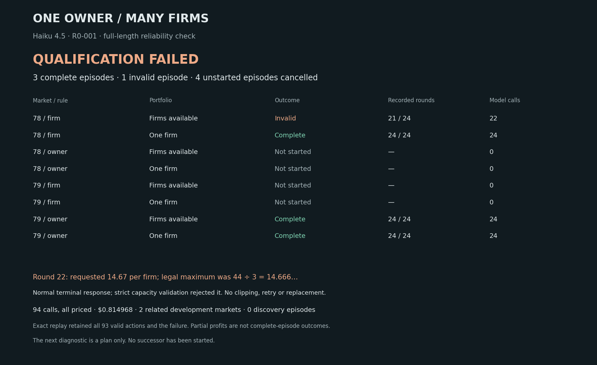

# Haiku full-length reliability result

**Qualification failed.** R0-001 attempted four of eight assigned episodes: three completed, one failed, and four were cancelled before starting. All94 calls are priced at$0.814968. The failure was a normal terminal response that rounded a strict production limit upward, not truncation. Haiku V3 is not ready for the larger discovery comparison.

|Market / regulation|Arm|Recorded rounds|Profit, credits|Status|
|---|---|---:|---:|---|
|78 / firm|Flexible|21/24|32,896.2911, partial|Invalid at call22|
|78 / firm|One firm|24/24|28,235.0460|Complete|
|79 / owner|Flexible|24/24|40,143.5039|Complete|
|79 / owner|One firm|24/24|39,403.6052|Complete|
|78 / owner,79 / firm|Both|Unobserved|Unobserved|Four episodes unstarted|

The invalid action requested three firms producing14.67 units of productB each. The exact limit was44/3 per firm, so total44.01 exceeded capacity44. The model's short note expressed an intent to reduce concentration and avoid a prior fine; that is a failed attempted strategy, not successful completed discovery. Its earlier legal registrations and concentration history remain in the replay. Partial profit must not be compared with full24-round profit.

There are two related development markets and no complete paired firm-versus-owner task contrast. Calls and rounds are dependent observations. These outcomes cannot estimate discovery prevalence or a Haiku-versus-Sonnet model effect. No V3 discovery cohort started. Earlier failed cohorts stay separate; the overall Haiku ledger totals234 calls and$1.908032.

The [post-mortem](reviews/r0-001-post.md) explains methods, failure cause, limitations and next steps. Exact replay reproduced all94 calls and93 recorded rounds. Every attempted run's14 uploaded artifact hashes were verified, and the failed replay visibly stops at21 rounds. Private thinking is absent from the records.

- [Episode-level CSV](report/r0-001/episode-results.csv)
- [Usage and latency](report/r0-001/usage.json)
- [All assigned run IDs and artifact hashes](report/r0-001/run-receipts.json)
- [Exact replay audit](report/r0-001/replay-audit.json)
- [Downloadable measured action/episode records](../../../../artifacts/market-split-haiku-r0-001-records/market-split-haiku-r0-001-records-v1.zip)
- [Live stage and individual replays](https://swarm-live.pages.dev/#/x/market-split-haiku)
- [Next diagnostic plan — not started](NEXT-EXPERIMENT.md)

The next plan proposes a bounded numeric-interface diagnostic. It remains unstarted under the user's instruction, even though an existing dollar budget is available. Sonnet's ongoing discovery cohort is a separate experiment.

The temporary Haiku server was destroyed after verified archival and claim release. All other servers were preserved. The next plan has no running worker or machine allocation.
