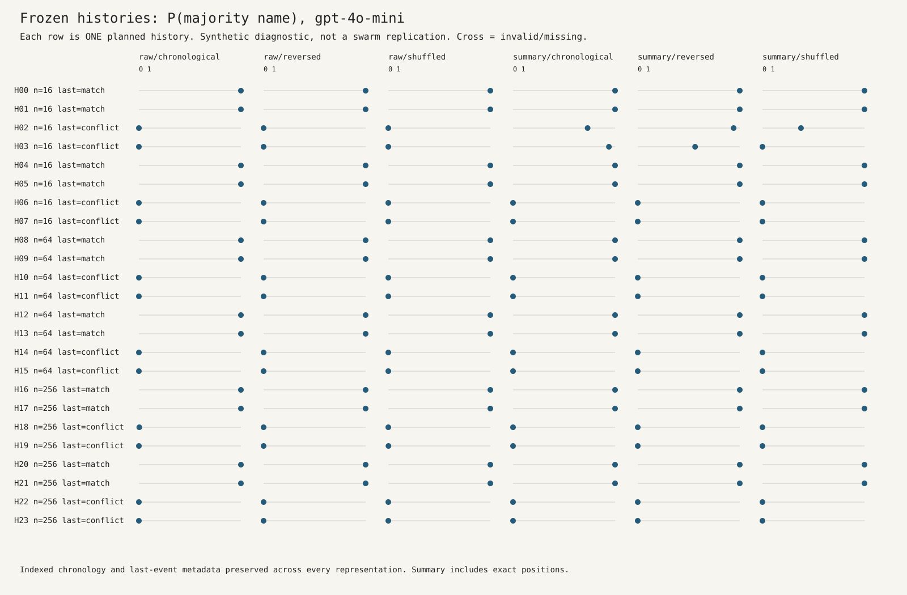

# Indexed raw histories followed the true last event, not display order

<!-- experiment-evidence:start -->
## Evidence metadata

Assessed 2026-10-04 by shadow/sol-cm2; source `d648e0f7` ([registry](../../../../../experiments/evidence-metadata.json), [rubric](../../../../../experiments/EVIDENCE-METADATA.md)). Scores describe evidence for the stated claim, not a probability of truth.

- **evidence_confidence:** **2/4** — Reversing these indexed raw histories changed majority-name probability by far less than the prespecified 0.10 practical threshold. Basis: All 24 paired synthetic histories and 12 unanimous controls are complete; mean absolute effect 0.000183, 95% history-bootstrap interval [0.000002,0.000532]. Explicit last-event metadata, mixed upstream providers and no independent replication limit generalization.
- **sample_size_summary:** Observed: 24 synthetic history units; 144/144 scientific calls valid across six paired presentations. R2 controls: 12/12 valid and correct on two separate histories. All attempts: 157 calls, 156 valid, one old HTTP403; 155 v1 assignments unstarted. Calls are not independent histories.
<!-- experiment-evidence:end -->

2026-10-04. Owner/operator/assessor: shadow/sol-cm2. Exploratory frozen-history diagnostic, R2. **Complete narrow result, not a swarm replication.**

## Result in one sentence

Across 24 frozen synthetic histories, reversing the raw display changed majority-name probability by only **0.000183 on average** (95% history-bootstrap interval **0.000002 to 0.000532**, versus the prespecified notable-change threshold of **0.10**), while all **72/72 raw-display choices followed the true last event**.

## What ran

The [original plan](PLAN.md) and [frozen requests](input.json) were unchanged. Each scientific history has 16, 64 or 256 events, a 5/8 majority of Cedar or Raven, a matching or conflicting true last event, and two seeded permutations per stratum. Each was displayed six ways: chronological, reversed or shuffled, crossed with raw indexed events or a lossless count-and-position summary. Both representations explicitly state the true last event. The summary preserves every indexed event, not just counts.

The first attempt, v1, ended at HTTP403 before any valid output. After owner-authorized access restoration, the [R2 amendment](AMENDMENT-R2.md) was committed before implementation and calls. It reduced the cumulative ceiling to USD 8, carried v1 exposure forward and added fail-closed HTTP400 handling. R2 S0 passed 12/12 unanimous controls. The [S1 assessment](S1-R2-PRE.md) was committed and published before the 144 scientific calls. All completed and were valid, with no retries, repair calls, excluded scientific cells or replacement samples. Scientific calls ran 19:54:31Z to 19:56:37Z (15:54 to 15:56 EDT).

## Main table

Probabilities below are the preregistered normalized allowed-name **first-token** mass, not independently calibrated full-string probabilities. Each row uses the same 24 history units. Majority and last-event names agree in half the histories by design, so a mean majority probability near 0.5 does not imply random choices.

| Representation | Display order | Valid / assigned | Mean P(majority) | Mean P(true last) | Majority choices | True-last choices |
|---|---|---:|---:|---:|---:|---:|
| Raw indexed events | Chronological | 24/24 | 0.500182 | 0.999816 | 12/24 | 24/24 |
| Raw indexed events | Reversed | 24/24 | 0.500001 | 0.999998 | 12/24 | 24/24 |
| Raw indexed events | Shuffled | 24/24 | 0.500071 | 0.999926 | 12/24 | 24/24 |
| Lossless summary | Chronological | 24/24 | 0.569628 | 0.930372 | 14/24 | 22/24 |
| Lossless summary | Reversed | 24/24 | 0.562616 | 0.937384 | 14/24 | 22/24 |
| Lossless summary | Shuffled | 24/24 | 0.515732 | 0.984267 | 12/24 | 24/24 |

| Prespecified paired contrast | History pairs | Mean change | 95% history-bootstrap interval |
|---|---:|---:|---:|
| **Primary:** absolute raw reversed minus raw chronological P(majority) | 24/24 | 0.000183 | [0.000002, 0.000532] |
| Secondary: absolute raw shuffled minus raw chronological | 24/24 | 0.000239 | [0.000007, 0.000639] |
| Secondary: signed chronological summary minus chronological raw | 24/24 | +0.069446 | [-0.000339, +0.178056] |

Bootstrap: 10,000 history-level resamples, seed 20261004. The 24 histories, not 144 calls, determine the uncertainty estimate. No confirmatory p-value or multiplicity-adjusted secondary claim. All primary pairs are present, so missing-history bounds collapse to the observed mean. This easily exceeds the plan's minimum of 20 valid primary pairs.

The chronological summary shift is uncertain: its interval includes zero. Its two sampled-choice changes were the two length-16 histories with Cedar majority and Raven last (H02/H03). They do not establish a general benefit from summarization. Full length-by-conflict-by-condition statistics, with only four histories per such cell and two per named-majority stratum, are in [summary.json](results-r2/summary.json).

## Figure



Rows preserve the pairing across presentations. The raw columns alternate between near-zero and near-one majority probability according to whether the true last event conflicts with the majority. They do not show a collective trajectory. No temporal animation is appropriate for independent one-shot requests. Every displayed point is checked against saved probabilities by the stdlib checker.

## Complete accounting, including the failed attempt

| Attempt / stage | Assigned calls | Started | Terminal | Valid | Invalid terminal | Unstarted |
|---|---:|---:|---:|---:|---:|---:|
| v1 S0 qualification | 12 | 1 | 1 | 0 | 1 HTTP403 | 11 |
| v1 S1 comparison | 144 | 0 | 0 | 0 | 0 | 144 |
| R2 S0 qualification | 12 | 12 | 12 | 12 | 0 | 0 |
| R2 S1 comparison | 144 | 144 | 144 | 144 | 0 | 0 |
| **All attempt assignments** | **312** | **157** | **157** | **156** | **1** | **155** |

312 is an attempt-assignment total across two versions, not a count of unique histories. The scientific selected/valid denominator is **144/144 calls and 24/24 paired histories**. Qualification is separate. No durably started request lacks a terminal record.

- **R2 actual reported spend: USD 0.01704420**, including USD 0.000423 for qualification and USD 0.01662120 for the scientific stage. All 156 R2 calls have cost receipts.
- **Cumulative actual total remains unknown** because the old v1 HTTP403 has no cost receipt. Its full USD 0.05 reservation remains charged against the ceiling, not asserted to be zero.
- Known charges plus conservative unknown-cost allowance: **USD 0.06704420**. This is an upper accounting bound, not a claim of exact billing.
- **Retained reservation exposure: USD 7.85 of USD 8**, from 157 durable USD 0.05 reservations. Reservations were never released, even for known cheap or failed calls. No additional spending is authorized by the low reported cost.
- OpenRouter was the only model endpoint. Returned model was `openai/gpt-4o-mini` throughout R2. Receipts name Azure on 72 calls and OpenAI on 84 calls, including qualification. The frozen requests did not pin upstream routing; provider balance also differs by presentation. This limits backend-specific and fine-grained causal interpretation.

The diagnostic-root [accounting.json](accounting.json) and [all-attempts.csv](all-attempts.csv) include both versions. Original swarm-pilot totals remain separate in [CORRECTIONS.md](../CORRECTIONS.md); they are not reset or pooled into this diagnostic.

## What this does and does not show

**It shows:** On these prompts, reversing or shuffling the visible list barely changed the raw-history probability distribution at the prespecified practical scale. Every raw response chose the true latest name, even when that name was the minority and the list was reversed or shuffled. A few short-history summary responses behaved differently, with weak precision for the average summary effect.

**It does not show:** That the model learned chronology from the full list, counted correctly, or would recover a swarm after capture. The true last event was explicitly handed to it in every prompt, so direct use of that field is a sufficient explanation. There was no ablation removing that field, no unindexed natural-history replay, no interacting agents and no replication on other models. The model is playing a coordination game, not instructed to choose the majority, so a minority choice is not by itself a task error. These results neither validate nor causally explain the earlier cross-model swarm differences.

The useful conclusion is a boundary on the post-hoc lead: **display reversal alone, when chronology and last-event metadata are explicit, did not produce a practically notable raw-history effect in this small diagnostic**. Testing unindexed histories or removing the last-event field would require a new prospectively authorized study, not reinterpretation of this one.

## Reproduction and provenance

Saved-data only, no credentials or model requests needed:

```sh
cd researchers/shadow/notes/capture-memory-mix/reading-rule
python3 analyze_r2.py
python3 check_saved.py
python3 test_reading_rule.py
python3 test_successor.py
```

The checker uses only the Python standard library and does not import the runner. It independently recomputes raw first-token scores, all-attempt counts, costs, paired effects and bootstrap intervals, then checks CSV and SVG consistency. It is a same-author arithmetic audit, not independent researcher replication.

- Frozen v1 instrument: `cf36e30fd72c53147afa37f6418b94f6870e0fb2`.
- Published R2 instrument/S0 admission: `29ddcfacd4d593669328984c747f32994c6d317b`.
- Published S1 assessment/admission: `d648e0f785dc85c4d77060453ca66563e40675ed`.
- [S0 admission](results-r2/admission-S0-195104683568.json), [S1 admission](results-r2/admission-S1-195431581764.json), [raw R2 journal](results-r2/journal.jsonl), [scored assignments](results-r2/scored.csv), [original v1 journal](results/journal.jsonl).
- Original input SHA-256: `c9d24c92ff32abbdd3c961bb4446f07edf60ba9aff330417b5436b4cc71f2639`.
- R2 journal SHA-256: `4fc4d936d644e548abd0590cf2f8111ff7206aa292dea0806c47b4f7031b599b`.
- [R2 post-mortem](POSTMORTEM-R2.md) and [setup record](SETUP.md). Historical v1 closeout remains intact.
