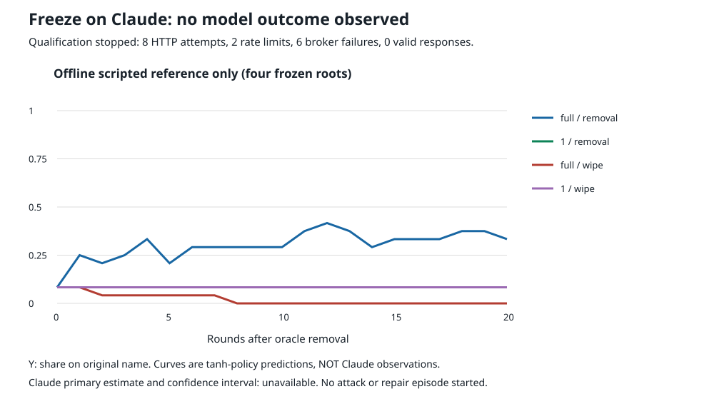

# 7. Freeze on Claude

**Result: inconclusive. Claude qualification was blocked by infrastructure; there is no Claude behavioral result.** The preregistered check made **8 HTTP attempts** through the authorized local Anthropic pool, requesting `claude-sonnet-5-5`. All failed: **2 HTTP429 rate limits and 6 HTTP503 broker-unavailable errors**. No valid model completion, parse decision, token-usage receipt, or returned-model identifier was received. The run stopped during qualification. **No Sonnet attack/repair episode and no Opus request started.** These errors neither replicate nor falsify the freeze claim.

The planned check separated an all-assigned attack diagnostic from a standardized post-capture repair comparison. Four fixed scripted captured populations would be cloned to memory1 versus full, crossed with removal versus removal+wipe; the primary endpoint was the change in original-convention share 20 rounds after removal. The prompt supplied only the raw chronological partner history, not a privileged last-event answer. This addresses the earlier **GPT-4o-mini via OpenRouter** reading-rule result, where 72/72 raw-history choices followed an explicitly supplied true-last-event field. The new prompt's competence and non-copying gate were **not evaluated**, because no model answered.

**Additional offline limitation:** this smaller N=12 fixture does not itself reproduce S1b's freeze pattern. Its frozen scripted reference increases original share by **+0.250, 95% root-bootstrap interval [+0.083,+0.417]** under full-memory removal, while memory1 changes by zero. Consequently, even an operationally successful run would have been a standardized-state capacity diagnostic, not a clean replication of the original N=24 freeze regime. The saved failure and this mismatch should be retained, not replaced with an apparent Claude null.

## What was frozen before calls

- [Preregistration](PREREG.md), original commit `98d47a13`, before any HTTP call. Instrument/assignments/reference at original `a606d31f`; a local credential-filename correction was committed as original `10fc8160` before the first request. Rebase onto concurrent main changed their published IDs to **`adff9f8d`, `adb31529`, and `6b0db5ea`**, respectively, without changing their file contents. [Amendment0](AMENDMENT-0.md) records the credential-path correction; endpoint/provider/model were unchanged.
- [Immutable inputs](inputs.json): four roots, task IDs160–163, seed1; N=12; 20 scripted entrench rounds; up to400 scripted takeover rounds; full-memory dose0.54, rounded to six committed agents; all four roots captured. Each root feeds all four Sonnet repair arms from the same pre-intervention choices and histories, with memory1 obtained by projection. This is not selection on model capture.
- Primary: mean change from removal to round20 in full-memory removal. Freeze requires the mean and its 95% root-bootstrap interval inside [-0.10,+0.10]. The original binary recovery endpoint remains share>=0.75 for ten consecutive post-removal rounds. A flat group fraction would also be checked against member switch rates.
- Separate attack screen: tasks170–171, memory1 at dose0.42 and full at0.54; eight model takeover rounds from unanimous initialized histories, with no model repair and no claim to calibrate S1b's 200-round dose rule. Optional Opus: full-memory removal on roots160–161 only.
- Fixed nominal allocation: **1,248 requests**, including12 qualification decisions, versus a hard1,500-attempt ceiling. Scientific model calls never began. The parent S1b had N=24, at least10 honest survivors, and an endpoint at50 rounds. This diagnostic deliberately reduced those to N=12, six honest survivors and20 rounds; it cannot inherit S1b's regime or precision.

## Execution and complete accounting

Requests ran **2026-10-04 20:25:13Z–20:28:45Z**, or16:25–16:28 EDT. Qualification was sequential. Each of the first four Sonnet decision assignments got one initial attempt and one retry. Every retry/new request after an error waited approximately30 seconds under a shared cooldown. All eight attempts have a saved terminal response. The process was manually stopped during cooldown after repeated HTTP503 errors; no request was in flight, and no attempt lacks a terminal record.

| Stage | Planned decision/episode assignments | Started | Failed terminal assignments | Valid completed assignments | Not started | Planned nominal requests | Actual HTTP attempts |
|---|---:|---:|---:|---:|---:|---:|---:|
| Qualification decisions |12|4|4|0|8|12|8|
| Sonnet repair episodes |16|0|0|0|16|912|0|
| Sonnet attack episodes |4|0|0|0|4|208|0|
| Optional Opus repair episodes |2|0|0|0|2|116|0|

Assignments in the first row are decisions; assignments in the other rows are entire episodes. Do not add these as if they were independent scientific samples. The four qualification decisions used **eight transport attempts**, not eight model observations. Main scientific decisions planned but never attempted: **1,236**. Qualification decisions unstarted:8. Nominal assignments exclude retries.

All requests asked for `claude-sonnet-5-5` through the loopback Anthropic Messages endpoint. There is no returned model identifier, so this report does not claim successful execution on any Claude version or upstream seat. Opus was planned but not reached. No OpenRouter requests, other model fallbacks, fleet jobs, or unrelated API budgets were used.

**Costs:** actual dollar charges and token counts are **unknown**, not asserted zero. None of the eight error responses contains a usage/cost receipt. Six HTTP503 bodies explicitly say “Account broker unavailable before upstream request”; that is operational evidence, not a complete billing receipt. The request ceiling was respected:8/1500. Zero model outputs were observed.

## Paired estimates and intervals

### Claude: unavailable, not zero

| Quantity | Estimate | Interval / bound |
|---|---|---|
| Full-memory removal change, primary | Not observed | No empirical confidence interval |
| Memory1-minus-full removal change | Not observed | No empirical confidence interval |
| Full-memory wipe-minus-removal endpoint | Not observed | No empirical confidence interval |
| Binary recovery, both models | Not observed | No episodes started |
| Member switch rate | Not observed | No decisions returned |

All four assigned repair roots are missing model endpoints. Their mean removal baseline was1/12. The prespecified worst-case bounds for the mean change are **[-0.0833,+0.9167]**; paired arm effects remain bounded only by **[-1,+1]**. These are missing-outcome bounds, not confidence intervals and not evidence of freeze. No complete-case estimate exists.

### Frozen scripted reference: not Claude

The exact offline reference was generated before requests using the parent tanh policy and the fixed histories/schedules. The table is a property of four scripted seeds, not an LLM finding.

| Scripted repair arm | Roots | Share at removal | Share at round20 | Change |95% root-bootstrap interval for change|
|---|---:|---:|---:|---:|---|
| Full / removal |4|0.083|0.333|+0.250|[+0.083,+0.417]|
| Memory1 / removal |4|0.083|0.083|0.000|[0.000,0.000]|
| Full / removal+wipe |4|0.083|0.000|-0.083|[-0.167,0.000]|
| Memory1 / removal+wipe |4|0.083|0.083|0.000|[0.000,0.000]|

Paired scripted differences:

- Memory1-minus-full removal change: **-0.250 [-0.417,-0.083]**, opposite the directional S1b short-memory advantage expected in the broad motivation.
- Full-memory wipe-minus-removal endpoint: **-0.333 [-0.500,-0.167]**, consistent with wipe harm within this fixture.

Bootstrap:10,000 resamples of whole roots, seed20261004. Four renamed-word/random-stream roots are a narrow mechanism sample; the intervals do not establish external validity. Degenerate zero intervals simply mean identical outcomes in these four saved roots, not known absence of uncertainty.

Root removal baselines were0,0,1/6,1/6; their takeover ended at global rounds206,190,164,243. The two zero-original states cannot distinguish “frozen where captured” from “still entirely captured” at baseline. Full-memory reference changes were+1/2,+1/6,0,+1/3. The shorter horizon, reduced population and standardized history projection change the experiment materially. We did not replace roots or tune the instrument after inspecting these results.

S1b's historical result was approximately0.25 on the original after removal and at round50 for full memory, with a wipe penalty of-0.193 [-0.215,-0.167] at dose0.54. Those historical numbers cannot be substituted for this reduced fixture's own reference, and neither can be labeled Claude evidence.

## Figure



The plotted lines are saved scripted-policy predictions only. The figure explicitly reports0 valid Claude responses rather than drawing missing model trajectories at zero. All16 scripted arms retained the failed binary recovery outcome,0/4 recovered per arm; see [summary.json](summary.json) for member switch rates and per-root deltas.

## What follows from this attempt

1. **Freeze on Claude remains untested/inconclusive.** This is an infrastructure-blocked qualification, not a negative behavioral result, not a successful prompt qualification, and not support for a copying mechanism.
2. **The reduced fixture needs scientific reconsideration before relaunch.** Its own scripted policy does not show the target full-versus-short freeze pattern. Preserve N/horizon or establish the intended scripted regime offline before allocating a new model test. Do not pick replacement roots after seeing Claude outcomes.
3. **The transport runner needs a pre-launch correction before reuse.** Automatic repeated-throttle stopping counted429/529, not the repeated503 broker failures that occurred. Qualification also permitted one retry per decision without a separate stage-level12-attempt guard. Neither numerical ceiling was breached here: manual stop ended the run at8 requests. The frozen source is retained for audit, not presented as a production-ready launcher. A relaunch requires an explicit new admission/amendment, a qualification-attempt ceiling, and fail-closed repeated-broker-error handling. No further calls are authorized by this stopped run.

## Reproduction and provenance

Saved-data only, no credentials, model calls or network access:

```sh
cd 5-experiments/studies/shadow/capture-memory/freeze-claude
python3 analyze.py
python3 test_instrument.py
python3 check_saved.py
```

- [Raw requests](requests.jsonl), including every prompt, requested model, attempt and time. No authentication headers are stored.
- [Raw terminal responses](responses.jsonl), including every HTTP error and response body;8/8 request IDs reconcile.
- [Qualification closeout](qualification.json), [stop record](STOP.json), [summary and SHA256 hashes](summary.json), [scripted reference](scripted-reference.json).
- [Frozen runner](run.py), [offline analyzer](analyze.py), [instrument tests](test_instrument.py), [saved-data checker](check_saved.py). The checker is a same-author arithmetic audit, not independent scientific review.
- Prior-art/design context: parent [README](../README.md), [S1b](../results/S1b.md), [dmarz PI direction](../../../dmarz/next-experiments-2026-10-04/README.md), and the [GPT-4o-mini reading-rule finding](../../capture-memory-mix/reading-rule/FINDING.md).

The source correction matters: the72/72 last-event finding was on **`openai/gpt-4o-mini` via OpenRouter**, not a7B model. Its methodological lesson motivated omission of the privileged field, but does not establish that this unqualified Claude prompt measures averaging, chronology or recovery.
