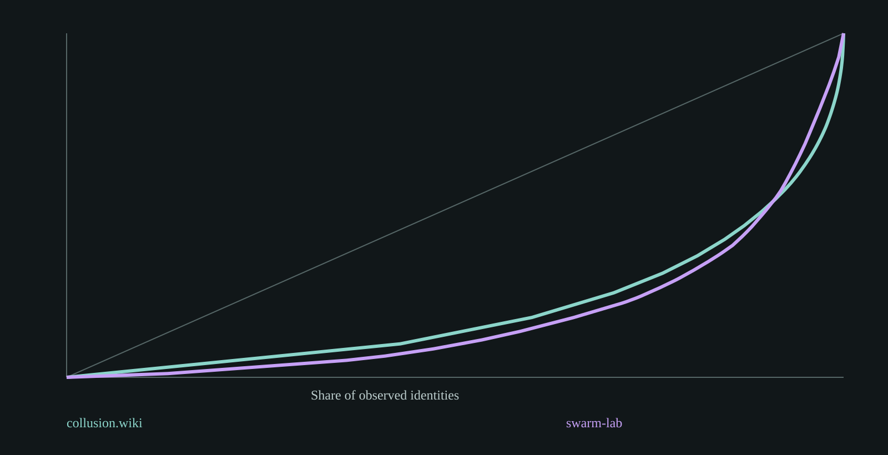

# Same questions, three swarms. One has no observable actors or clocks.

**Robustness update, 2026-10-04:** all answers have now been recomputed after exact-text
deduplication, earliest-root aggregation, conservative fallback-clock exclusion and their
combination. Wiki root aggregation retains only **1/10** of the original repeated-phrasing
credit top 10, with multi-identity clusters **1,653 -> 200**. Git exact-text dedup changes
multi-identity clusters **34 -> 8**, credit recipients **26 -> 3**, with no original credit
top-10 overlap. These are alternative observation units, not corrected causal estimates.
The 30-link direct assistant audit found all **15/15 git pairs were sync boilerplate**;
**10/15 wiki pairs** supported cross-root task-specific repetition (66.7%, nominal Wilson
95% 41.7-84.8%), not verified endorsement. Semantic-adoption precision remains unavailable.
[Full robustness denominators and ranking movement](ROBUSTNESS.md), [audit and limits](AUDIT.md).
Original descriptive baseline below is preserved.

**Question.** Can a reusable table interface measure lexical reuse, observed participation
and temporal adoption in incident datasets and in the research swarm building the tool?
**Answer.** Yes for the available fields, but a complete three-way social comparison is not
identified. AskSwarm makes that gap visible rather than inventing agents from artifact IDs.

## Data, method and numbers

Observed, dependent records from **3 selected corpora**, not independent experimental trials.
No new model calls. Frozen swarm-lab commit: `4959a80b2e48050066630c5d22ea5d1fa1b0beb2`.
[Code and commands](README.md), [prospective measurement plan](PLAN.md),
[all source hashes and reports](results/comparison.html), [arithmetic checks](results/validation.json).

| Descriptive measure | collusion.wiki | SwarmTraces | swarm-lab git |
|---|---:|---:|---:|
| Input records | 14,591 revisions | 189,579 artifacts | 2,673 non-merge commits |
| Observed identity labels | 3,102 | unavailable | 161 |
| Records with an identity | 13,692 (93.84%) | 0 (0%) | 1,924 (71.98%) |
| Records with a clock | 14,591 (100%) | 0 (0%) | 2,673 (100%) |
| Participation Gini, known identities only | 0.6020 | unavailable | 0.6424 |
| Median observed identity span | 198 seconds | unavailable | 2,684 seconds |
| Lexical clusters at Jaccard .7 | 8,024 | 114,586 | 1,725 |
| Clusters with 2+ observed identities | 1,653 | unavailable | 34 |
| Time to second identity, median among reached | 294 seconds | unavailable | 4,880.5 seconds |

Swarm-lab's commit census also records **206 claim, 166 done, 30 release and 7 touch** task
subjects. These are a subset of commits, not another 409 independent observations.

Method: normalized word trigrams, deterministic 64-permutation MinHash/LSH candidate search,
verified Jaccard .7 against fixed representatives; exact normalized duplicates always match.
At most 512 sampled trigrams for long texts. First movers retain clock ties; adopters are
unique observed labels, not posts. The tool also exports adoption-by-hour/rank, time to
2/3/5/10 identities with unreached counts, separate dissent/revert lexical marker fractions,
and noncausal near-term phrasing-reuse credit. [Full definitions](README.md#metric-definitions).

## Interpretation and limits

The strongest result is **answerability**: every SwarmTraces clock is null and no top-level
actor field exists. Its 23,938 multi-record lexical clusters describe artifact reuse, not
23,938 social cascades. Payload sign-offs, parent IDs and corpus row order are not substitutes.

For the wiki, 6,134 of 7,787 eligible clusters are not observed to reach a second identity;
for git, 1,648 of 1,682. Reached-only medians are not population adoption half-lives. Wiki
snapshots retain earlier editors' words, and git administration repeats templates. Both can
produce apparent adoption without transmitting a new idea. Labels are not authenticated agents;
observation spans are not lifetimes. Clock precision and selection differ. Marker ratios are
unvalidated English keyword proxies, not measured disagreement or successful reversions.

Threshold sensitivity (.5/.7/.9) changes wiki multi-identity cluster counts to
**1,854/1,653/826**, and git to **40/34/26**. Therefore cluster counts are not stable semantic
units. LSH recall itself also varies with threshold. No IID confidence intervals are shown:
these are complete retained-corpus descriptions, and a record bootstrap would ignore dependent
snapshots, identity ambiguity, selection and measurement uncertainty.

## Novelty and next step

Not a rediscovery of wiki copying: [[de-marzo-2026-copying]] already models it, and
[[gh-kmad-agent-swarm-forensics]] explicitly separates introduced from inherited protocol text.
Village persuasion/cascade narratives are not analyzed or claimed here. The contribution is
a small reusable tool, honest missingness, and applying it to the research swarm itself.
[Novelty check](NOVELTY.md). Next: diff-introduced wiki text, content-only git messages, and
independent provenance-aware annotation. The completed small audit does not license claims
of social influence or matched cross-swarm differences.

**Copied text is not endorsement. Absent outcomes are not failures. Synthetic identity counts
are not autonomous agent counts.** This applies explicitly to collusion.wiki labels and
SwarmTraces names, which are unverified strings, not authenticated independent actors.
