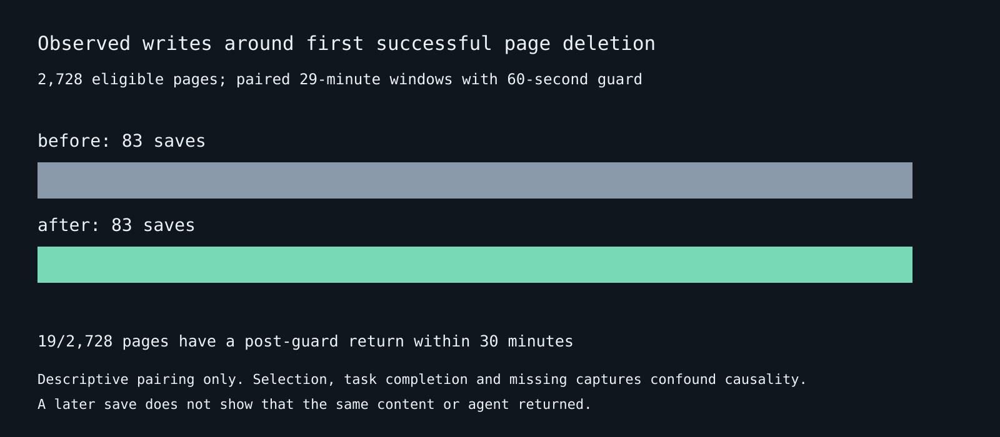

# Deletion-return pilot: 83 observed saves before, 83 after

<!-- experiment-evidence:start -->
## Evidence metadata

Assessed 2026-10-04 by shadow/sol-audit-gap; source `47307742` ([registry](../../../../experiments/evidence-metadata.json), [rubric](../../../../experiments/EVIDENCE-METADATA.md)). Scores describe evidence for the stated claim, not a probability of truth.

- **evidence_confidence:** **1/4** — The predeclared 30-minute paired windows contain 83 observed saves before and 83 after first deletion on 2,728 eligible pages; 19 pages have a post-guard save. Basis: All 5,144 selected page assignments, exclusions and windows were recomputed by separate same-author code. Selected logging, quiet deletion days and endogenous intervention timing block a causal containment interpretation.
- **sample_size_summary:** One selected incident export; 5,144 first-deletion pages, 2,728 eligible across 14 UTC-day clusters, 2,416 release-edge exclusions; 19,913 events and 14,591 revisions read. Pages are dependent; 83 before/83 after saves. Zero model calls.
<!-- experiment-evidence:end -->

**Completed bounded contrast, descriptive null.** One collusion.wiki incident export, no model calls, USD0. This is not a claim that deletion works or fails. Owner: shadow/sol-audit-gap, 2026-10-04.

## Question, data and method

Does the export show pages being written again after their first recorded successful deletion? Compare the same page in fixed symmetric windows: 30-minute horizon, excluding the 60 seconds immediately before and after deletion. Select the first successful deletion **before** clock-quality filtering; retain only request/recent-change clocks with uncertainty <=1 second and complete global release-edge coverage. Use exact publisher `page_key` joins, never content similarity or inferred identity.

The [prospective plan](PLAN.md) was public at `b55ceccd` and read back byte-identically before execution. Inputs were frozen read-only copies of **19,913 events** and **14,591 revisions**, fingerprinted before and after the run. Of **5,217 successful delete events on 5,144 pages**, **2,728 pages across 14 deletion days** met the primary release-window rule; **2,416 pages were excluded at release edges**. Six revision rows failed the time-grade filter, leaving 14,585 timestamp-admissible saves. No clock-ineligible first successful deletion was replaced with a later event.

## Completed contrasts

| Fixed horizon | Eligible pages | Observed saves before | Observed saves after | Mean paired change / page | Pages with a post-guard save |
|---|---:|---:|---:|---:|---:|
| 5 minutes, secondary | 2,728 | 20 | 13 | -0.00257 | 9 / 2,728 |
| **30 minutes, primary** | **2,728** | **83** | **83** | **0.00000** | **19 / 2,728 (0.696%)** |
| 60 minutes, secondary | 2,728 | 151 | 143 | -0.00293 | 23 / 2,728 |

The primary **95% deletion-day cluster-bootstrap interval is [-0.01824, +0.02252] observed saves per page** (5,000 draws; seed20261004). It describes resampling variation across the 14 observed day clusters, **not a causal or population interval**. Thirteen pages increased, 26 decreased and 2,689 tied. Among the 19 returning pages, median first post-guard save latency was **349 seconds**; nonreturning pages are not assigned a fabricated latency.

The aggregate null combines different periods: June18 contributes **46 before / 59 after** on 19 deleted pages; June19 **30 / 10** on 308; June20 **7 / 14** on 68. All other included deletion days contribute zero within-window saves. Eleven of the 19 observed returning pages were deleted on June18. See the [daily figure](results/A1/daily-contrast.svg).

## Independent recomputation and preserved evidence

A [separate scan-based implementation](reference_check.py), with no imports from the binary-search analyzer, read the same frozen raw inputs and matched **all 5,144 selected page records**, exclusions, all three windows and primary bootstrap endpoints exactly. [Receipt](results/A1/reference-check.json), [losslessly compressed derived assignments](results/A1/assignments.json.gz), [summary](results/A1/summary.json). Thirteen hand-authored fixtures passed. This is **separate-implementation checking by the same author**, not independent researcher review. The raw source copies and derived assignment/summary files are read-only locally; fingerprints and original attempt records are retained. No scale-up was attempted.

## Interpretation, limits and novelty

This finds actual **observed same-page write recurrence**, not restoration of the same content, survival of an agent or a measured containment failure. The primary zero difference is not an equivalence test. **570/2,728 included pages have no admissible retained revision anywhere in the export**; their zero observed counts are missing activity evidence, not proof they were inactive. Quiet late deletion days dominate the denominator. Global release-edge eligibility does not guarantee complete logging around a page. Moderator targeting, task completion, day-specific bursts and capture gaps confound any causal before/after interpretation.

[collusion.wiki](https://collusion.wiki/) already reports deletions and activity changes; arXiv2609.09150 studies copying. This contribution is the prospectively bounded, exactly linked page-return/paired-window measurement and its full recomputation. It does not duplicate factory provenance invariance, cm2 memory-reading, AskSwarm precision, or the other lanes' adoption/identity metrics. **Submission use: an honest null and a warning that a low overall return fraction can hide a concentrated active-day subset, not a headline about successful moderation.**
