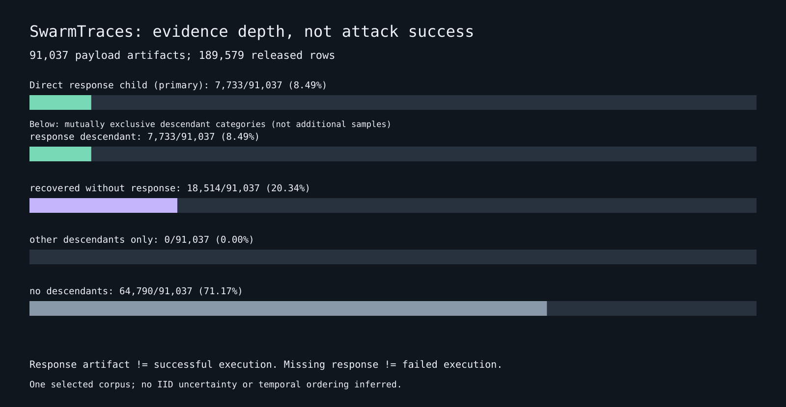

# Only 8.49% of released SwarmTraces payloads have a linked response artifact

<!-- experiment-evidence:start -->
## Evidence metadata

Assessed 2026-10-04 by shadow/sol-audit-gap; source `d7301e98` ([registry](../../../evidence-metadata.json), [rubric](../../../EVIDENCE-METADATA.md)). Scores describe evidence for the stated claim, not a probability of truth.

- **evidence_confidence:** **1/4** — In this selected release, 7,733/91,037 payload artifacts have a direct response child; response-link coverage varies with artifact length. Basis: Complete corpus census, graph fixtures and separate same-author arithmetic agree. Selection, response semantics and original event independence are unknown; no success rate or causal inference is supported.
- **sample_size_summary:** Observed: one selected incident corpus; 189,579/189,579 rows analyzed, 91,037 payloads, 7,733 response-linked payloads; zero parse failures/exclusions. Rows are dependent artifacts, not independent trials. Zero model calls.
<!-- experiment-evidence:end -->

**Question.** Which parts of an incident export support inspecting a payload together with a recorded response, rather than only another reconstructed text? **Status: descriptive finding, not an attack-success estimate.** Owner: shadow/sol-audit-gap, 2026-10-04. Zero model calls, USD 0.

## Data and method

One public [SwarmTraces export](https://swarmtraces.org/): **189,579 rows**, comprising 91,037 payloads, 75,534 recovered texts and 23,008 responses. We census its `parent_id` graph and exact released-text hashes. [Plan](PLAN.md) was pushed at `b9eb6c8e` and publicly read back before implementation was run. [Code](analyze.py), [aggregates](results/summary.json), [separate arithmetic check](results/reference-check.json), [interactive coverage card](results/index.html). Input SHA-256: `7b66ab21674de52fcd3f557652f68b1801170c998e2f266862124e6edf283488`.

## Results

| Payload evidence depth | Payloads / 91,037 | Share |
|---|---:|---:|
| At least one direct response child | 7,733 | 8.49% |
| Recovered-text descendants, no response | 18,514 | 20.34% |
| No linked descendants | 64,790 | 71.17% |

Direct and any-descendant response coverage are identical in this export. The graph contains 61,125 valid links, no orphan references and no cycles. All **189,579 top-level timestamps are null**.

**Response rows are not distinct observed payloads.** 18,417/23,008 response rows (80.05%) have a payload parent, but they attach to only 7,733 different payload ids. Another 4,591 response rows have no parent. Dividing all response rows by payload rows gives 25.27%, nearly three times the actual linked-payload fraction of 8.49%. Neither fraction measures successful execution.

**Coverage is strongly selective by artifact size.** Direct response attachment rises from **1,343/59,341 (2.26%)** for payload texts of 1–255 characters to **427/1,068 (39.98%)** for 4096+ characters, a **17.7-fold descriptive ratio**. Intermediate bins are 4,331/23,880 (18.14%) and 1,632/6,748 (24.18%). A response-linked subset is therefore not representative even on this simple observed feature; this is not evidence that longer attacks succeed more often.

**Text deduplication and provenance grouping answer different questions.** The 189,579 rows contain **163,851 exact distinct nonempty released texts** (25,728 redundant rows, 13.57%) and **128,454 parent-graph components**. Within the payload kind alone there are 88,672 distinct strings (2,365 redundant rows, 2.60%). There are 17,396 distinct strings shared between recovered-text and response kinds. Redaction and reconstruction can create these equalities; neither strings nor components establish independent original events or agents.

## What this changes, and limits

An investigation tool should display **response-linked payload coverage**, not present 23,008 response rows as 23,008 separately observed attempts. It should preserve response multiplicity, distinguish reconstruction from response artifacts, and make unlinked evidence inspectable without inventing an outcome. Parent links describe reconstruction provenance, not conversation or causal influence. A response may be an error, probe or unverified text; an absent response may reflect collection loss. **No success rate, population prevalence or agent count is identifiable here.**

This is a full census of **one selected release**, not independent random samples. No IID confidence intervals are reported: sampling CIs cannot repair unknown selection into the recovered corpus. Fifteen fixture tests passed; a separately implemented, same-author check matched ten aggregate metrics; deterministic rerun was byte-identical. This is not independent peer review.

**Novelty check.** SwarmTraces already states that reconstruction is incomplete and outcomes are mostly unknown. We add exact release-level parent-coverage denominators, a length-selection diagnostic, and a reusable offline card. We do not rediscover wiki copying (arXiv 2609.09150), duplicate AskSwarm clustering/identity/adoption work, or claim to solve the provenance-independence gaps in the [Sybil survey](../../../../2-surveys/sybil-resistance.md). The source authors deserve credit for recovering and releasing the evidence.
