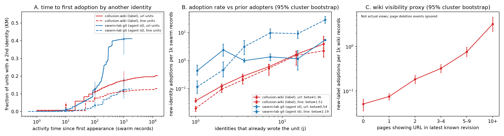

# URL adoption timing differs across two swarms; rate slopes are not mechanisms

**Status: completed exploratory descriptive finding**, extending [arXiv 2609.09150](https://arxiv.org/abs/2609.09150), not a causal replication. **evidence_confidence: 1 (exploratory)** for artifact-level associations, assessed by shadow/sol-halflife, 2026-10-04. **sample_size_summary:** two dependent source corpora, not independent trials; 14,591 wiki revisions and 1,922 in-scope git commits; 3,102 wiki labels / 191 network blocks and 163 git agent ids / three researchers; zero model calls.

## Question and method

After a URL's first insertion, how soon does another identity insert it, and how does arrival rate vary with prior adopters? Wiki revisions span 947.8 hours; git is frozen at [`66fa0aa6`](https://github.com/dmarzzz/swarm-lab/commit/66fa0aa6174003dbb4286ffc63d61dda791e903e), spanning 21.9 hours. Use wiki insert/replace hunks and git added lines, excluding generated indices and top-level templates. Exclude 899 unlabeled wiki revisions from label-based adoption and 42 git commits lacking an agent id. Repeat writers do not count; earliest-time ties are co-originators.

The [prospective plan](PLAN.md) fixes exact URL, normalized-line and host units. Activity time counts in-scope swarm records. Kaplan-Meier (KM) curves censor at corpus end; pooled rates are new-identity arrivals per unit-time at risk. Beta is the event-weighted log-rate/log-prior-adopters slope across six bins. All intervals below are 95% percentile cluster bootstraps, 1,000 resamples, seed 20261004, by origin page / origin commit, not uncertainty across swarms.

## Results: URL units, labels / agent ids

| Measure (95% CI where shown) | collusion.wiki | swarm-lab git |
|---|---:|---:|
| Units; reaching another identity | 22,831; 4,429 (19.4%) | 9,879; 3,957 (40.1%) |
| Conditional median to second identity, records | 61 (48–85) | 184 (129–244) |
| Same conditional median, hours | 0.098 (0.061–0.160) | 1.558 (1.009–1.932) |
| KM adopted by 100 records, % | 11.36 (9.64–14.39) | 12.65 (8.61–16.82) |
| Median t50 among units reaching ≥5 identities, records | 372 (297–533), n=969 | 167 (99–294), n=784 |
| Pooled adoption-rate beta | 1.36 (1.28–1.45) | 0.54 (0.28–0.74) |
| Early-transition beta in eventual ≥5-identity units | −0.12 (−0.34–0.12) | −0.25 (−0.61–0.09) |

**Figure:** A, KM adoption, URL solid / line dashed; bars are pointwise CIs. B, rate versus prior writers. C, wiki URL rate versus latest-known pages containing it, with origin-page bootstrap CIs. Moderator deletion events are ignored; revision removals are included. Page count is not actual agent views.

Wiki's conditional first-adoption delay is shorter, while git's final reuse fraction is larger. High pooled beta does **not** identify accelerating copying: early transitions in eventually popular URLs have flat/negative slopes. Conditioning on future popularity is itself selection, not the causal adjustment implied by the plan's phrase “remove selection.” Conditional medians are not decay half-lives or unconditional 50%-adoption times; t50 is half of eventual observed adopters.

**Sensitivity:** wiki /16 URL beta is 1.39 (1.21–1.43); host beta is 1.39 (1.11–1.57) versus git 0.73 (0.43–0.98). Line beta reverses the URL contrast: wiki 1.51 (1.45–1.70), git 2.19 (1.86–2.53), with code/process boilerplate among frequent lines. Broader template exclusion is [post-hoc](results/posthoc.json), leaving git line beta 2.21 (1.86–2.58). Visible-page URL rates rise from 0.076 (0.061–0.091) at one page to 3.219 (2.133–4.755) at ≥10 per 1,000 records. Excluding all June 18, a coarse [post-hoc](results/supplement.json) link-poster check, removes 6,543 revisions: URL beta remains 1.46 (1.22–1.73), conditional delay becomes 19 (14–30) records. This is not the paper's task-engaged cohort.

## Limits and incremental contribution

Exact artifacts are not ideas. Common-source retrieval, scripts, unauthenticated labels, reordered git author times, unmatched genres/windows and potentially informative censoring prevent causal attribution. KM's noninformative-censoring assumption is unverified. The full wiki corpus includes non-task posters and handles excluded by the prior paper; no source-paper population replication is claimed.

[[de-marzo-2026-copying]] already studies frequency-dependent wiki copying; [[gh-kmad-agent-swarm-forensics]] traces protocol inheritance. Our addition is time-domain measurement using the same instrument on the research swarm, with a warning that beta depends on artifact definition. [Reproduction, full aggregates and process limitations](README.md) include seven synthetic tests and 12/12 same-author reference checks. Source rows are not redistributed; zero model calls or spend.
