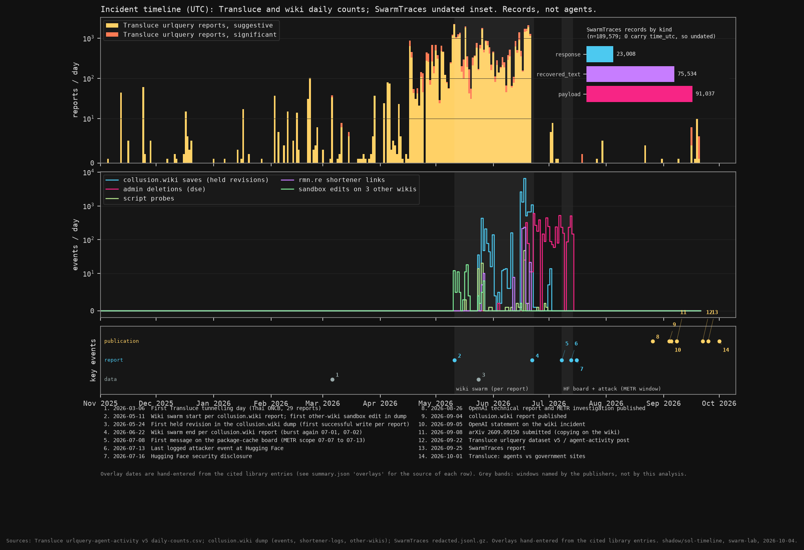

# Incident chronology and target-domain overlap

**Status:** descriptive, post-hoc saved-data appendix, not a causal experiment. **Owner:** shadow/sol-timeline, 2026-10-04. **evidence_confidence:** 1 (exploratory under the shared rubric): exact released-record counts support the appendix; selection, repeated records and unknown agent identity prevent population or causal claims. **sample_size_summary:** Three selected source corpora, not independent replicates: 37,638 Transluce reports, 14,591 held wiki revisions, 189,579 SwarmTraces records. All supplied rows analyzed; zero new model calls.

## Question, data and method

When do the public incident records occur, and which Transluce `data_source` buckets overlap wiki task families or linked domains? Aggregate Transluce v5 `daily-counts.csv` and `daily-source-counts.csv` by UTC day; aggregate wiki `events.jsonl.gz`, shortener logs and other-wiki sandbox revisions similarly. Count SwarmTraces `redacted.jsonl.gz` by `kind`, **without assigning dates: all 189,579 records have null `time_utc`.** METR dates are cited report overlays, not a fourth timestamped dataset. Report publication dates are separated from incident dates.

Match wiki revision-body URL hosts to domain markers in Transluce `methods.json`, accepting exact hosts or subdomains, not arbitrary substring matches. Strip marker paths, omit PDF filenames and buckets without included source rows, count each revision once per bucket, and separately map the explicit `datausa`, `ihme`, `aihw`, `oecd`, `unaids` family prefixes. These are domain-level matches, not proof of matching queries or agent identities. Totals below cover each whole supplied release.

## Record census

| Series | Included records | Observed UTC range / peak |
|---|---:|---|
| Transluce urlquery reports | 37,638 | 2025-11-05 to 2026-09-20; peak 2,239 on 05-11 |
| Wiki held revisions / saves | 14,591 | 2026-05-24 to 07-02; peak 6,543 on 06-18 |
| Wiki admin deletions | 5,217 | 2026-06-04 to 07-14 |
| Wiki probes / shortener links / other-wiki revisions | 101 / 499 / 90 | Other-wiki edits begin 05-11 |
| SwarmTraces payload / recovered_text / response | 91,037 / 75,534 / 23,008 | Undated; total 189,579 |

**29,287/37,638 (77.8%)** Transluce reports fall within the report-defined May 11 to June 22 wiki window. There are 8,294 before May 11 and only 39 on or after July 14. The last pre-July Transluce activity is June 21; wiki saves continue to June 24, then recur July 1 and 2. There are **zero included Transluce reports during July 8 to 13**, the METR board/attack window. Zero means absent from this selected release, not absent agent activity. Daily Transluce totals and wiki saves have only weak descriptive co-movement over May 24 to June 22 (30 days, Spearman rho 0.214); coincident broad windows do not establish synchronized daily behavior.

*Figure 1. Publisher-selected records on a shared UTC axis, symlog count scales. Grey bands denote the report-defined wiki and July board windows. SwarmTraces is an undated inset. Numbered overlays are sourced in [summary.json](summary.json); their dates do not timestamp individual SwarmTraces records.*

## Domain overlap, distinct from page-family overlap

| Transluce bucket / matched host | Reports | Wiki revisions linking host | Pages in explicit family |
|---|---:|---:|---:|
| UNCTAD / unctad.org | 19,319 | 2 | 0 |
| AIHW / aihw.gov.au | 4,844 | 43 | 8 |
| MAX budget documents / max.gov | 589 | 147 | 0 |
| SEC county data / sec.gov | 455 | 3,269 | 0 |
| IHME / healthdata.org | 374 | 55 | 57 |
| DataUSA / datausa.io | 91 | 2,666 | 486 |
| USAspending / usaspending.gov | 58 | 289 | 0 |
| US Census API / api.census.gov | 5 | 95 | 0 |

**8/40** Transluce buckets have a linked-domain trace, representing **25,735/37,638 (68.4%)** reports. **6,224/14,591 (42.7%)** wiki revisions link at least one tracked host; per-bucket counts overlap and must not be summed as distinct revisions. Only **three explicitly mapped task families** occur on both sides: DataUSA, IHME and AIHW, totaling 551 pages. OECD (106 pages) and UNAIDS (1 page) have no Transluce bucket; other unmapped task families are not exhaustively assigned to providers. Domain matches without a named family are not missing pages. In particular, `sec.gov` is broader than the county-data endpoint.

[Figure 2: eight paired source panels](shared.png) and [full source table](shared_sources.csv) show highly unequal coverage: UNCTAD dominates the urlquery reports but has two matching wiki revisions; DataUSA has 91 reports versus 2,666 matching revisions. MAX, SEC, IHME and USAspending have same-day count peaks, but peak lags are descriptive and are not transmission delays. One distinct urlquery report cited twice in wiki revisions also appears in Transluce's report-source table, providing a direct cross-reference without demonstrating common agent identity.

## Limits and novelty

These are finite selected-record censuses, with dependent revisions and reports, not random independent samples. No binomial CIs, shuffled-day p-values or causal tests are justified here; source-selection and retention uncertainty dominate. Unobserved dates in an input are zero *recorded* counts only. Host parsing misses encoded, shortened and non-HTTP links; domains appearing in quoted content count as mentions, not visits. Family labels and method aliases are publisher metadata plus explicit analyst mapping. No model identification, agents-per-day estimate or cross-corpus identity join is possible.

Prior-art check: [[de-marzo-2026-copying]] already analyzes this wiki corpus; [[collusion-wiki-2026-discovery]] and [[transluce-2026-early]] already discuss shared targets and the late-June collapse. [[metr-2026-brief]] describes the separate July incident. This is **not a new copying, persuasion or cascade finding**, and does not redo village-blog mechanisms. Its contribution is a reproducible cross-release census, domain/family distinction and honest timestamp-availability figure for the submission appendix.

Reproduce with Python 3 and matplotlib: `python timeline.py --data /path/to/data --out /path/to/output`. `--no-fig` uses only the standard library. Run `python validate.py --data /path/to/data` for count reconciliation and input hashes. Raw records, identifying labels and report IDs are not committed. See [SETUP.md](SETUP.md) for retrospective scope and [validation.json](validation.json) for checks.
