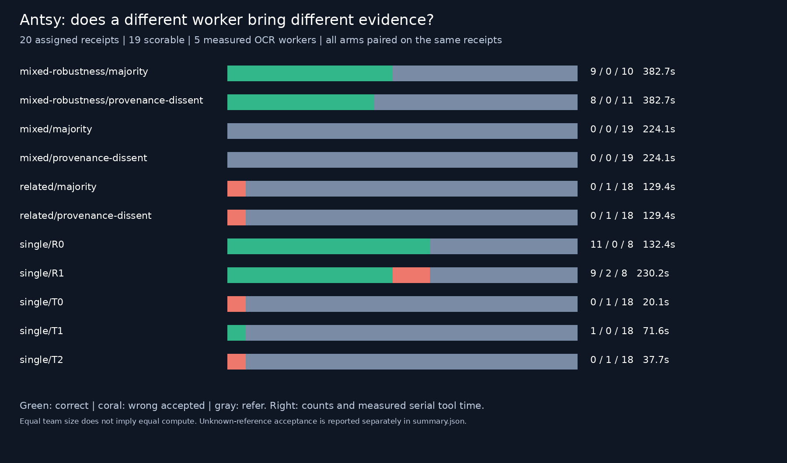
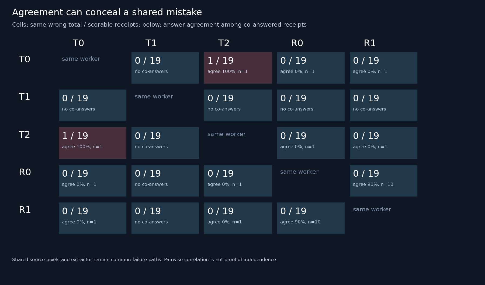

# Antsy v7: different workers helped perception; quorum did not help decisions

**Qualification failed; S1 was not run.** The repaired qualification completed20 assigned receipts and100/100 valid OCR invocations, with19 scorable references and1 unknown. The predeclared requirement that each engine family supply at least two correct totals failed. The stronger RapidOCR worker reached11/19 correct, but the best Tesseract variant reached only1/19. This is a diagnostic result about these pipelines on these receipts, not evidence of a general diversity effect or a qualified swarm comparison.

[Prospective plan](PLAN.md) · [setup and attempt history](SETUP.md) · [shared diversity protocol](../../../../tooling/agent-experiments/WORKER-DIVERSITY.md) · [live run](https://swarm-live.pages.dev/#/r/antsy-diversity-v7%2FS0-repair-1)

## What was changed and measured

Five tool-workers across two OCR engines, all reading the same actual receipt pixels: three Tesseract segmentation modes, RapidOCR original image, and RapidOCR grayscale/autocontrast/2x image. Exact engine/config/model/input/extractor hashes, fresh process initialization and no peer communication make the configurations reproducible. All share one extractor. These are tool-worker comparisons, not Layla/Jev or other LLM-agent results.

Three paired three-worker teams each use majority and duplicate-aware dissent protection, alongside all five singleton baselines:220 replayed policy outcomes from20 receipts, not220 independent cases. We measure declared configuration differences, provenance overlap, answer agreement, shared wrong answers, missingness, correctness correlation, directed rescue, unique correct candidates, coverage and measured serial tool cost. Shared source pixels and extractor remain possible common failure paths.

## Main observations

Counts below are on19 scorable receipts; the unknown-reference receipt was referred by every policy. Cost includes all20 assigned receipts, fresh process/model initialization and preprocessing. It is the sum of measured worker durations for the selected team, not observed concurrent latency or a compute-matched comparison.

| Policy | Correct | Wrong accepted | Refer | Tool seconds |
|---|---:|---:|---:|---:|
| Original-image RapidOCR R0 alone |11|0|8|132.4|
| Transformed RapidOCR R1 alone |9|2|8|230.2|
| Related T0/T1/T2, majority or dissent |0|1|18|129.4|
| Mixed T0/T1/R0, majority or dissent |0|0|19|224.1|
| T0/R0/R1, majority |9|0|10|382.7|
| T0/R0/R1, dissent protection |8|0|11|382.7|

R0 alone was the strongest observed worker. The two-RapidOCR team made fewer correct decisions at about2.9 times its measured cost. The primary mixed team accepted nothing: its removal of one wrong acceptance came entirely with lost coverage. The coverage loss was5.26 percentage points, exceeding the predeclared5-point margin. Neither this observation nor the secondary team supports a practical improvement over the strongest singleton. These are qualification descriptions, not held-out efficacy estimates.

## What the diversity measurements revealed

- **Same answer is not verification.** T0 and T2 co-answered exactly one scorable receipt and agreed on the same wrong amount. Their100% agreement has denominator1, not evidence of reliability. They also matched answerability/missingness on all20 receipts.
- **A distinct engine supplied useful information.** R0 had11 correct answers where each of T0/T2 did not. T1 supplied one correct answer absent from every other worker. The five-worker candidate oracle is12/19, versus11/19 for R0 alone; labels are used only for this descriptive upper bound, never for operational selection.
- **More preprocessing did not add correct coverage here.** R1 supplied no correct answer missing from R0; R0 supplied two missing from R1. Their answer agreement was9/10 co-answered cases, with correctness phi0.809. R1 also introduced two wrong candidates. These are observed associations, not a universal argument against preprocessing.
- **Negative correlation is not automatically valuable diversity.** T1–R0 correctness phi is−0.276, but T1 was correct only once and they never co-answered. Sparse competence and missingness drive this statistic. T0/T2 correctness correlations are undefined because they were never correct, and are reported as null.
- **A blanket dissent veto can lose correct decisions.** In the secondary team, dissent protection changed one correct acceptance into a referral without removing a wrong acceptance. An unreliable dissenter must not have an unquestioned veto merely because it differs.

### Post-hoc diagnostic example: receipt48

| Worker | Candidate total |
|---|---:|
| T0 |13,450|
| T1 |missing|
| T2 |13,450|
| R0 |73,450|
| R1 |73,450|
| Evaluator reference, withheld from workers |73,450|

Related-worker majority accepts the shared wrong total. Replacing T2 with R0 creates disagreement, but the mixed team cannot reach two agreeing votes and refers. In T0/R0/R1, majority is correct; a blanket dissent veto discards that correct answer because T0 disagrees. One selected case illustrates both failure mechanisms; it was not the sampling rule or a preselected outcome.

Receipt57 is the sole unique T1 success (39,000) while both RapidOCR variants abstain. It identifies potential routing headroom, not a validated rule for recognizing when T1 is right. Receipt40 shows R1's transformation turning a correct R0 total125,334 into1,255,244; receipt46 adds a wrong R1-only candidate43,636 against reference48,000.

## Diagnosis, uncertainty and limits

A read-only replay of saved OCR found at least one recognizable total anchor on7/10/9 of20 receipts for T0/T1/T2, versus18/17 for R0/R1. After exclusion rules, counts were5/8/7 versus17/16; final numeric candidates were1/1/1 versus11/11. Both OCR recognition and the conservative shared extraction contract constrain coverage. These aggregate observations do not establish the exact cause of every missing total. Changing extraction now would be development on used qualification data, not a fresh evaluation of this frozen design.

The initial attempt failed because `libGL.so.1` was absent; the repaired attempt has no execution failures. Wrong answers and abstentions in the repaired attempt are preserved task outcomes. The competence imbalance prevents attribution to diversity apart from model capability. No vendor/layout-disjoint sampling or absence of pretraining overlap is established. Image-size strata are a coarse proxy, not a removal of difficulty confounding. Two engine families and one small qualification set cannot estimate a defensible effective number of independent agents.

R0's0 errors among11 accepted totals has a Wilson95% upper error bound of25.9%; zero observed errors does not establish safety. Paired bootstrap intervals in [uncertainty.json](results/S0-repair-1/uncertainty.json) are exploratory, unadjusted for multiple contrasts and assume receipt independence. The primary wrong-acceptance difference interval includes zero. No benefit claim or safety guarantee follows from the qualification.

## Evidence and audit

- [Manifest and exact runtime](results/S0-repair-1/manifest.json), source `f0be4c82149c5c986d56cf19cd23afa4f8ef2646`;100 started,100 valid,0 invalid,220 analyzed outcomes,20 assigned,19 scorable. Elapsed501.0s.
- [Call journal](results/S0-repair-1/calls.jsonl), [numeric observations](results/S0-repair-1/records.jsonl), [summary](results/S0-repair-1/summary.json), [pairwise and stratified measures](results/S0-repair-1/diversity.json).
- [Separate reconstruction audit](results/S0-repair-1/separate-audit.json) checks all220 decisions,100 call pairs,10 pair statistics and cost/scoring consistency. Same author; not an independent researcher review.24 offline tests passed locally and on the host.
- [All-case decision map](results/S0-repair-1/decision-map.png), [column key](results/S0-repair-1/arm-key.json), [first-three-receipt replay](results/S0-repair-1/observed-traces.gif), [visual decode audit](results/S0-repair-1/visual-audit.json). Replay timing is normalized; it shows recorded candidates, not live parallel execution. All18 GIF frames decoded.
- [Failed initial attempt](reviews/S0-post.md) and [prospective bounded repair](reviews/S0-repair-pre.md) remain available. Parent has10 fully recorded receipts plus an interrupted partial receipt; exact started count is unknown and not invented.

The manifest's historical `model_calls: 0` field denotes hosted language-model/API calls. The repaired run did make100 native OCR invocations, including40 RapidOCR pipeline invocations. No hosted-model charges or new machines were incurred. Raw receipt text/images, credentials and private access details are not in the public artifacts.

## Next design decision

Do not run S1 with these controls. First establish two useful perception paths, separating OCR recognition from field extraction on already-used development cases. Qualify the revised contract on a new predeclared set without weakening the competence threshold. Then compare a strong singleton with a targeted complementary checker, at matched compute, rather than requiring a weak majority to ratify the strong worker. Test whether a checker adds correct completions or catches errors at a defined referral cost; learn routing only on development data. Retain duplicate provenance checks, but assess calibrated treatment of dissent instead of giving every contrary output veto power.

The intended50-receipt test set remains unopened by this v7 study. Any continuation requires a new prospective amendment and current admission; this iteration does not silently consume another repair or reclassify failed qualification as success.
