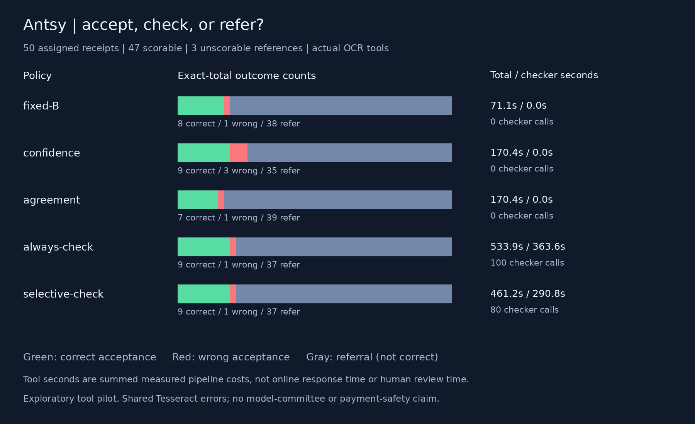
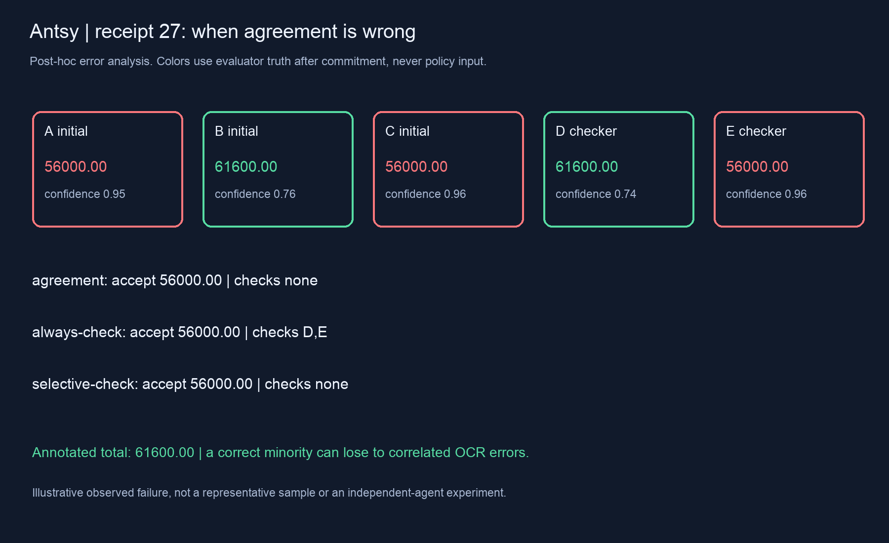
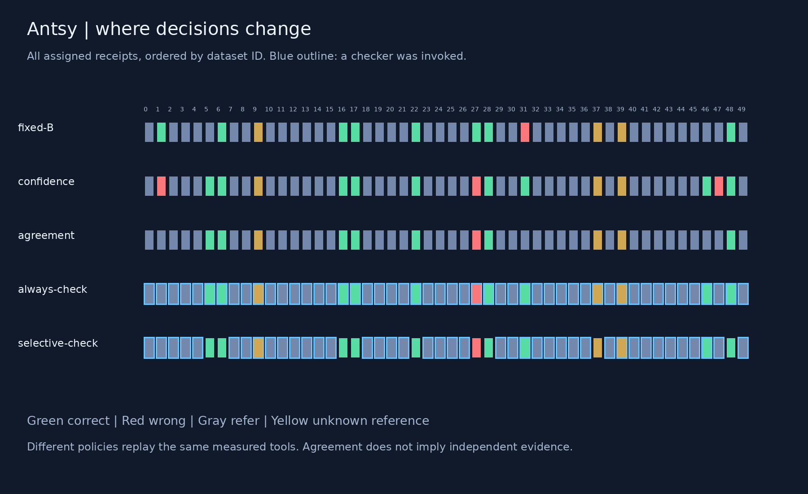

# Antsy v6 results: better measurement, limited value from more checking

The repaired application pilot ran reliably, but the tested OCR/quorum system is a weak receipt-total extractor. Selective checking saved work relative to always checking; it did not establish a compelling advantage over a cheap single pipeline. This is evidence about five real OCR tools and deterministic routing policies, not new Laya/Jev performance or a learned urgency effect.

[Final dashboard](https://swarm-live.pages.dev/#/r/antsy-receipt-v6%2FS1-reparse-2) · [pre-run](reviews/S1-pre.md) · [repair pre-run](reviews/parser-repair-pre.md) · [audit](results/S1-reparse-2/audit.json) · [numeric analysis](results/S1-reparse-2/analysis.json) · [reproduce](REPRODUCE.md)

## What was actually run

20 development receipts, then50 first-use official test receipts from pinned CORD-v2. Each receipt had five actual OCR pipelines measured. The test measurement completed250/250 OCR calls without execution errors, and the final repair produced250 complete policy outcomes. Zero model/API calls.47 test receipts have the declared total reference;3 do not. All50 remain published. Exact-image overlap with earlier validation/development is rejected; exact header-fingerprint overlap with development was0, which does not prove vendor/layout independence.

Three software defects were found and preserved: whole annotated lines were mistaken for reference values, literal quotation marks corrupted TSV reading, and hyphenated subtotals bypassed the exclusion. The first two were repaired before test. The third was found through source/development review during test measurement, before reading test decisions. A frozen repair replayed the same raw OCR; it changed3 development candidates on receipt9 and0 test candidates. This is a targeted repair of one sample, not an additional independent evaluation. [Development repair assessment](reviews/E0-reparse-post.md).

## Measured tradeoff

Counts below concern the47 scorable receipts. Every policy also accepted one of the3 unknown-reference cases; those acceptances are not counted correct. Tool time totals include all50 assigned receipts and initial extraction, with inherited original pipeline timings in the repair. The final parser replay took1.18 seconds separately. These are summed measured pipeline costs, not an online end-to-end latency benchmark.

| Policy | Correct | Wrong | Refer | Checker calls | Total tool seconds |
|---|---:|---:|---:|---:|---:|
| Fixed mode6 (B) |8|1|38|0|71.1|
| Highest OCR confidence |9|3|35|0|170.4|
| Initial agreement |7|1|39|0|170.4|
| Always check |9|1|37|100|533.9|
| Selective check |9|1|37|80|461.2|

Selective matches always-check outcomes with20% fewer checks and13.6% less total measured tool time. Compared with initial agreement, it adds2 correct acceptances (4.26 percentage points among scorable receipts) and costs290.8 extra tool seconds across the batch. The receipt-paired descriptive95% bootstrap interval for that correctness difference is0 to10.64 points. Compared with fixed-B, it adds only1 correct acceptance at approximately6.49× the measured compute cost, with the same observed wrong count. Human referral cost is unmeasured; assumed penalty sensitivity in the JSON is not measured monetary utility.

Selective's observed accepted-error rate is1/10 on scorable acceptances, with approximate95% Wilson interval1.8%–40.4%. Including its one unknown-reference acceptance gives error bounds1/11 to2/11 (9.1%–18.2%), not a confidence interval. These small, potentially dependent samples support no payment-safety guarantee. Degenerate paired bootstrap intervals on zero differences do not establish equivalence or zero risk.

## What explains the outcomes

**Checking mostly corroborates rather than discovers.** Only one receipt (35) gained a correct total absent from all initial candidates: E read54000.00 while A–D returned missing. The two-source quorum still referred it. The two recovered acceptances (31 and46) corroborated totals already present in an initial pipeline. A hindsight all-five candidate oracle reaches13/47; the actual selective policy accepts9 correctly. Neither number is a deployable accuracy guarantee.

**Correlated agreement can be confidently wrong.** On receipt27, A/C/E reported56000.00; B/D reported the correct61600.00. Initial quorum accepted the wrong amount without checking. Always-check also chose the wrong three-versus-two majority. High OCR confidence preferred the wrong answer too. Adding more variants from the same OCR family does not necessarily supply independent evidence.

**Conservative extraction is the dominant limitation.** Selective refers37/47 scorable receipts. Some correct singleton candidates are discarded; many pipelines yield no admissible anchored total. This is partly OCR/line-layout/label coverage and partly the declared strict parsing contract. These are valid task failures and design limitations, not missing executions. We did not silently relax parsing or tune the quorum on these test outcomes.

**Missing references stay unknown.** Test9,37,39 have neither structured total_price nor a total.total_price annotated line. Cash/change, total_etc and credit-card fields were not substituted after seeing results. Receipt37's20000.00 acceptance remains unscored.

First3 assigned animated traces are retained; [receipt31](results/S1-reparse-2/receipt-031.gif) is a labeled post-hoc first changed-decision illustration. Its checker corroborates C's113886.00 against B's113386.00; this is an observed example, not representative efficacy evidence.

## Assessment and next gate

The experiment now answers a practical question with real tools, explicit wrong decisions, abstention, and costs. The controls expose a weak committee story instead of constructing a winner.46 tests pass, six injected defects are detected, all assigned decisions reconcile, and figures/GIFs were decoded and visually checked. Repository validation and secret scans pass. External independent scoring review remains open.

Do not enlarge this same committee or claim success from the saved checks alone. The next useful development work is a genuinely different extractor/checker, broader legitimate total-label/layout support, and calibrated handling of conflicting/singleton evidence. Qualify those on new development material before another untouched evaluation, ideally with independently verified vendor/layout separation and measured referral costs. Only then compare one versus five decision roles with equal information and a matched-call/resource control. The first50 test receipts are now used evidence, not a reusable holdout for tuning.
