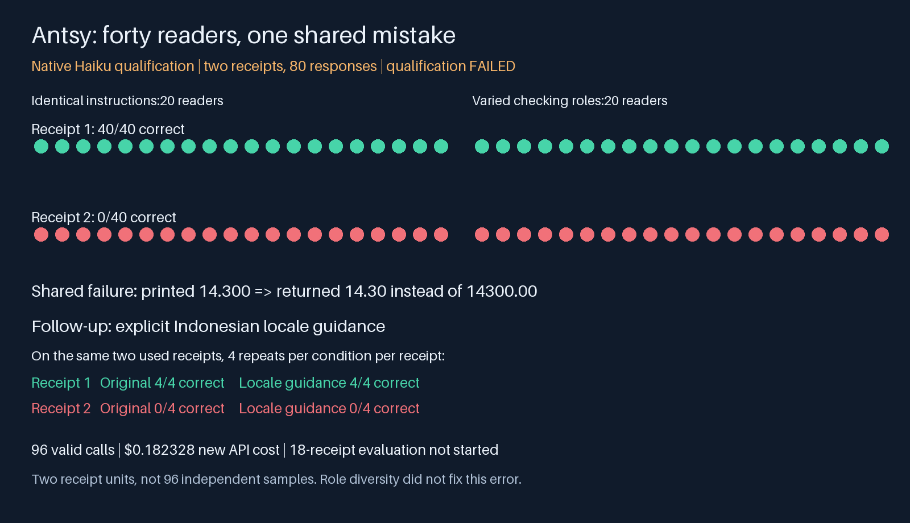

# Antsy Haiku: role diversity did not fix shared normalization

<!-- experiment-evidence:start -->
## Evidence metadata

Assessed 2026-10-04 by vishesh/codex-methods; source `9781739c` ([registry](../../../../../experiments/evidence-metadata.json), [rubric](../../../../../experiments/EVIDENCE-METADATA.md)). Scores describe evidence for the stated claim, not a probability of truth.

- **evidence_confidence:** **1/4** — Forty Haiku readers shared a1000-fold normalization error on one qualifying receipt; role variation and a16-call locale diagnostic did not repair it. Basis: Two real receipts;96valid calls with full trace coverage, source-label review and original-ledger accounting. Same-author used-case diagnostic, not population evidence.
- **sample_size_summary:** 2receipt units. Q0:40responses each,1receipt correct and1wrong for both panels. D1:same2receipts ×2conditions ×4repeats;no benefit. E0:0of18receipts collected.
<!-- experiment-evidence:end -->

**FINISH this diagnostic; keep the main evaluation closed.** Q0 completed80 valid calls; D1 completed16. No API, schema, route, accounting or trace execution errors occurred. All96 returned visible responses and known usage. Native Haiku qualification failed; the subsequent locale-guidance repair was not supported. These are two receipt units, not96 independent observations.

## Results and interpretation

| Receipt | Q0 identical20 | Q0 varied20 | D1 original | D1 locale guidance |
|---|---:|---:|---:|---:|
| Passing receipt |20/20 correct|20/20 correct|4/4 correct|4/4 correct|
| Grouping challenge |0/20 correct|0/20 correct|0/4 correct|0/4 correct|

The failed case's visible total is14.300 in an Indonesian receipt, with subtotal13.000 and tax1.300. All40 Q0 readers quote the correct printed line yet normalize it to14.30 rather than14300.00. Four fresh locale-guided readers repeated that error. The intervention supplies corpus locale but no answer or case-specific numeric example. It does not establish that any possible clarification must fail.

Within the observed sample, singletons, repeated homogeneous readers and role-diverse readers all make the same receipt-level decisions. This directly demonstrates a shared wrong-answer cluster on one receipt; it does not estimate population error correlation, effective independent panel size or role-diversity benefit. The two Q0 response vectors coincide, so a numerical correlation would be uninformative and unstable. Do not turn unanimity into calibrated confidence. The necessary next architecture should separate perception (literal printed token) from currency normalization and verified task decision.

## Concrete offline repair and its limit

The [normalization guard](normalization_guard.py) parses supported grouping conventions in the visible evidence string, comparing that independently computed value with the model's returned amount. It **refers** on disagreement or ambiguous/multiple evidence values; it never repairs an answer using gold. The paired tests cover comma and period grouping, decimal fractions, absent/competing amounts and the1000-fold mismatch.

Saved-data replay across all96 responses: the48 wrong-case responses are referred;48 passing-case responses are consistent. These are retrospective safety checks, not48 independent repairs, native requalification or verified image grounding. A fabricated quote could still pass; unknown currency conventions can still be mishandled. The initial conservative guard referred all96 because it did not cover comma grouping; that development defect was repaired with an explicit comma-grouping test before publication. No failed native result was overwritten.

A future useful design would require a literal amount token, explicit supported locale/currency contract, deterministic normalization and source-span/image verification, with mixed-format and ambiguous controls. Use a small fresh capability screen before considering another40-agent panel. Neither more identities nor extra prompt roles alone is justified by these results. The18 evaluation images remain uncollected, and no evaluation result is implied.

## Trace review, costs and closeout

Both attempts have verified declared trace coverage; this verifies retained bytes and required categories, not truth. Original requests, isolated contexts, visible answers, grades, usage and timing remain in private backups. Every qualification miss was included in the saved-output inspection and normalization replay; the first observable discrepancy is between quoted14.300 and parsed14.30. This does not reveal internal model reasoning. The source label was checked against the actual delivered image after qualification, so that case is now inspected diagnostic data.

Q0 actualUSD0.15156; D1 actualUSD0.030768; total newAPIUSD0.182328. All96 charges reconcile, zero unknown reservations. The original80 ledger rows hash-match unchanged; the same ledger accepted the16 new unique diagnostic IDs. Conservative historical holdUSD5 remains, yieldingUSD5.182328 exposure againstUSD20 cumulative authority. No new infrastructure charges. Both workers, relays and tunnel stopped; exclusive host claim released. Five original hub artifacts downloaded and hash-verified before release. Native execution outcomes remain separate from failed qualification and failed repair efficacy.

Source: Q0 `f44d211fab31fc81706aa3a3cd57ad13a535e742`; D1 `96b7ee7f`. Both public condition-specific plans were browser-verified before their calls. Host Python3.12.3, Pillow11.3.0; twelve panel tests passed on-host, two diagnostic tests passed on-host before D1; eight diagnostic/guard checks pass locally after saved-data repair. This is a same-author review, not independent replication. No additional researcher approval was required by owner direction.
