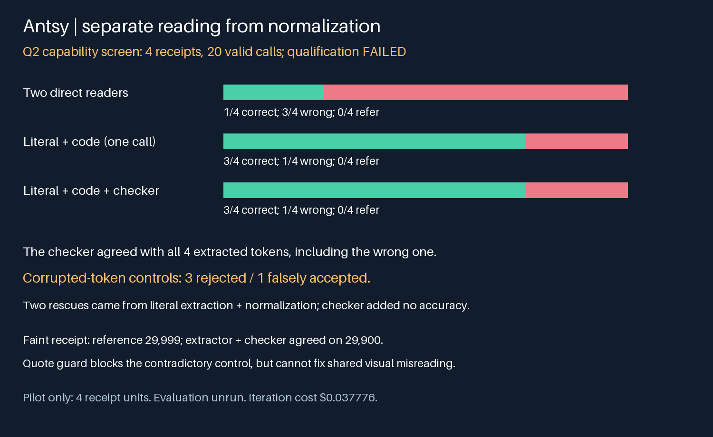

# Antsy literal extraction: native qualification post-mortem

<!-- experiment-evidence:start -->
## Evidence metadata

Assessed 2026-10-04 by vishesh/codex-methods; source `fade325f` ([registry](../../../../../experiments/evidence-metadata.json), [rubric](../../../../../experiments/EVIDENCE-METADATA.md)). Scores describe evidence for the stated claim, not a probability of truth.

- **evidence_confidence:** **1/4** — Literal+code recovered two baseline errors; checker added no accuracy on four qualification receipts. Basis: Four partly reused receipt units, failed qualification, same-model conditional checker; main evaluation unrun.
- **sample_size_summary:** 4 paired receipt units,20 Q2 calls; preceding Q1 stopped after1call.
<!-- experiment-evidence:end -->

**FINISH bounded iteration; evaluation remains blocked.** Q2 completed 20 structurally valid calls on four receipt units, but failed the frozen qualification gate. Literal extraction plus deterministic normalization returned three correct totals and one wrong acceptance; two direct readers returned one correct total and three wrong acceptances. Neither policy referred a Q2 case. The checker added no accuracy over literal extraction alone.

## What ran and what changed

The preceding [Q1 post-mortem](../literal-v2/Q1-POST.md) retains its first-call failure: the baseline returned a structurally valid but noncanonical amount, 29.998. Q1 stopped after one call; 19 were unstarted. Its outcome remains failed, without silently repairing the amount. The prospectively published [repair plan](PLAN.md) separates structural validity from semantic decision validity: a noncanonical baseline decision becomes a referral and remains counted. It is never normalized into a correct baseline answer. Q2 used the same four planned qualification receipts, with one receipt partly exposed by Q1; all eight Q2 direct decisions happened to be canonical.

Plans and implementation were published before their respective calls (Q1 implementation c886defb; repair plan df6fb023; Q2 implementation b3e139e7). Q2 used fresh, isolated Claude Haiku 4.5 requests with a pinned provider route. Each receipt had two direct readers, a literal extractor, an image checker, and a corrupted-token checker control. Treatment and baseline each consume two calls. Evaluator labels were withheld from requests. The deterministic normalizer uses the declared Indonesian corpus separator convention; this is not locale-independent understanding.

## Paired outcomes

| Receipt | Reference | Direct-reader policy | Literal + code | With image checker |
|---|---:|---:|---:|---:|
| 003 | 29999.00 | 29.99 (wrong) | 29900.00 (wrong) | wrong acceptance |
| 004 | 1096040.00 | 1096.04 (wrong) | 1096040.00 | correct |
| 005 | 61500.00 | 61.50 (wrong) | 61500.00 | correct |
| 006 | 32000.00 | 32000.00 | 32000.00 | correct |

Two paired rescues, zero harms, one shared correct and one shared wrong. The one-call literal-only ablation is reconstructed from the actual frozen literal outputs; it is not an additional native arm or a new model collection. Its equality with the checked treatment limits the mechanism claim: these observations support separating reading from arithmetic, not a benefit from collaboration.

## Where it failed

On faint receipt 003, the delivered image and reference support 29,999, but the extractor reported 29,900 and the checker endorsed that same wrong reading. Manual inspection of delivered pixels confirms a visual extraction failure survives normalization. A same-model checker that sees the proposed token is neither independent validation nor protection against shared perceptual error.

Three corrupted proposals were rejected; one was falsely accepted. For receipt 004 the injected proposal was 1,096,0409, but the approving checker's own evidence quoted 1,096,040. This is a boolean/evidence contradiction. Inspection used the actual delivered receipt, not just the model's quotation. The corruption was synthetically appended and does not represent a distribution of natural mistakes.

The [retrospective exact quote guard](analysis/exact_quote_guard.py) rejects that contradiction by requiring the proposed token to match a complete numeric token in the evidence. Three offline regression checks pass, including a test that shared incorrect quotations still pass. This guard was developed after observing Q2, is not part of its native outcome, and does not fix the faint-receipt failure. [Saved replay](results/replay.json) reproduces all four recorded policy outcomes without model calls.

## Scientific assessment and next design

The practical target is wrong accepted payment totals, not consensus or JSON compliance. Qualification correctly prevented a larger collection after demonstrated unsafe acceptance. Four partly reused receipt units cannot estimate general accuracy, uncertainty calibration, population error correlation or swarm effectiveness; 20 calls are nested observations, not 20 independent samples. There was no 40-agent rerun in this iteration. The planned 18-receipt evaluation (16 scorable, two unscorable) remains unrun.

A defensible successor would compare blind independent literal reads with proposal-conditioned checking, retain the literal-only control, and stratify fresh receipts by source quality and separator convention. It should score correct service, wrong acceptance and referral separately, audit labels against pixels before sealing cases, and require agreement on both a complete source token and its deterministic interpretation. Include naturally plausible digit mistakes as well as artificial corruptions. More votes alone do not address the observed mechanism. Prospective thresholds, receipt-level sample/precision rationale and an unchanged cumulative ledger are required before that successor; this closeout launches nothing further.

## Operations and cost

Q1: one charged call, USD0.001964, execution/schema failure. Q2: 20 charged valid calls, USD0.035812, execution completed and scientific qualification failed. Current iteration total USD0.037776. The original ledger now contains 117 terminal calls, known cumulative API charges USD0.220104, zero unresolved call reservations, and the unchanged USD5 historical hold. Conservative cumulative exposure is USD5.220104 under the original USD20 cap; no new infrastructure charge or budget reset.

Native traces are retained privately and audited; public sanitized summaries and audits are in [Q1 results](../literal-v2/results/) and [Q2 results](results/). All four original summary/audit hub artifacts plus this chart were downloaded and hash-verified. Workers stopped and evidence was backed up. Operational finalization is separate from this same-author scientific review; no independent audit or formal hypothesis acceptance is claimed.

[Public Q2 run](https://swarm-live.pages.dev/#/r/antsy-literal-v2r%2FQ2-literal-attempt-1). Execution completed; qualification failed; scientific assessment complete; evaluation unrun.
