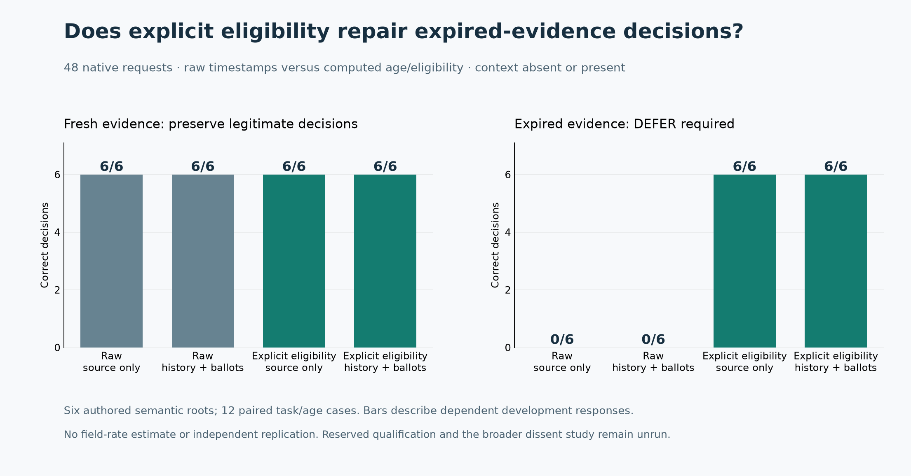

# Explicit eligibility repaired the observed expiry errors

RD7 F0-A1 completed all **48 native requests**. Explicit computed age and eligibility produced **24/24 correct decisions**, compared with **12/24** from raw timestamps. All gains came from expired evidence; fresh decisions stayed correct. This is a finite development diagnostic, not fresh qualification or evidence of collective dissent.

| Interface and context | Fresh evidence | Expired evidence | Total |
| --- | --- | --- | --- |
| R0: raw, source only | 6/6 | 0/6 | 6/12 |
| R1: raw, opposing history and ballots | 6/6 | 0/6 | 6/12 |
| E0: explicit eligibility, source only | 6/6 | 6/6 | 12/12 |
| E1: explicit eligibility, opposing history and ballots | 6/6 | 6/6 | 12/12 |

The prospectively specified repair signal passed. Each expired-evidence contrast corrected six pairs and harmed none. Fresh contrasts changed no decisions. Raw expired inputs yielded six wrong PROCEED and six unsupported HOLD decisions; an unsupported HOLD is not counted as correct merely because it is cautious. No fresh input caused unnecessary DEFER. Adding opposing context changed no actions within either representation in this matrix; that does not establish that context never matters.

## What changed and what it means

The treatment adds a deterministic receipt containing evidence age, time-to-live, scope/revision matches and eligibility, computed only from actor-visible metadata. Substantive source text, timestamps, action criteria and matched choice order are preserved. There is no expected action in the receipt. The experiment establishes a response difference for that composite aid; it does not distinguish arithmetic assistance, salience or the explicit eligibility label, and visible outputs do not reveal hidden reasoning.

The practical baseline is now implemented: reject expired, future-dated, wrong-scope or wrong-revision evidence and matching cards from actionable input, retain it in the audit, and return DEFER without a model call when no eligible evidence remains. An offline replay over the 24 raw-arm assignments scores 24/24: twelve expired assignments defer deterministically, and twelve fresh forwarded requests exactly match the retained native inputs. This is saved-data controller analysis, not an independently executed hybrid cohort. Explicit-arm fresh answers are not reused because gating removes their receipt and changes their input. The full actor-visible literal reference also answers every case correctly; no advantage over that reference is claimed.

## Scope and reliability

The design has six authored semantic roots across three shared task grammars, twelve task/age cases and four dependent condition exposures per case. It reuses inspected development facts. All 48 requests, visible responses, parser outputs and accounting records reconcile; all 12 misses and the full 48-row compact trace audit were inspected. There are no invalid, missing, unstarted or retried assignments. One stateless native resolver answers each request; the five ballots are scripted, not five native agents. The pinned route is `typesafe/jev-1.13-20260917` / TypeSafe.

There are no hosted repeat measurements, independent replication, field failure-rate estimate or population confidence interval. The paired bounds in the machine-readable summary are missing-outcome identification bounds, not confidence intervals. The 54 separately generated qualification cases remain sealed and unrun; they use new values and boundary/mismatch/mixed-source cases but share the synthetic grammars. RD6's failed qualification remains preserved, and its D0 comparison remains unrun.

## Operational closeout

The plan was public before implementation and the final immutable plan was registered and verified before dispatch. The native public-plan validator first rejected missing standard section headings; this consumed zero model calls or reservations. Correcting the headings and adding a real-validator check produced 61 passing offline checks, both locally and on the deployed source. The actor bytes, labels, order and fixture manifest did not change. The admitted attempt ran once, in 30.81 seconds, with no fallback or retry.

Frozen execution source: `a4de7c2d1f9fcdcf148a150288e15cd742e27674`. Native bundle: `e8f170dfbaf96eba57b6c2c8d849e0919e442cca8893c28b17031f5bd398698b`. The seven native files remain byte-identical. Their pre-closeout status fields are retained as historical records; [the completion receipt](results/f0-a1/closeout.json), [post-mortem](reviews/F0-A1-POST.md) and [eleven-dimension review](reviews/F0-A1-QUALITY.json) record the later assessment.

The diagnostic added USD 0.002046072 in settled API cost and USD 0.004672059 in estimated allocation cost. The original ledger now records 554 calls and USD 0.025480519 committed API exposure, including USD 0.004032 historical uncertainty and no new unresolved reservation. Combined lifetime committed API and allocation estimate is USD 0.785242987 under the original USD 1 API / USD 1 infrastructure caps. Allocation estimates are not invoices. Worker and relay are verified stopped; the borrowed machine's exclusive claim is released. No machine was provisioned or destroyed.

## Next useful question

The approved direction is: **Can a dissenter identify an invalid basis for consensus, acquire current evidence and restore the correct decision beyond an eligibility gate plus routine refresh?** This diagnostic supports freezing the eligibility repair and testing it on the sealed qualification reserve before designing the broader comparison. The future comparison needs an equally funded non-dissenting checker and scheduled-refresh controller, with legitimate service restored, false challenges, missed invalidity, checks used and recovery latency reported separately. A gate already solves the present expiry cases; another larger run on the same matrix would add little decision value.

Disposition: **FINISH / PARK this completed diagnostic**. Native qualification and the broader comparison remain separate, unlaunched stages; approval of the research direction is retained without inventing approval of an unspecified main-study contract.

[Prospective plan](PLAN.md) · [Complete native packet and responses](results/f0-a1/native/) · [Trace audit](results/f0-a1/trace-audit.json) · [Saved-data analyzer](results/f0-a1/analyze_saved.py) · [Replay](results/f0-a1/native/replay.html) · [Resources](results/f0-a1/resources.json)
