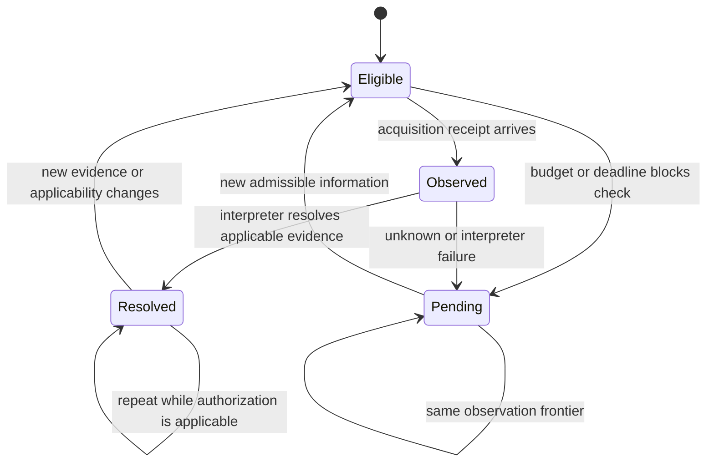

# Improvements and acceptance criteria

These are proposed repairs and tests, not verified fixes. RD4's 576 records remain unchanged. The sequence separates operational reliability, decision semantics and the new research treatment so that an eventual improvement can be attributed to the changed component.

## First make the instrument trustworthy

| Priority and issue | Proposed change | Acceptance evidence before a new run |
| --- | --- | --- |
| P0 transport readiness | Keep the actual end-to-end relay probe, supervise worker/relay/tunnel together and durably record readiness immediately before dispatch. Process existence alone is insufficient. | Offline fault injection: tunnel death between setup and dispatch yields zero provider reservations and an unstarted assignment; death after dispatch preserves an ambiguous/failed attempt without retry. Readback and shutdown paths still work. |
| P0 mixed resource accounting | Separate physical acquisition attempt, successful immutable observation receipt, inference reservation/dispatch and interpreted decision. | If acquisition succeeds but inference fails, the observation remains available and the physical check remains spent. If nothing was dispatched/acquired, no check is charged. Restart preserves both ledgers; ambiguous reservations are never refunded speculatively. |
| P0 denominator and continuation reporting | Freeze the full assignment manifest once; show per-segment and full-cohort denominators separately. | Partial summaries never silently divide by observed cases; every assignment is planned, started or terminal. Continuation accepts only never-started work and cannot overwrite outcomes. |
| P0 uncertainty state | Store last verified action separately from currently authorized action, unresolved observation frontier and reason. | A DEFER cannot become a justified HOLD/PROCEED solely because the next admission says KEEP. Repeats remain unresolved until new admissible information or a defined escalation resolves them. Expired or wrong-version history never authorizes action. |

The last item may lower raw correctness on a particular old row: RD4's symmetric gate obtained one correct HOLD by retaining the old action after earlier DEFERs, without another verification. A sound uncertainty contract should not preserve that point by treating an unresolved record as verified. Track factual correctness and justification separately; do not tune the contract to retain lucky points.

## Then address the accuracy mechanisms separately

| Mechanism and RD4 evidence | Proposed change | Acceptance test and limitation |
| --- | --- | --- |
| Both gates refused the valid alarm recovery, root `294ed0f1b3dc`, final epoch. This is the original gate's one-point loss versus always-check. | Replace learned admission in the primary successor with a transparent eligibility rule, then apply the declared allocation policy. A fresh applicable observation can earn a check in either direction. | Both stopping and resuming challenges reach the verifier when eligible and affordable; irrelevant, stale and fabricated-acquisition inputs do not. A check does not guarantee reversal or truth. No claim that prompt wording repaired the model. |
| The symmetric gate deferred an answerable initial build challenge, root `a1424d89c5a1`. | Use the same structural eligibility rule; remove the extra model judgment about whether a check is allowed. | A relevant required-test contradiction with a timely available verifier is checked; optional-test failure and wrong-platform evidence remain negative controls. Measure inference cost as well as completion. |
| All checking arms deferred on the negated numeric alarm receipt, root `6dd7a1db979b`. | Make actor-visible measurements, requirements, time and scope explicit in a structured evidence card, retaining original text and field provenance. Diagnose this representation separately from budget policy. | Paired fresh raw/card qualification includes positive and negative wording, thresholds, missing fields and genuine conflicts. No action label or evaluator-generated fact enters the card; an unparseable phrase stays unknown. A finite parser is not a general semantic solution. |
| A repeated unresolved alarm used the second check, leaving none for later recovery. | B1 remembers attempted resolution by eligible observation frontier. Same frontier: retain unresolved status and acquisition receipt, use no additional native call. | Alias count/order, quoted wording and timestamps in untrusted prose cannot buy another acquisition. A real new trusted measurement or independent check can be eligible. Include a case where a second independent early measurement is actually useful. |
| Distinct early observations may still exhaust B1's budget. This is a new hypothesis, not an RD4 measured effect. | B2 protects the final check until a fixed public time, with no evaluator-informed override. | Test against B1 with identical evidence, interpreter and maximum resource limits. Include no-late-change and urgent-early counterexamples; report unused capacity and delay. |

## Observation identity is not a solved provenance problem

RD4 canonicalized exact observation tuples. That handles duplicate aliases, not an adversary who controls authoritative acquisition IDs or a semantically equivalent rewrite presented as a new measurement. The next implementation must distinguish message ID, observation/acquisition ID, source root and task revision. The local ingestion adapter owns authenticated acquisition identity; a classifier cannot authenticate the world by reading a convincing string.

For the finite prototype, explicit field extraction may canonicalize equivalent numeric content, but retain all same-time disagreements and the original text. Do not collapse contradictory values into one convenient answer. A new timestamp can represent a genuinely new measurement of the same value without making it an independent sample. Native broad-language/forged-provenance claims remain outside the small first stage.

## State contract

This is a proposed state contract, not a measured transition graph. Physical acquisition, interpretation and authorization are separate recorded facts even when they occur in one user-visible check. Cached historical actions remain inspectable but cannot masquerade as fresh authorization.

## Implementation order and stopping rules

1. Implement P0 accounting, explicit uncertainty and admission faults; add offline transition tests without opening native qualification inputs.
2. Implement common eligibility and auditable evidence cards. Create separate development, Q5 and H5 manifests; disclose shared grammar and authorship.
3. Implement B1 and B2 as small allocation overlays on a common interpreter. Verify that treatment differences are only deduplication/reservation, not hidden context or extra calls.
4. Build measured views from event logs and test failure/expiry/early-urgency frames. Reconcile raw records through a separate same-author scoring pass.
5. Prepare bounded Q5 only after source, route, public plan, budget and exclusive fleet gates. Failure returns to design; it does not consume the 12-call margin as an implicit retry allowance.

No confidence cutoff is fitted to the RD4 probability outputs. The few observed confidence values do not establish calibration. No automatic model substitution, human oracle, extra inference pass, or paid broader sweep is part of this plan. Optional reviewer feedback is useful but is not an owner-imposed approval gate.
