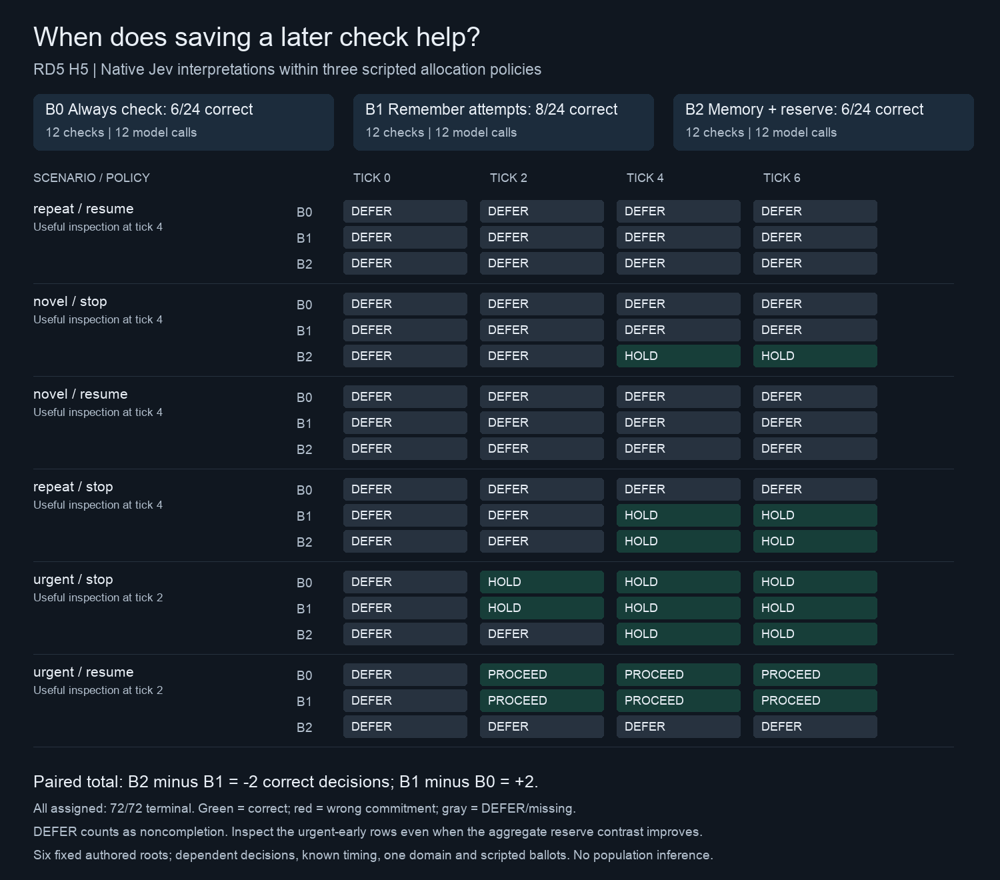

# RD5 result: a saved check can still fail to reopen a decision

**The fixed late reserve did not improve this native pilot.** Remembering inconclusive attempts produced 8 correct decisions out of 24. Adding a reserve until tick 4 produced 6/24, the same as bounded always-check. All 72 scheduled decisions completed; all 36 H5 model calls were valid. The result is adverse for the implemented reserve rule, with a separate weakness in interpreting evidence that should permit resumption.

Cells show the final decision for each scheduled epoch. A physical check returns one tick later; the trace retains both the epoch and actual return tick. DEFER counts as noncompletion, rather than a wrong commitment. These are six fixed authored roots, not 72 independent tasks.

## What the comparison established

| Policy | Correct / assigned | DEFER | Wrong commitments | Checks | Model calls |
|---|---:|---:|---:|---:|---:|
| B0: bounded always-check | 6/24 | 18 | 0 | 12 | 12 |
| B1: remember inconclusive attempts | 8/24 | 16 | 0 | 12 | 12 |
| B2: memory plus reserve until tick 4 | 6/24 | 18 | 0 | 12 | 12 |

The primary B2−B1 contrast is **−2 correct decisions, or −8.3 percentage points**. The secondary B1−B0 contrast is +2 decisions. No missing outcome, unequal check allowance or extra model call explains the difference. The preregistered development screen required at least +2 for B2, with no extra unsafe or unjustified commitments; it failed on the benefit criterion. Zero wrong commitments alone is insufficient: most assigned decisions deferred.

| Mechanism, two roots each | B0 correct /8 | B1 correct /8 | B2 correct /8 | Reserve minus memory |
|---|---:|---:|---:|---:|
| Repeated inconclusive inspection, then change | 0 | 2 | 2 | 0 |
| New but inconclusive inspections, then change | 0 | 0 | 2 | +2 |
| Urgent early useful inspection | 6 | 6 | 2 | −4 |

Memory saved a check on the repeated stop case. Reservation preserved a check for the novel stop case. The urgent stop case lost one scheduled correct decision because the reserve delayed its answer from tick 3 to tick 5. The urgent resume case lost all three correct decisions obtained by B0/B1: B2 delayed acquisition, then returned DEFER rather than reopening.

## Where the accuracy difference came from

The saved-response audit reconstructs every request and all 72 state/action records exactly. It separately recalculates the all-assigned scores from actions and authored truth. All four misses on decisive evidence are **late resume requests**: the delivered observation and card explicitly say the reading is 20, within the required 10–30 interval, but Jev returns DEFER. Stop readings of 40 were interpreted correctly. Across all 12 decisive calls, 8 were correct; the other 24 calls correctly deferred on incomplete observations.

| Delivered decisive request | Expected | Returned | DEFER probability | PROCEED probability |
|---|---|---|---:|---:|
| Repeat/resume, B1 at tick 4 | PROCEED | DEFER | 0.47 | 0.44 |
| Repeat/resume, B2 at tick 4 | PROCEED | DEFER | 0.53 | 0.35 |
| Novel/resume, B2 at tick 4 | PROCEED | DEFER | 0.49 | 0.40 |
| Urgent/resume, B2 at tick 4 | PROCEED | DEFER | 0.43 | 0.42 |

The urgent-resume comparison is especially informative: the earlier successful and later deferred requests differ **only in `now` and `deadline`, from 3 to 5**. The source text, observation timestamp, card, historical HOLD and four-HOLD/one-PROCEED scripted ballots are identical. The record remains within its declared lifetime. This localizes an observable context sensitivity; it does not prove that time alone caused the response. History, ballots and recency may interact, and hosted response variability remains an alternative. No hidden reasoning is available.

A retrospective, explicitly scripted diagnostic applies the literal numeric rule to the delivered cards while retaining the same acquisition and budget machinery. It produces B0=6, B1=10 and B2=12 correct decisions. Compared with that reference, native interpretation loses 0, 2 and 6 decisions respectively. The four failed resumptions therefore account for the reversal from a scripted +2 reserve advantage to the observed −2. **This is an analysis of the authored task, not another native experiment or evidence that a repair works.** It also shows that this finite numeric task has a useful simple controller; Jev is not needed to evaluate a correctly extracted scalar against two bounds.

## Qualification and scope

Before H5, Q5 passed all 24 requests: raw 12/12 and cards 12/12, including all six uncertainty cards. Both forms reached the ceiling, so there is no observed card accuracy advantage. The [Q5 post-mortem](reviews/Q5-A2-POST.md) and source-bound bundle audit were completed before H5 admission.

Q5 used empty history and no ballots. It did not establish competence in H5's complete context. That transfer gap limits a claim about allocation alone, while leaving the end-to-end negative result intact. The experiment also uses one semantic domain, known arrival times, six authored roots, a finite parser and scripted ballots. It does not demonstrate an emergent swarm, independent generalization, calibrated probabilities or field usefulness. It is not pooled with RD4's different cohort and denominator.

## Completion and decision

The approved cycle is complete. Both stages used 60 new valid calls and 48,729 input tokens, costing **USD 0.002046618** as reported by the provider. Lifetime API exposure is USD 0.022699069, including USD 0.004032 of historical unresolved reservations. Infrastructure remains an estimate: cumulative time/rate accounting through release is USD 0.720248442; even charging the full renewed 90-minute envelope gives a combined ceiling of USD 0.820627636, within the original USD 2 cap. No allowance was reset.

Native artifacts, replay and both figures were uploaded and hash-verified. Workers, relays and tunnels stopped; the exclusive allocation was released and verified. All old failed/non-dispatched attempts remain. No retry or additional model run is scheduled.

**Practical decision:** do not adopt this fixed delay as a general improvement over memory. The next useful discriminator concerns reliable reopening under history, ballots and time—not a larger sweep of the same reserve rule. [Candidate next question](NEXT-QUESTION.md), [scientific post-mortem](reviews/H5-A1-POST.md), [structured quality assessment](reviews/H5-A1-QUALITY.json), [saved-data audit](results/h5-a1/extended-audit.json), [accounting](results/h5-a1/resources.json).
