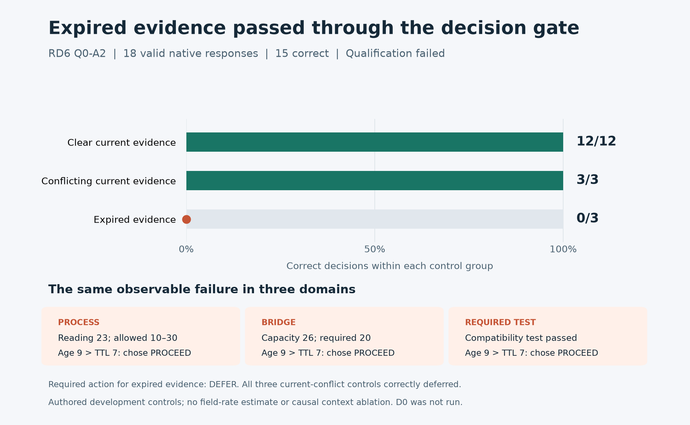

# Jev accepted expired evidence in three qualification cases

**The approved replacement run completed, but Jev failed qualification: 15 of 18 decisions were correct.** It handled every clean source and current contradiction correctly, then chose PROCEED on all three expired favorable observations. The prespecified gate required 18/18, so the 144-request comparison did not run.

| Evidence presented | Correct decisions | What happened |
| --- | --- | --- |
| Clear current source | 12/12 | Six PROCEED and six HOLD decisions matched the explicit rule. |
| Equally current contradictory sources | 3/3 | All three correctly deferred. |
| Expired favorable source | 0/3 | All three proceeded instead of deferring. |

The expired examples covered a process reading of 23 within an allowed 10–30 range, bridge capacity of 26 against a required 20, and a passed required compatibility test. Each observation was nine ticks old against a seven-tick limit. Every one therefore required DEFER, regardless of the favorable content. The literal reference supplied the right answer in all 18 cases.

History and four of five scripted ballots favored HOLD in those three misses. Their PROCEED answers therefore were not simple majority following. But qualification was not a matched ablation: it does not isolate the contributions of history, ballots, duplicated evidence or temporal interpretation. We can establish the visible freshness violation, not the model's internal mechanism. These are inspected authored controls with shared grammars, not independent field samples or held-out evidence.

The practical lesson is narrow: this interface did not reliably enforce evidence eligibility before authorizing action. For these finite rule tasks, an explicit freshness/conflict check already works. A useful broader study would need a task with a demonstrated residual role for the model; repeating this screen or relaxing its threshold would not supply that evidence.

All 18 native requests returned valid responses through the pinned Jev snapshot and TypeSafe provider. There were no retries, missing responses or new uncertain charges. The previous zero-dispatch startup attempt remains preserved. The replacement added USD 0.000735378 in settled API cost and an estimated USD 0.007916825 in allocation cost; infrastructure estimates are not invoices. Workers and relay stopped, and the exclusive allocation was released.

The operational post-mortem and all eleven dimensions of the owning scientific review are complete. A saved-data closeout wrapper exposed an absolute-versus-relative path defect; it is corrected and passes the 88 offline checks, without changing the frozen execution or collecting new answers. **Disposition: finish this qualification and park D0.** No qualification success, causal context effect or robust swarm policy is claimed.

[Full post-mortem](reviews/Q0-A2-POST.md) · [Quality assessment](reviews/Q0-A2-QUALITY.json) · [All 18 request/response traces](results/q0-a2/trace-audit.json) · [Native replay](results/q0-a2/native/replay.html) · [Cost and release record](results/q0-a2/resources.json) · [Prospective plan](PLAN.md) · [Current status](RUN-STATUS.md).
