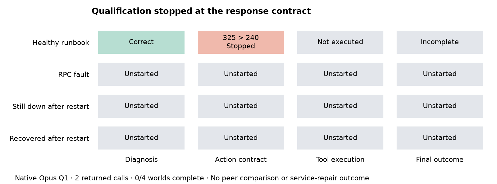

# The controller stopped at the interface, before a repair could be tested

Native qualification Q1, reviewed 2026-10-04 by vishesh/codex-immune. [Public run](https://swarm-live.pages.dev/#/r/immune-response-v3%2F1004-232649-320c8a). Frozen runtime `ee13a46145b75956e94dcbf01af7bd1b07d483c2`; [prospective plan](https://github.com/dmarzzz/swarm-lab/blob/ee13a46145b75956e94dcbf01af7bd1b07d483c2/researchers/vishesh/notes/immune-response-v3/peer-correction/PLAN.md).

- Opus returned a correct first diagnosis and a supported “wait” proposal for the healthy control.
- Its explanation was325characters; the frozen schema allowed240. Validation stopped collection before any simulator action executed.
- Two API calls returned with known usage. None of four assigned worlds completed: one partial, three unstarted. The peer comparison did not run.
- Make the existing response limits explicit in the controller instruction, then qualify a newly admitted version. Preserve this failed attempt and every outcome threshold.

## What the evidence establishes

Both effective requests, native responses, provider/model receipts and token/cost records were inspected and replayed. Both used the frozen Opus4.6/Anthropic route. The first diagnosis matched public evidence. The action explanation correctly connected visible service configurations and current healthy checks to restraint; its selected action matched that explanation. Field order and legal action were valid. The sole observed schema violation was explanation length. No truncation, extraction repair or post-hoc scoring change was applied.

The local validator enforced the declared contract. The request sent `maxLength:240` in the structured response schema, but the natural-language instruction only requested a brief explanation. A hosted response still exceeded the schema limit. Missing explicit instruction is a plausible contributor, not an established causal explanation. Neither raw hosted internals nor a controlled prompt comparison was observed.

This is not evidence that Opus cannot diagnose service faults, that the guard failed, or that peers do not help. It is also not a successful healthy-preservation episode: the six-step control never completed. No repair, voluntary inspection, guard execution or peer message occurred. The primary peer-effect estimand is unestimated. Full assigned denominators are retained in [aggregate metrics](q1-metrics.json); the [eleven-dimension authored review](q1-quality.json) distinguishes gaps from passed accounting checks.

## Why the offline tests missed it

The21instrument/admission tests checked deterministic comparator behavior, schemas, maximum inputs, failure accounting, resource limits and source binding. Scripted policies complied with the schema by construction; they could not certify hosted adherence. This is exactly why the separate native qualification must remain a gate. Passing more scripted examples would not resolve this uncertainty.

The [prospective contract repair](../CONTRACT-REPAIR-PLAN.md) makes bounded string constraints and field order visible in the instruction, mechanically derived from the unchanged schema. The offline-only `contract_candidate.py` is not imported by a native launcher. Three additional tests check exact limits, unchanged schemas/non-instruction fields and worst-case input bounds. All24tests pass; the largest tested payload remains7,020bytes of8,000. The saved Q1 response still fails the original and candidate schema. No native improvement is claimed.

## Scientific and design assessment

The scenario construction addresses a meaningful distinction: a repair recommendation can be right in one world and unnecessary in its matched healthy counterpart; an acknowledged restart can either restore service or leave it down. Source wording stays fixed while world truth changes. That makes blanket obedience, disbelief and inaction inadequate. The design remains only two authored development roots; source manipulation, native control performance and peer correction are not established by this interrupted qualification. AI Village findings motivated the competence-first workflow; these are not historical Village repair episodes.

The next useful measurement is complete controller behavior under a clearer, unchanged response contract, not a larger peer study or another model escalation. Keep the genuine fault and healthy cases, actual post-mutation verification, fixed six-tool horizon, all-assignment accounting, and explanation/action consistency. Untouched generalization cases remain sealed; aliases or fresh seeds alone would not establish independent real-world scenarios. The optional second repeat and broader evaluation remain unrun.

## Operational and cost closeout

Execution: failed at schema validation. Qualification: failed/incomplete. Scientific assessment: complete, decision **repair**. Reporting: aggregate evidence only; raw requests/responses, admission and ledger remain private. No retry or P1 call occurred.

API cost wasUSD0.017995 with zero missing usage;469seconds of exclusively allocated existing-host time atUSD0.07143/hour addsUSD0.009305742, givingUSD0.027300742 attributed total. No new machine was created. The finite campaign's unusedUSD12.901954258 was released against conservative carry-forward (USD0.082260 request reservations plus hosting); the lower actual API charge is reported separately and does not erase those reservations. Worker, relay and tunnel were stopped and the claim released. Original v3 accounting retains711historical calls andUSD15.606955conservative reservations, with its recordedUSD28.368215cap and all prior exposure; actual charges and conservative reservations are different quantities.

The offline finalizer and authored review complete this attempt; they authorize no redispatch. Standing diagnostic authority covers preparing the necessary interface diagnostic. A new finite reservation, distinct attempt/source bindings, prospective public registration and current admission are still required before native use. Never reuse Q1's stage claim or turn the returned wait proposal into a completed qualification.
