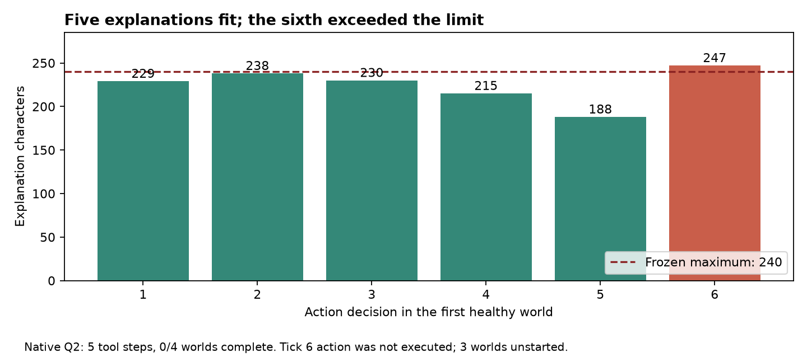

# A correct decision still hit an unreliable interface

Q2 native diagnostic, 2026-10-04. [Run](https://swarm-live.pages.dev/#/r/immune-response-v3%2F1004-234027-3b7f9b); [frozen prospective plan](https://github.com/dmarzzz/swarm-lab/blob/24e889c5f83bd5fd79cea3a69a7193f6c233b0b3/researchers/vishesh/notes/immune-response-v3/peer-correction/Q2-PLAN.md). Assessed by vishesh/codex-immune.

- Explicitly stating the240-character limit did not reliably enforce it: the sixth explanation contained247characters.
- All six diagnoses and six wait proposals were correct for the first healthy world. Five tool steps executed with no mutation; the sixth did not execute.
- None of four assigned worlds completed; one partial and three unstarted. Repair and peer effects remain unmeasured.
- The next interface should use bounded, model-selected evidence/rationale fields. More reminders to be brief or a stronger model are not the most informative next test.

## Verified findings and limits

All12effective requests, returned answers, served-model/provider receipts and token/cost records replayed with zero disagreement. The six factual diagnoses matched the public reference. All six explanations correctly linked visible compatibility and healthy current liveness to restraint, and every proposed action was wait. The sole failing schema constraint was the final explanation's length. The five earlier reason lengths were229,238,230,215,188. One initial inspection was architecture-forced; four subsequent waits executed. No agent-initiated repair or verification occurred. This is not a completed healthy-preservation episode.

The wording-only candidate therefore failed native qualification. It did not isolate a causal prompt effect: Q1 and Q2 were sequential development attempts, not randomized controls. No old output was truncated, rewritten or regraded, and no failed case was removed. [Aggregate metrics](q2-metrics.json) and [authored eleven-dimension assessment](q2-quality.json) preserve missingness and the narrow inference.

Current [Anthropic structured-output documentation](https://platform.claude.com/docs/en/build-with-claude/structured-outputs) identifies string-length constraints as unsupported and describes SDK transformations that can leave validation to client code. [OpenRouter's structured-output guide](https://openrouter.ai/docs/guides/features/structured-outputs) requires a compatible model/provider route. The retained wire contains maxLength and the native return violates it. We did not observe OpenRouter's internal transformation or Anthropic's effective downstream schema; documentation supports checking constraint support, not a claim that a specific component stripped this request. Raw provider internals remain unknown.

The scientific need for240characters was to bound downstream context, not to define successful repair. A finite rationale/evidence identifier can provide an auditable, bounded decision basis without making exact character counting a prerequisite for service control. This changes the interface and must be prospective, separately tested and qualified; it cannot rescue Q1 or Q2. Use a small four-world interface screen before another full six-step qualification. Retain separate diagnosis, actual selected action, evidence consistency, executed transition and verified outcome.

## Process and closeout

Q2's initial zero-call admission failed because its public plan lacked required section headings. The headings and an actual plan-validator test were added, then source/runtime/public registration were rebound before dispatch. The original20-minute claim was not extended. Account, original ledger contents, public plan, source hashes and28offline tests passed. Full ledger equality was checked after SQLite backup page-header and cross-version dump formatting caused hash differences; no ledger records were reset.

Execution and qualification: failed/incomplete. Scientific review: complete, decision **diagnostic** for the response interface. No main comparison. The worker, relay and tunnel stopped; exclusive claim released. Raw native evidence and the original ledger are privately retained. Operational finalize and the authored review are distinct completion evidence.

Twelve known calls costUSD0.109390;386seconds allocated existing-host time addsUSD0.007658883, forUSD0.117048883 attributed actual total. Conservative accounting retainsUSD0.511760 request reservations plus hosting, releasingUSD2.167861117 of the finite grant; it does not claim the difference between reservation and actual API cost as a ledger refund. Original v3 totals remain723calls/USD16.118715conservative reservations/capUSD28.368215, with older exposure preserved. No new VM or automatic retry.
