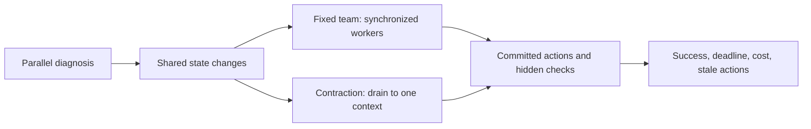

# Twelve candidate development worlds

Brainstormed contracts only: no native runs, collected cases, independent sample count or benchmark reproduction is claimed. Each needs a different executable causal graph, a checker and a source/template cluster before admission. Similar stories from one underlying generator remain dependent. The future sealed cases must not be slight edits of these examples.

| World | Initial investigation and later coupling | Checkable resolution | Strong simple competitor / failure to detect |
|---|---|---|---|
| Incident A: stale endpoint after failover | Compare frontend errors, resolver cache and replica state; a failover changes the authoritative endpoint during investigation. | Reads/writes reach the new primary; old endpoint removed; healthy services remain available. | One agent refreshing endpoint state before commit. Catch a correct repair applied to an obsolete target. |
| Incident B: connection-pool saturation | Inspect service pool limits and database capacity; a deployment changes one consumer's pool while another worker reallocates capacity. | Every service passes load checks and aggregate reserved connections fit the database limit. | Deterministic global resource allocator. Catch locally valid increases that jointly exceed capacity. |
| Incident C: certificate rotation | Inspect trust stores and expiry paths; certificate and client-trust changes must be ordered. | Every required client authenticates throughout the allowed rotation window; no permanent trust bypass. | Dependency-ordered transaction script. Catch intermediate outages hidden by a healthy final state. |
| Incident D: poisoned message and retries | Inspect queue consumers and message histories; one worker changes retry policy while another quarantines/replays messages. | Required messages processed exactly once, poison isolated and legitimate backlog drained. | Idempotent queue controller. Catch a duplicate effect masked by a final empty queue. |
| Incident E: cache stampede | Inspect misses, backend load and cache invalidation; workers independently propose warmup, throttling and TTL changes. | Required load served within capacity, current values returned, no indefinite stale-cache workaround. | Fixed rate limiter plus cache warmer. Catch throughput purchased by stale answers. |
| Incident F: rollback crosses configuration versions | Compare current rollout, feature flag and database compatibility; rollback changes the valid configuration combination. | Chosen image/schema/flag combination passes compatibility and service checks. | Constraint checker plus serial executor. Catch a stale but syntactically valid configuration. |
| Migration A: enum extension across services | Trace producers, parser validation and stored values; a contract adds a new enum variant. | Old and new payloads pass hidden round-trip and persistence tests. | Single agent with repository search and tests. Catch updating the producer but not every consumer. |
| Migration B: authentication scope rename | Inspect middleware, client SDK and migration rules; staged compatibility requirements change allowed scope spellings. | Correct requests accepted, forbidden requests rejected, compatibility window honored. | Explicit compatibility matrix and rule-driven edits. Catch a permissive fix that passes only happy-path tests. |
| Migration C: event schema and replay | Explore event emitters, consumers and historical fixtures; a new schema must coexist with old replay records. | Live and historical fixtures decode without data loss; duplicate-event semantics preserved. | Versioned schema tooling plus one integrating agent. Catch tests run only against fresh records. |
| Migration D: timeout budget propagation | Trace gateway, service and client timeout defaults; one module changes units or retry behavior. | End-to-end deadline tests pass under controlled slow responses with no retry amplification. | A deterministic budget validator. Catch individually reasonable defaults that violate the system deadline. |
| Migration E: package export and build boundary | Inspect exports, generated bindings and downstream builds; concurrent work adds a symbol not yet in the releasable artifact. | A clean checkout/package installation builds and passes downstream tests. | Clean-build validation with a single agent. Catch working-tree success that fails from committed output. |
| Migration F: cache-key format transition | Inspect writers, readers, invalidation and rollout order; mixed old/new processes coexist. | Correct reads and invalidations across versions; bounded migration without returning another user's entry. | Scripted dual-read/single-write rollout. Catch a globally inconsistent key convention. |

## Construction and challenge requirements

For each world, author at least two plausible diagnoses and evidence that separates them through legal tool use. Include an irrelevant update to test whether the policy mistakes all version changes for important conflicts. Exogenous events cannot be chosen after observing which arm is winning. The same initial data and event tape go to each matched arm, with real differences only in declared coordination/roster policy.

A scenario is not ready because its reference script succeeds. Mutate the reference with a wrong target, missing prerequisite, stale version, duplicate action and a valid alternative action order. Check that the evaluator rejects substantive errors and accepts equivalent correct strategies. Keep the solution, fault labels and evaluator source outside actor workspaces. Inspect generated filenames and scenario metadata for answer leakage.

For real source-backed cases, record the repository/incident provenance, permission to use the material, original cluster and any simplifications. A lightweight incident emulator is a controlled operational analogue; it is not a production outage reproduction. A small generated repository is a mechanism fixture; reserve actual project issues for transfer after capability is established.

## Example visual, planned rather than observed

Recorded replays will show the same root and event tape, not fabricated agent movement. The compelling outcome might be the fixed team winning: good synchronization can preserve parallelism that contraction unnecessarily throws away.
