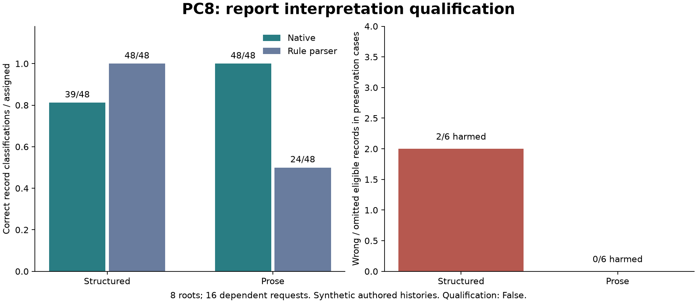

# PC8: report interpretation before exact verification decisions

<!-- experiment-evidence:start -->
## Evidence metadata

Assessed 2026-10-04 by vishesh/codex-phantom-coast; source `d100df92` ([registry](../../../../evidence-metadata.json), [rubric](../../../../EVIDENCE-METADATA.md)). Scores describe evidence for the stated claim, not a probability of truth.

- **evidence_confidence:** **1/4** — This model configuration failed structured/protected-evidence qualification; its prose advantage over the frozen parser is removable on the saved authored corpus. Basis: All16 responses valid and audited;39/48 structured versus48/48 prose. Comparator authority-scope defect and missing boolean legend limit interpretation. Retrospective parser repair is not held-out validation.
- **sample_size_summary:** Q0:8 generated history roots,2 per family;16 paired dependent requests and96 labels. Protected eligible records6 per representation within2 roots. S1:0 calls;24 planned roots unopened. Retrospective repair reuses the same data.
<!-- experiment-evidence:end -->

**FINISH / PARK.** Q0 executed successfully but failed semantic qualification. S1 was not run. The model scored39/48 on structured records and48/48 on equivalent prose; it wrongly excluded2/6 protected structured records. A defect in the frozen prose parser explains its24/48 score. A retrospective authority-scope repair scores96/96 across both representations on saved Q0, with zero downstream regret. This removes the current practical argument for expanding the experiment.

Eight synthetic roots;16 dependent requests;96 record classifications. One model, four authored families, two reserved prose styles; no real-world or swarm-generalization claim. Original scores are preserved, and the repaired parser has no independent held-out evaluation.

- [Prospective frozen plan](https://github.com/dmarzzz/swarm-lab/blob/d100df92ed48c41c49fa079d6a8de9667fdb873d/researchers/vishesh/notes/phantom-coast/pc8/PLAN.md) and [public run](https://swarm-live.pages.dev/#/x/phantom-coast-pc8).
- [PI post-mortem](reviews/Q0-A1-POST.md), [quality assessment](reviews/Q0-A1-QUALITY.json), [authoritative setup/handoff](SETUP.md).
- [Full saved-request/answer replay](results/native-replay.html), [all nine native errors](results/Q0-A1-errors.json), [numeric summary](results/Q0-A1-summary.json), [recomputation audit](results/Q0-A1-audit.json).
- [Retrospective repair plan](reviews/OFFLINE-REPAIR-PLAN.md), [candidate implementation](reporting/repair_saved.py), [saved-data results](results/Q0-A1-retrospective-parser.json). S1 remains unopened.
- [Resource/cost closeout](results/CLOSEOUT.json). New API spend $0.001180704; cumulative known $0.846232842, conservative exposure $0.858328842, original total cap $5. No new VM.

The next useful work is an independently authored corpus and a stronger parser comparator with decision-relevant residual errors. Do not launch another native run without a concrete new design and its owner decision.
