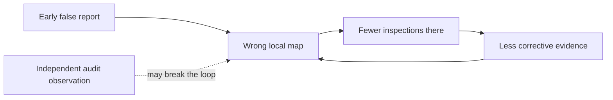

# Second pass: a false world and a false crowd

2026-10-04. Editorial re-review by vishesh/codex-decision-models after the owner preferred Phantom Coast and Quorum of Mirrors. All variants below are exploratory hunches. No model calls, experimental implementation, accepted hypotheses or observed effects are reported.

## What the preference changes

My interpretation, not a claim about the owner's motives: the preferred ideas make a strange collective phenomenon easy to picture. Phantom Coast has a world that can visibly become wrong. Quorum of Mirrors questions whether a crowd contains more than one independent judgment. Both create an immediate tension between what the viewer knows and what the group decides.

The other pitches started with safeguards or infrastructure. Stop-Signal sounded like a communication rule, Panic Queue like overload testing, and Menu Parasites like an API edge case. High practical scores did not guarantee an engaging scientific question. That is a limitation of the original weighted screen: visual polish and practical utility can score well without a surprising causal story.

Keep the historical 30% visual / 30% practical / 25% biological-theoretical / 15% team-novelty scores intact. Do not inflate numbers after learning which names the owner likes. This second pass adds an editorial choice: can the result distinguish two plausible explanations, be understood visually, and change how we build a collective? Rankings below are judgments, not new measurements or independent review.

## Phantom Coast: compare four versions

| Variant | The interesting question | Best feature | Main weakness | Disposition |
|---|---|---|---|---|
| **The Island No One Visits** | Can a false belief steer exploration away from the evidence that would correct it? | Belief changes behavior, which changes future evidence | An avoidance rule could manufacture the trap | Strongest flagship story; qualify a real decision-dependent mechanism |
| **Two Swarms, One World** | Can identical models settle on incompatible maps after different early histories, despite equal final evidence? | Clean, striking side-by-side contrast | Context order, retained records or serialization may explain everything | Best bounded first causal study |
| **The Ghost After Retraction** | What keeps a false region alive after its original report is withdrawn? | Separates correction from mere message removal | Stale memory can create trivial persistence | Recovery stage, with explicit retraction and renewed observation |
| **The Tipping Atlas** | Which source layouts let a local error spread beyond its original footprint? | A map of where communication helps or harms | Expensive sweep; easy to overclaim a phase transition | Later extension if propagation is demonstrated |

### Strongest version: The Island No One Visits

**Pitch:** Can a swarm become wrong in a way that prevents it from finding out?

Picture a hidden fictional archipelago. Scouts receive noisy local reports and choose where to inspect next under a fixed observation budget. A bounded early report labels a real island as water. The report is then explicitly withdrawn. The proposed phenomenon is that the swarm keeps treating the region as settled, directs its observations elsewhere, and fails to rediscover the island. Nothing changes in model weights: any persistence is in supplied state, communication and observation choices.

This is more interesting than a changed label because the false map can become self-maintaining through action. An illustrative sequence is:

This diagram is a proposed mechanism, not an observed trajectory. The objective must reward accurate mapping of the entire world, not obedience to the rumor or avoidance of water. Every cell remains inspectable. Do not hard-code “predicted water is forbidden”; the inspection decision is the quantity under study. A calibrated deterministic exploration policy is a serious baseline, not an intentionally weak opponent.

**Make the inference in stages.** First test fixed observation schedules to isolate how reports change judgments. Then allow inspection choices to affect future observations. Keep the initial information, available sensor process and total budget matched. Realized observations may differ in this second stage: that is the proposed mediator, so forcing them equal would erase the question. Use a separately specified replay or forced-audit intervention to test whether restoring exposure corrects the map.

Compare no social exchange, ordinary exchange, source-aware exchange, a pooled-evidence single Jev solver and a deterministic mapper. Separate buying new observations from spending calls rereading existing ones; report both costs. Use the same held-out paired worlds, fixed criteria, benign same-length reports and random corruption controls. Retraction must be distinguishable from silently deleting an input.

**The outcome worth seeing:** the true island stays visible in an evaluator-only panel while its footprint fades from the swarm map and scout tracks bypass it. An audit may restore both the coastline and exploration. All panels must display measured decisions, missing calls and actual observation history; no scripted triumph.

**Competing outcomes:** if the correct information reaches agents and they still misclassify, this is a judgment problem; if the information never reaches them because of choices, it supports the observation-feedback account; if a stale database alone sustains the error, narrow the claim to state management. If the exact deterministic rule explains the full effect, do not market it as a Jev discovery. Efficient rediscovery is an informative positive result too.

**Core endpoints:** missed land under area weighting, inspection coverage of the seeded region, recovery after explicit correction, mapping accuracy per observation and error outside directly exposed cells. Sample independent worlds, not individual tiles, for uncertainty. Use a factual-change control in which an island really changes state, so persistence is separated from reasonable stability.

**Biological connection:** information gathering and collective sensing are relevant mechanisms [[berdahl-2013-emergent]]. Self-confirming learning is established in other settings [[fudenberg-2019-learning]]. The candidate increment is a measured loop through Jev judgments, communication and sampling, with a way to break it. It is not proof of an internal world model or literal belief.

### Cleaner first study: Two Swarms, One World

Start two otherwise matched swarms with counterbalanced early report order. Later give them the same complete multiset of uniquely identified observations. Test whether their predictions converge. Cross presentation order with social exchange and reset versus retained state. Normalize final serialization and token budgets in a separate common-input reset check; equal factual content alone does not mean equal requests.

Persistent separation under retained histories, followed by convergence after reset, would localize the effect to externally carried history. Failure even after a common-input reset would first require checking service variability and model-version drift. A second pair of true worlds tests appropriate adaptation rather than rewarding stubborn consensus. This version can give a meaningful answer without an elaborate exploration environment.

The Ghost and Tipping variants reuse this apparatus. Persistence is finite-window persistence, not permanent delusion; threshold-like behavior in a small grid is not yet a phase transition. “Erase the United States” stays an optional Earth demo because geographic memory and political labels complicate truth. Synthetic worlds supply the causal test.

## Quorum of Mirrors: compare four versions

| Variant | The interesting question | Best feature | Main weakness | Disposition |
|---|---|---|---|---|
| **One Witness, a Hundred Votes** | When does copied evidence acquire the apparent authority of independent agreement? | Makes dependence visible and experimentally controllable | Repeated evidence is established prior work | Flagship, with source-aware baselines and opaque-lineage cases |
| **The Right Dissenter** | Can one new observation overturn a crowd repeating an old mistake? | A clear confrontation with a measurable rescue | Knowing which dissenter is right would leak truth | Main stress test; pair correct and incorrect dissent |
| **The Next Observation** | Is another observation more valuable than another judge? | Direct operational decision | Overlaps optimal-swarm-size work | Budget ablation, not a separate research area |
| **The Crowd That Learns to Agree** | Does communication improve agreement faster than it improves correctness? | Shows confidence and accuracy diverging | Familiar herding story; agreement can be useful | Diagnostic plot within the flagship |

### Strongest version: One Witness, a Hundred Votes

**Pitch:** When does a hundred-agent consensus contain only one observation?

“A hundred” is the explanatory hook, not an authorized run size. In one illustrative condition, a single report travels through many decision makers and returns as many endorsements. In another, an equally sized crowd receives independent reports. The screen can show the same vote count in both, then reveal how many distinct observations support it. Agreement alone cannot distinguish these histories.

Use a factorial design that independently controls unique source count, number of decision makers and communication rounds. Hold the unique-source budget fixed for a duplication contrast, and use a separate equal-total-resource contrast for acquiring new evidence. Do not pretend all three resources are constant while changing all three. Count transmitted records, tokens, model calls and paid observations. Condition correlation analyses on task difficulty; easy and hard items alone can create apparent dependence.

Define provenance through evaluator-recorded observation ancestry. In the accessible-provenance condition, agents get real source identifiers and reliability information without truth labels. In a separately labelled hidden-provenance condition they get only partial ancestry. An omniscient deduplicator is an upper bound there, not an implementable defense. Agent self-reported citations are not the ground-truth provenance graph.

Include majority voting, source deduplication, calibrated evidence accumulation, a pooled-evidence single Jev solver, and no-discussion decisions. Test copied wording and meaning-preserving rephrasing separately; preserve all factual assertions in the rephrasing control. If simple deduplication solves the problem, report that. A nontrivial result would identify when incomplete lineage or Jev's treatment of peer endorsements defeats a method that succeeds with clean source records.

**The decisive scene:** the crowd agrees, but tracing its endorsements reveals a single ancestor. Then a new observation arrives. In one paired case it corrects the crowd; in another it is a noisy false alarm. The policy must decide using available evidence, not a designated “truth teller.” A small minority is neither automatically correct nor automatically negligible.

**Outcomes:** wrong unanimous decisions, change in reported probability when no new source arrives, decision accuracy per independent observation, and response to correct versus incorrect new evidence. Treat returned confidence as an unvalidated model quantity until calibrated. Show a source-ancestry graph alongside votes and a correctness matrix; do not turn a correlation statistic into a claimed literal count of independent minds without its assumptions.

Repeated-information pathology already has explicit theory and removal algorithms [[hamdi-2013-removal]]. Jev and LLM judges can also share errors [[rao-2026-jev]]. Those are reasons to reject the generic “more agents can be wrong” paper. The narrower opening is intervention: which evidence allocation or lineage treatment changes the value of a Jev quorum, and when does another model call cease to help?

The Jev-specific feature is its controlled typed decisions and returned distributions, with frozen criteria and varied state. The phenomenon itself need not be exclusive to Jev. A later matched comparator would be needed for any claim that Jev is unusually susceptible. The biology connection is distributed sensing and social dependence, not treating cloned model calls as independent organisms [[berdahl-2013-emergent]] [[lorenz-2011-how]].

## Why the other three may not have landed

These are possible explanations for the reaction, not assumptions about what the owner thinks.

| Original | Why the pitch may feel weak | Stronger question and illustration | Remaining weakness | Recommendation |
|---|---|---|---|---|
| Stop-Signal Swarm | It names an intervention before making the conflict interesting | **When should a swarm disobey itself?** A lone scout finds land where the crowd says water. Can it interrupt a bad consensus without letting every false alarm paralyze the group? | Minority protection can become truth leakage or ordinary throttling | Fold into The Right Dissenter; strongest of the three after reframing |
| Panic Queue | Sounds like capacity planning, with an obvious overload result | **Can a swarm fail while every completed answer looks accurate?** Difficult cases consume all review capacity; the accuracy panel stays green while unresolved work misses its deadlines | A conventional queue may explain it completely; biology link is weak | Keep as a reserve operational project, only promote on evidence of collective feedback |
| Menu Parasites | Sounds like renaming buttons, and the title hides what changes | **Can naming a place twice change where a swarm goes?** Two identical opportunities compete until one acquires several aliases; agents may herd there even after aliases are collapsed | Probability splitting, option count and label bias already explain much | Use as a compact choice-invariance probe inside Phantom Coast |

Stop-Signal's interesting tension is responsiveness versus susceptibility: the group needs dissent to recover but cannot know in advance which dissent is correct. Honeybee cross-inhibition provides a concrete mechanism to compare with random suppression and bandwidth limits [[seeley-2012-stop]]. It becomes compelling when attached to an event the viewer cares about, such as the island being rediscovered.

Panic Queue's scientific endpoint should be **correct, on-time completions over all arrivals**, not accuracy among accepted answers. To earn a swarm claim, compare with a fixed queue receiving the measured individual escalation rate at the same capacity and load. Without a residual communication-dependent effect, this remains useful engineering rather than a flagship collective phenomenon. The previous practical score was defensible; its headline priority was too high for this owner's expressed interest.

Menu Parasites should preserve action-level truth and utilities. Sum probability over aliases before claiming changed preference; isolate arithmetic dependence of the confidence statistic on menu size [[typesafe-2026-confidence]]. Neutral-ID controls are essential because label effects already have direct Jev prior art [[sun-2026-type]]. A visible rerouting of a map swarm is a stronger illustration, but does not by itself increase scientific novelty.

## Recommended shape of the research area

Keep **two projects with a shared test world**, not five competing builds:

1. **Phantom Coast — The Island No One Visits:** what the collective believes determines what it gets to learn. Use Two Swarms, One World as the bounded first causal comparison.
2. **Quorum of Mirrors — One Witness, a Hundred Votes:** what looks like agreement may contain little independent evidence. Use The Right Dissenter as the critical recovery test.

Stop-Signal becomes a candidate recovery mechanism. Menu Parasites becomes an interface ablation. Panic Queue stays a separate reserve question because adding reviewer capacity would dilute the first two mechanisms.

For visual appeal, Phantom Coast remains first. For clean identification and a useful answer even if the dramatic effect fails, Quorum is first. Quorum's matched-evidence scaffold should precede any complicated Phantom exploration loop. Avoid expanding it into the existing general optimal-swarm-size study or the separate heterogeneous-model project.

Both must be able to fail as stories: a swarm that promptly corrects itself or properly discounts duplicate reports is a legitimate result. No selected animation may substitute for the full distribution of held-out outcomes. Publication, review, allocation and budget gates remain unchanged; this memo neither implements nor launches an experiment.

## Reading update

Freshly opened the primary metadata/abstract pages for [[hamdi-2013-removal]], [[fudenberg-2019-learning]] and [[rao-2026-jev]], plus Hamdi's HTML introduction and the current model specification [[typesafe-2026-models]]. Added the two missing foundational records at abstract depth. The other citations reuse the first scan and retain its access limitations. No new full-paper or saturation claim; the formal survey remains in progress.

