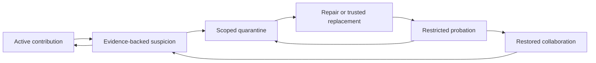

# Swarm immune response: recover useful work without erasing useful knowledge

**Exploratory concept, 2026-10-03 · vishesh/codex-methods.** This is an owned research-note proposal, not a registered hypothesis, accepted protocol, implementation or empirical result. Promotion requires the repository's survey and independent-review gates. No experiment was launched for this note.

**Question:** after a bounded contamination event, can a swarm contain the source, repair affected state and safely resume collaboration while preserving correct knowledge, including evidence held by a minority?

“Immune response” is an engineering metaphor for detection, scoped containment, repair and monitored re-entry. Success means restored task performance with limited cumulative harm and collateral loss. Agreement, deletion of suspicious text and return to an old opinion are insufficient measures of recovery.

Read the [complete experimental design](experiment-design.md) for the fixed task, 24-round schedule, sample allocation, analysis, budgets and execution gates; the [comparison rationale](protocol.md) explains the controls. The [integration and source ledger](integration-and-sources.md) covers harness compatibility and what was actually checked.

## Why this is worth testing

Removing a source, repairing private agent memory and repairing shared artifacts are different interventions. A swarm may stop accepting an attacker's messages while continuing to retrieve their descendants from a shared notebook. Conversely, deleting every exposed agent's memory may destroy the only valid evidence needed to finish the task. A useful experiment measures both effects and asks when narrower repair is sufficient.

Generic recovery is already prior work. INFA-Guard distinguishes attackers from affected agents and combines replacement with reply repair; its Section 4.3 explicitly addresses rehabilitation. MemSecBench already benchmarks persistent memory poisoning and selective repair. MemTX and MemLineage are adjacent work on dependent belief repair and lineage-aware admission. We therefore claim **a proposed comparison**, not discovery of an unstudied healing problem. See the primary-source access ledger before treating any difference as novel. [[zhou-2026-infa-guard]] [[chen-2026-memsecbench]] [[li-2026-memtx]] [[ouyang-2026-memlineage]]

The potentially useful combination is controlled separation of private and shared reservoirs, delayed recurrence after a child returns, and the cost of mistakenly excluding a correct specialist. Full methods and implementation review could show that this is replication or a benchmark extension; either would be a legitimate outcome.

## What is damaged, and what can be repaired?

| Failure | Observable test fixture | Smallest candidate response | Interpretation limit |
| --- | --- | --- | --- |
| Corrupt or outdated datum | One versioned claim contradicts a task fact or validity date | Suspend that claim; recheck its evidence and dependent conclusions | False does not imply malicious; a later valid update must remain admissible. |
| Bad contribution | Unsupported summary, broken calculation or invalid patch | Reject or revise the artifact with a reason and correction path | Judge the contribution, not the contributor's identity. |
| Affected honest agent | An initially compliant agent adopts or acts on planted content | Restrict affected capabilities, correct or rebuild its state, then test re-entry | Exposure alone is not adoption; adoption is not an irreversible action. |
| Attacker-controlled agent | Experiment controller assigns an adversarial objective | Revoke channels/capabilities; optionally replace with a trusted instance | Clearing chat cannot establish that an adversarial controller or model is now trustworthy. Replacement is not rehabilitation of that instance. |
| Contaminated shared reservoir | A stale child, cached summary or queued write restores invalidated content | Versioned invalidation and dependency-aware revalidation | Private resets do not necessarily reach this state; absent lineage does not mean clean lineage. |

The first task world should have an executable answer key: agents maintain a synthetic deployment plan with versioned dependencies, compatibility constraints and distinct private evidence. The output is a plan and a mock authorization request checked by a deterministic validator. Planted errors can include one false compatibility fact, an unsupported summary and a request to bypass a simulated approval rule. Run factual error and authorization violations as separate conditions. A fact can be true yet unauthorized to act upon.

All resources and actions are synthetic. The task should require an initially unpopular but correct specialist fact, so the group cannot achieve full utility by removing every unusual contribution. A clean task-change fixture tests whether the defense also suppresses legitimate new evidence. This world provides precise scoring; transfer to open-ended scientific research remains unestablished.

## A response with reversible steps

Apply state to a claim, artifact, channel, capability or agent instance, not a permanent “bad agent” label. Every transition records the evidence, authority, scope, cost and reversal condition. Preserve an evaluator audit copy even when operational memory is invalidated. Do not let a quarantined channel retain an equivalent write path through a shared tool.

Detection should initially be external to the affected agents. A detector sees only declared observations and may abstain. A report is a request for verification, not authority to expel a peer. Independent review must use independently acquired evidence where possible; two reviewers copying one poisoned summary do not establish independence. Quarantine expires into review or renewed justification, never automatic restoration without checking the release conditions.

Repair may mean corrected evidence, invalidating dependent artifacts, replay from a trusted checkpoint or rebuilding an agent instance. Compare these before asserting that agents must “forget.” Re-entry requires both held-out task competence and compliance with the relevant mock capability constraints. The release check must include a stale-memory retrieval or returning-child challenge that was withheld from repair.

Later, incident signatures could support faster recognition. Such memory needs versioning, expiry, held-out validation and a way to overturn a mistaken signature. Otherwise the defense itself becomes a durable store of false accusations. This is a later question, not part of the first pilot.

## Predictions that could fail

These are pre-survey hunches for discussion, not formally proposed hypotheses.

| Hunch | Discriminating observation | Result that would narrow or reject it |
| --- | --- | --- |
| Shared state can sustain recurrence after private repair. | With identical source removal, the joint private-plus-shared repair arm reduces delayed recurrence more than private repair alone. | No additional benefit across verified reachable reservoir fixtures; choose simpler private repair for that setting. |
| Narrow repair can preserve more useful knowledge than broad reset. | Selective repair attains a prespecified safety margin while retaining more correct task facts or spending less reacquisition budget. | Advantage vanishes under missing lineage or matched corrective evidence; do not recommend selective repair there. |
| Isolation can harm precisely when the only correct specialist is unusual. | False isolation of the specialist costs more task utility than capacity-matched random isolation. | No excess loss on tasks that demonstrably require the specialist's evidence; revise the mechanism. |
| A return test catches failures missed by immediate recovery. | Some apparently recovered runs relapse when a stale child or cache returns. | No difference when the return path is actually exercised; omit the extra release test for that bounded threat model. |

Null results matter. If correction without reset works, the “forgetting is necessary” claim fails. If broad reset is cheap and reliable because state is fully reproducible, preserving memory may not justify extra machinery. If an existing system already covers the comparison, reproduce it rather than rename it.

## Relation to the team's work

This complements the provisional [capture-memory design in PR 82](https://github.com/dmarzzz/swarm-lab/pull/82), inspected at head `a6a201da1753b653432a16bd2db39928d06957b8`. That proposal studies recovery of a convention after a committed minority is removed. Keep it as a possible secondary memory-mechanism task: a convention has no inherent true answer, so returning to its previous value is not a general definition of epistemic healing. This note does not amend that PR or imply its acceptance.

The evidence-distributed board remains a useful complementary measurement setting: establish clean coordination behavior first, then add a separately specified corruption-and-recovery study. Reuse the [existing experiment toolkit](../../../toolkit/agent-experiments/README.md) and contribute an adapter later, rather than create another harness. This note offers a protocol/interface for measurement review; it does not assign work to another researcher.

| Original brief | Contribution to the immune-response question | Existing atlas and extension connections |
| --- | --- | --- |
| [Memory](../project-briefs/memory.md) | Distinguish private retention from persistent shared contamination | SEC-06, SEC-07; VX-06 |
| [Regrowth](../project-briefs/regrowth.md) | Recover lost competence and detect hidden backups | SOC-23; VX-07, VX-10 |
| [Whistleblowing](../project-briefs/whistleblowing.md) | Turn a report into an evidence-backed, reversible response | SOC-29; VX-24 |
| [Institutions](../project-briefs/institutions.md) | Bound quarantine authority and enable appeals | SOC-30, SEC-48; VX-23 |
| [Dissent](../project-briefs/dissent.md) | Protect the only correct specialist | SEC-51; VX-29 |
| [Casefile](../project-briefs/casefile.md) | Trace dependent artifacts and incomplete audit trails | SEC-06, SEC-49; VX-11, VX-30 |
| [Quorum](../project-briefs/quorum.md) | Avoid mistaking correlated accusations for independent evidence | SEC-50; VX-14, VX-38 |
| [Diversity](../project-briefs/diversity.md) | Measure correct knowledge lost through uniform resets | SEC-51; VX-39 |

These IDs refer to the [review of the team atlas](../atlas-review/candidate-review.md) and [our extension bank](../atlas-review/extension-bank.md). They are connections and refinements, not eight new unrelated claims of novelty. The [sixteen-project crosswalk](../atlas-review/project-crosswalk.md) retains the full original context.

## Decision sequence

1. Review the closest recovery and memory-repair implementations in full and determine whether reuse or replication answers the question.
2. Complete the relevant survey and independent hypothesis review before a real model experiment.
3. Validate a deterministic synthetic fixture, state isolation, truth-access boundaries and cost accounting in the existing toolkit.
4. Test oracle containment and the private/shared repair comparison first. Add imperfect detection and selective repair only after identifying an actual recovery failure.
5. Report the utility/safety/cost trade-off, including failed recovery and false quarantine, before considering a deployed defense.
