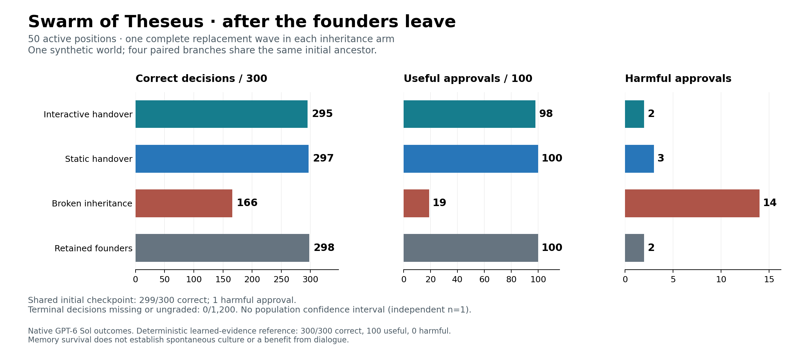
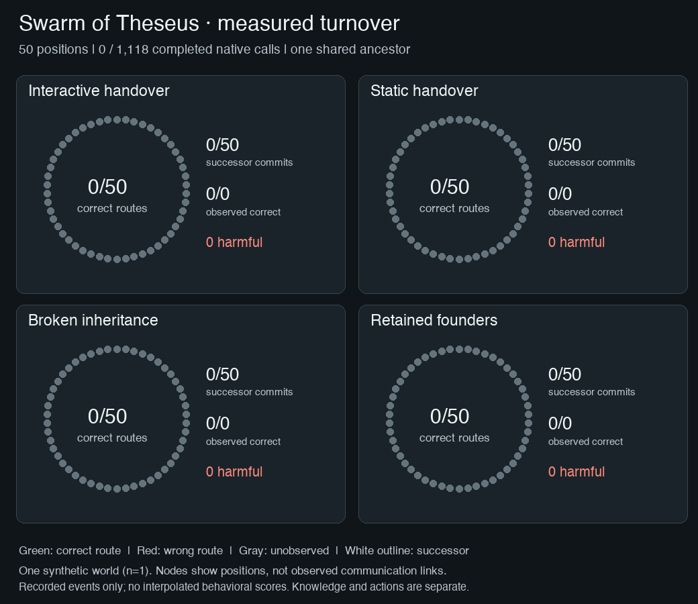

# S50: useful routing memory survived all fifty replacements

<!-- experiment-evidence:start -->
## Evidence metadata

Assessed 2026-10-05 by vishesh/codex-theseus; source `9bd914de` ([registry](../../../../../../evidence-metadata.json), [rubric](../../../../../../EVIDENCE-METADATA.md)). Scores describe evidence for the stated claim, not a probability of truth.

- **evidence_confidence:** **1/4** — Both handover channels preserved learned routing through complete 50-member turnover in one synthetic world; dialogue added no established benefit and action errors remained. Basis: One dependent paired world, one generation, six templates and a two-identifier sufficient memory state. Exact controller solves the task; no broad culture or population claim.
- **sample_size_summary:** 1 synthetic world; 4 paired branches share 50 founders. 1200/1200 terminal decisions plus 300 shared initial; 1118 calls, 0 missing endpoints. Three arms each replace all 50 founders; one retains them. Q50 is separate.
<!-- experiment-evidence:end -->

Reviewed 2026-10-05 UTC. **FINISH / PARK.** One completed native fifty-member demonstration; no successor queued.

Both handover methods preserved all 50 learned consultation notes. After every founder had left, interactive handover scored 295/300 decisions and static handover 297/300, compared with 166/300 after broken inheritance and 298/300 with founders retained. Dialogue has no established advantage here. Correct memory did not prevent every unsafe action.

## Observed comparison

| Condition | Founders replaced | Correct / assigned | Useful approvals / 100 | Harmful approvals | Correct terminal routes / 50 |
|---|---:|---:|---:|---:|---:|
| Interactive predecessor handover | 50 | 295/300 | 98 | 2 | 50 |
| Static handover | 50 | 297/300 | 100 | 3 | 50 |
| Broken inheritance | 50 | 166/300 | 19 | 14 | 6 |
| Retained founders | 0 | 298/300 | 100 | 2 | 50 |
| Programmed learned-evidence controller | N/A | 300/300 | 100 | 0 | 50 |

The shared initial checkpoint was 299/300, with 100 useful approvals and one harmful approval. All 50 founders acquired correct private routes. All 150 replacement commits were valid: 50/50 notes correct in each inherited arm, 0/50 in broken inheritance. Every replacement arm ended with 50 successors and zero founders. There were 1,200/1,200 graded terminal decisions and no missing endpoints; the shared initial 300 are reported separately.

The prospective primary contrast, interactive minus broken accuracy, is **+43.00 percentage points**. Interactive minus static is −0.67 points; interactive minus retained is −1.00 point. These are within-world descriptions, not population effects or evidence that static is reliably superior. A universal-defer reference gets 150/300 correct and no useful approvals. Its restraint is not successful service.

## What survived, what changed, and what failed

Forty-four responsibilities stayed the same; six changed. Interactive, static and retained conditions kept all 44 unchanged routes and revised all six changed routes. Every arm—including broken inheritance—scored 36/36 on the six updated roles, which received adequate fresh local learning. On the 44 unchanged roles, the scores were 259/264 interactive, 261/264 static, 130/264 broken and 262/264 retained. This is selective retention under an explicit update channel, not autonomous discovery of environmental change.

Breaking inheritance lost the pair of authoritative sources. Its 44 unchanged owners retained wrong guessed pairs; concentrated consultation produced **76 rejected witness requests out of 100** at the fixed capacity of two owners per witness. All 300 broken-arm actions nevertheless agreed with the deterministic rule evaluated under the actor's own supplied note and delivered records. Thus its 134 world-level mistakes are consistent with lost routing knowledge and its downstream evidence/congestion effects, rather than failed execution of the supplied local rule. Some correct deferrals occurred for the wrong reasons. It is an intentional information-loss control, not a strong architecture to beat.

The remaining **11 errors** had correct routes and delivered evidence. Eight approved a required record dated 11 when the current time was 10: one initial, two interactive, three static and two retained. One interactive response deferred all six cases despite sufficient evidence; three deferrals were wrong, costing two useful approvals and one required hold. The visible record establishes these rule-application errors, not their hidden cognitive cause. The same future-date error occurred at position_00 in all three informed terminal conditions; replacement is not necessary for that failure.

Initial invalid-record variants rotate, while terminal invalid cases are all future-dated. Initial-versus-terminal changes alone therefore do not estimate replacement cost; the retained-founder terminal control is the relevant comparison. All assigned outcomes, including the initial error, remain in analysis.

## PI assessment: a useful demonstration, a limited culture claim

The requested scale gap is closed: a connected institution with 50 active positions completed a full replacement wave, using private predecessor-to-successor material rather than a global answer archive. This supports survival of useful learned routing knowledge in this constructed world.

It does **not** establish rich or emergent swarm culture. The complete acquired knowledge fits in two source identifiers; the general decision rule is supplied to everyone. Static handover transmits that sufficient state without dialogue, and the programmed controller solves the task perfectly using legal learning evidence and permitted records. The controller is a same-author reference, not an independent scientific audit or native single-agent superiority test. Scaling identities does not make the mechanism more novel or create independent replication.

Practical implication: compact structured handover was sufficient here, while evidence eligibility still needed reliable enforcement. A deterministic record-validity check is a more direct engineering response to the observed temporal failures than assuming more mentoring will fix them. No repair is silently applied to this run, and no further native collection is needed to interpret this comparison.

Independent **n=1**, four paired branches with one shared ancestor, one replacement wave, one model configuration, fixed arm order and six synthetic semantic templates. Fifty positions, 100 identities per replacement arm, 1,118 calls and 1,500 decisions are exposure counts, not independent samples. No confidence interval, rare-failure reliability claim, human-like culture claim or generalized dialogue-benefit conclusion is supported. Model calls were sequential, not 50 concurrent API requests.

## Instrument, review and evidence custody

Q50 separately qualified the actual 50-seat context before main; [its post-mortem](Q50-POST-MORTEM.md) remains a separate cohort. The named SQLite lifecycle repair changed resource cleanup only; the scientific closure and packet stayed fixed. Main completed with no retries, fallback, invalid output contracts, accounting uncertainty or technical stop. All 218 witness calls delivered exactly the addressed records, including 206 two-owner envelopes and 12 one-owner envelopes. This resolves Q50's specific one-owner-only coverage gap in observed main execution.

An independently executing frozen mirror checked each effective request before dispatch; saved-data replay later reproduced all **1,118/1,118** exact requests and the native result. All served model/provider checks passed. Automated replay covered the whole cohort. Manual trace review covered all 11 nonbroken error cases, 12 successful cases across preserved/updated roles, and five declared broken-control case samples; it did not manually read every visible response. No independent reviewer is claimed. [Audit](S50-AUDIT.json), [stratified analysis](S50-ANALYSIS.json), [trace review](S50-TRACE-REVIEW.json), [quality review](S50-QUALITY.json) and [case assessment](S50-CASES.json) give the exact scope.

The result source was `9bd914def1c0830023db9342c10627a788abfdbc`, executable closure `8354c82184d91abba03ce520810c81783870f8db9070ab11b605877cc3a9440d`, packet `f06af92bb7f1767ffbe09d76a038153da299f27a4c691fe2d8c8aca3d376be9d`. The raw result digest is `109bf8d2834fc2504ac29b50e97bbdce5eb15687100152f3a1c3d60dd87fc909`; private native archive digest `2ae731973dec3eb6a77637129e92e719bf2d30bb3cd5258e76e0fd07667affc4`. Full requests, visible responses, original ledgers and lineage remain in the private durable evidence backup; public artifacts contain aggregate measurements, not operator conversations or owner prompts. The later repository layout migration did not change the frozen runtime.

## Cost, process and closeout

API cost **USD 3.0545377**; conservatively allocated hosting **USD 0.049862108** over 2513 seconds; main total **USD 3.104399808**. Cumulative study exposure is **USD 5.256744585 / 60**, including unchanged historical uncertainty USD 0.033102. New uncertainty is zero. The unused **USD 39.035600192** main reservation was released. Hosting is an allocation estimate, not an invoice.

The original local and remote ledger rows reconcile exactly; prior records and the 60 Q50 calls are preserved. Worker, relay and tunnel are stopped; the exclusive approved-account allocation is released. The public immutable plan and condition TLDRs preceded launch; admission/source/runtime/budget records are retained. Researcher review was not required by owner direction, not recorded as passed. The operational finalize hook completed, and this authored scientific review completes the attempt beyond the generated scaffold. Execution, process compliance, scientific interpretation and costs remain separate fields.

[Original immutable prospective plan](https://github.com/dmarzzz/swarm-dynamics-lab/blob/9bd914def1c0830023db9342c10627a788abfdbc/researchers/vishesh/notes/swarm-of-theseus/execution-diagnostic/sol50/scale50/PLAN.md) · [Public run and animation](https://swarm-live.pages.dev/#/x/swarm-of-theseus-s50-main) · [Standalone interactive replay](S50-REPLAY.html).

The replay uses 700 retained founder, selection, replacement and decision events; the GIF samples 46 display frames. Nodes represent positions, not measured communication edges. Missing observations stay gray; no intermediate behavioral checkpoint is invented. The PNG, animation endpoint and HTML initial/final/playback states were checked against the data.

**Decision: complete_valid_result; FINISH / PARK.** The requested larger comparison is complete. Preserve the narrow institutional-memory finding and negative dialogue-benefit result; no automatic iteration, extra sampling or new allocation follows.

## Retrospective relation to the three-member pilot — 2026-10-05 UTC

The [original S1 pilot](../../../RESULTS.md) found 100% post-turnover collective accuracy with notes or notes plus mentoring, versus 52.08% without either channel. S50 reproduces that qualitative pattern: 99.0% static, 98.3% interactive and 55.3% broken inheritance. This is consistency of the main conclusion, not an exact replication or evidence of a population-size effect. S1 used supplied procedures, Claude Haiku 4.5, team notebooks and majority scoring across six paired worlds; S50 uses learned source pairs, GPT-6 Sol, private predecessor transfer and individual decisions in one connected world. Fifty positions increase institutional size, not independent replication.

S50 adds complete fifty-member turnover with correctly preserved learned routes, and demonstrates that correct memory can coexist with unsafe actions. It does not establish richer culture or an advantage for dialogue. The [study overview](../../../README.md#what-changed-from-three-to-fifty-members) compares the cohorts without pooling them. This interpretation update changes no frozen plan, native result, denominator or evidence rating. FINISH / PARK remains the disposition.
