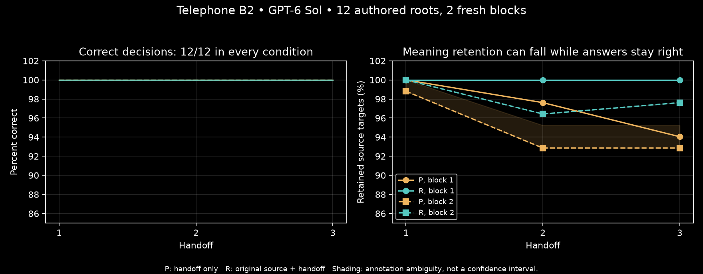

# Telephone B2: decisions repeated correctly while some meaning was lost

<!-- experiment-evidence:start -->
## Evidence metadata

Assessed 2026-10-04 by vishesh/codex-village-fit; source `272c0544` ([registry](../../../../../../../experiments/evidence-metadata.json), [rubric](../../../../../../../experiments/EVIDENCE-METADATA.md)). Scores describe evidence for the stated claim, not a probability of truth.

- **evidence_confidence:** **2/4** — On this selected benchmark both information policies preserve the original decision across two fresh three-hop blocks, while some source meaning is lost. Basis: Controlled complete narrow comparison with actual fresh executions, but copied prior answers, authored cases and same-operator semantic labels limit downstream and population inference.
- **sample_size_summary:** 12 selected authored roots, shared author/format; 144/144 main calls and 2 qualifiers, 2 arms × 3 hops × 2 fresh blocks. No missing calls; repetitions are nested, not extra independent tasks.
<!-- experiment-evidence:end -->

2026-10-04. **Execution, qualification and reviewed closeout complete. Practical reconstruction baseline remains a GAP.** Runtime `272c05441a4ba909841348fb3e3e41739eeed534`; approved source/gold/assignment/scoring anchor `de3653d1763a40d3cbfb60ef0a29e7e4bbd12bdf` remained unchanged. Delegated PI funding covered exactly this packet. No Sol50 or AI Village calls occurred.

## Results and practical interpretation

All 146 GPT-6 Sol/OpenAI calls returned valid results: two interface qualifiers and 144 main handoffs. Both arms answered all twelve roots correctly at every hop in both fresh blocks. The paired terminal decision contrast was zero in each block; no false GO, false HOLD, UNKNOWN, invalid or missing main outputs occurred. First-hop direct-source competence was 12/12 in every arm/block. Collection took 373.3 seconds for the main packet. These are fresh API responses with distinct generation IDs, not replayed outputs.

| Terminal source-meaning retention | Handoff only P | Source access R |
|---|---:|---:|
| Block 1 | 79/84 = 94.05% | 84/84 = 100% |
| Block 2, report-content view | 78 retained + 2 ambiguous / 84 = 92.86–95.24% | 82/84 = 97.62% |
| Block 2, strict status-integrated sensitivity | 77 retained + 3 ambiguous / 84 = 91.67–95.24% | 82/84 = 97.62% |

The ranges above reflect annotation ambiguity, not sampling confidence intervals. Averaging the two blocks within each root gives a descriptive report-content retention difference of 4.17–5.36 percentage points for R. Twelve deliberately selected authored roots and two repeats do not justify a population interval, a precise failure-rate estimate or an isolated model/scale effect. Source access deliberately has more information and actual input cost.

The main API cost was USD 0.148188 for P and USD 0.166118 for R, about 12.1% higher for R. Both lossless-copy and the corpus-specific rule controller solve the offline benchmark. The data do not establish a need for LLM retelling or a decision advantage over those simple alternatives.

## What the trace review found

All 144 effective requests and parent links replayed; all 1008 source-target cells and 1079 assertion clauses received two same-operator passes. This is not independent inter-rater validation. The full traces, source spans, label reasons and alternative readings are published alongside replay.py.

Repeated losses included weakening no restore result to no passed result, omitting same-receipt provenance, losing the initial-version qualifier and dropping a must-pass rule conjunct while retaining observations that happened to pass. Source access did not guarantee verbatim fidelity: some source-access outputs also omitted initial-version or shared-identifier details; one omitted identifier returned on the next hop with source access. These are observed textual transitions, not evidence of an internal forgetting mechanism.

Nine assertion clauses remain ambiguous: four critical unknown/not-recorded phrasings and five noncritical uses of correction for a clarification. No definite unsupported factual addition was identified under the frozen support rubric. Accurate statements that the original source was unavailable in P context were treated as supported context limitations, not invented source-world uncertainty. Source-report retention and strict status-integrated sensitivity remain separate; neither was selected after seeing the result.

## Endpoint limitation discovered in review

Each actor received its predecessor's GO/HOLD decision as well as the handoff. Every subsequent task asked the same decision question. A successor could therefore preserve the right answer by copying it even when some supporting meaning disappeared. This was the declared execution contract, so the zero decision contrast is valid for decision continuity. It cannot establish independent reconstruction of the decision, sufficient retained evidence for new downstream tasks, or low operational risk.

The source packets were also compact enough for a lossless copy: at most 676 JSON bytes within a 1536-token allowance. Native decision performance was at ceiling. The cases have defensible labels and distinct operational structures but do not yet discriminate whether lost details cause useful downstream harm. **Do not mark the broader practical-use baseline met merely because decisions repeated correctly.** Operational reliability, source-trace measurement and fresh decision-continuity replication passed; challenge and downstream-measurement gaps remain for the broader question.

## Process, costs and reconciliation

Approved-account identity, inventory, exclusive idle-host allocation, original ledger and deployed source were verified. The immutable public GitHub plan was read back and its rendered content checked before native collection; six condition-specific TLDRs were registered and verified through the authorized reporting API. The public dashboard-state endpoint returned HTTP 403; the equivalent preflight used actual registered metadata plus the independently accessible public plan, not an invented successful public endpoint response.

All 146 calls were reserved atomically in the existing ledger before qualification. The local bounded relay accepted only the fixed request sequence; all 146 relay hashes match remote saved requests and responses. No retries, fallback, extra model calls or new machine occurred. Main and qualifier workers exited, the relay and tunnel stopped, seven core artifacts were uploaded with matching readback hashes, and the exclusive claim was released (private allocation record). The offline operations finalize hook ran; its generic manual-adapter scaffold reports model_calls=0 and written_review_required because it does not understand this native format. It is not the actual native count or scientific assessment; this authored review and RESULTS.json supply those.

B2 model cost: **USD 0.316566000**. B2 allocated infrastructure: **USD 0.020575809**, based on actual exclusive claim lifetime at the verified hourly rate, not an invoice. B2 total: **USD 0.337141809**. Including all A0/A1 spending, Telephone cumulative: **USD 0.450886510** of the unchanged USD 5 slice. Zero unknown charges and zero outstanding reservations. The original ledger remains authoritative; no copied ledger creates another allowance.

## Decision and next useful scope

**Complete valid bounded result; DECISION NEEDED for the successor, not another B2 retry.** Preserve the repeated decision-continuity null and the imperfect meaning retention. There is no reason to buy fifty hops merely to amplify a curve.

The useful next contrast is a fresh downstream reader answering a prospectively frozen new operational question from the final handoff, with prior answer fields withheld from that reader. Compare source-access policy with handoff-only policy, retain lossless-copy and exact-rule controls, and keep follow-up questions unrevealed to handoff writers. Use new roots; the B2 failures are inspected development evidence, not a holdout. This addresses the observed measurement gap rather than tuning cases for a favorable effect. A proposed finite successor envelope is in NEXT-RUN.md; it is not funded or launched.

## Reproduction and visualization

Run `python3 results/replay.py` from B2: 144 responses and 1008 annotated target cells recompute without new model calls. `uv run --with matplotlib python results/plot.py` regenerates the measured trajectory figure. The full trace/annotation tables provide the hop-by-hop replay fallback; no live semantic scores were claimed while outputs were unreviewed. The static figure shows all hops and both fresh blocks, with ambiguity shading explicitly distinguished from confidence intervals.

