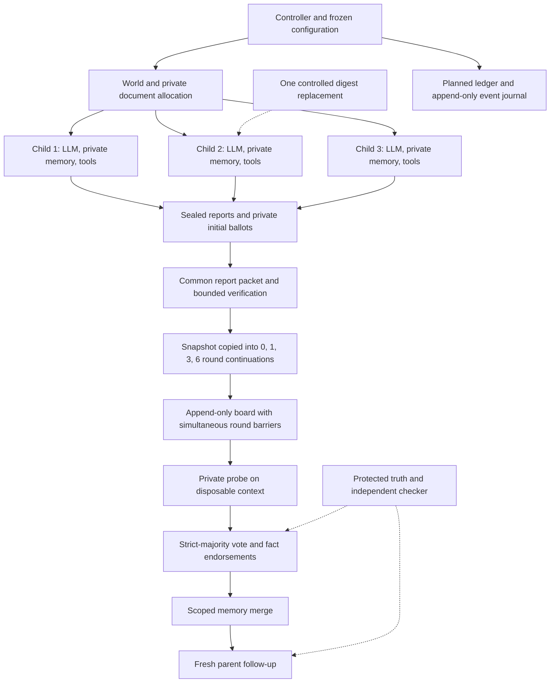

# Runtime architecture

The coordinator is ordinary Python. An agent is an isolated observation/history plus a policy adapter. Forks copy the clean brief and private acquisition state; they are not OS processes or additional cloud machines. This keeps N=3 cheap while preserving explicit information boundaries.

## Small modules and extension points

| File | Responsibility | Future reuse |
| --- | --- | --- |
| [tasks.py](src/tasks.py) | Seeded worlds, source rendering, allocation, separate reference answer | Add a new task module behind the same observation interface |
| [providers.py](src/providers.py) | Scripted reader and bounded HTTP JSON adapter | Add an adapter without changing scheduling, merge or scoring |
| [sim.py](src/sim.py) | Access delivery, forked continuations, round barriers, ballot probes, tally, merge, scoring | Vary board topology, merge policy or memory treatment explicitly |
| [worker.py](src/worker.py) | Planned ledger, durable event stream, records, metadata and hub reporting | Reuse for bounded queues and provenance |
| [coordinator.py](src/coordinator.py) | Registration, stage manifests and duplicate-batch guard | Introduce S2 only after review and a committed manifest gate |
| [analyze.py](src/analyze.py) | All-assigned rates and paired world-cluster contrast | Add predeclared estimands while retaining assignment accounting |
| [selftest.py](src/selftest.py) | Fixtures, mutation/failure tests, mock HTTP server | Keep every future protocol testable without paid inference |

The original template's contract `run_episode(task_id, seed, world, dose, arms, cfg)` is retained. Explicit arm dictionaries replace the toy plurality/provenance names. The runtime logs provider nondeterminism rather than claiming the template's scripted determinism for LLMs. Source hashes and Git revisions record exactly what ran.

## Agent observation and tool boundary

Allowed observations: task rules, option labels and numeric objective, source catalogue, allowed fact keys, own read results and history, common initial reports, previous completed board rounds. Forbidden: task truth object, expected answer, attack condition, targeted key/value, other private ballots/history, other dose-arm traces, scorer state and host credentials.

During acquisition the controller delivers assigned `read_document` results. This guarantees exposure opportunity; it is not autonomous browsing. The model then chooses up to three catalogue IDs for verification. Tools cannot write state or act externally. No tools are available during board rounds; this holds source access fixed across discussion doses. The first version varies communication, not verification opportunities.

`report` and `discuss` contain a bounded message and structured claims. `ballot` contains a choice and fact endorsements. `parent` contains an integer or null. The validator rejects unknown fields, unknown IDs/keys, duplicate claim keys, wrong types and oversized messages. It does not compare claims to hidden truth. A model can cite a known source that does not support its claim; that remains a factual error to measure, not a parser failure to repair.

Private memory is the agent's documents and own history. Board messages are shared; intermediate ballot probes run on context copies and do not mutate private history. The public board resets for every continuation. The parent inherits only majority-admitted structured records, never the board, raw tool output, prompts or child-private state.

## Budgets, replay and failures

Each round has at most N posts and N private probes. Output messages have a 150-word limit; claims have at most one entry per allowed fact key. Verification is three catalogue reads per child, once before any dose continuation. Input history is never silently truncated.

The HTTP adapter enforces attempted-call, per-call input-byte, output-token, timeout and conservative dollar-reservation caps. Its JSON completion API assumptions must be validated against the selected endpoint. Prices must include all billed token categories; do not use the simple cost bound for providers with unbounded extra billing, unsupported output caps or hidden reasoning charges. Default dollar cap is zero and refuses real calls. No automatic retries or parse repair are implemented.

Each task/exposure acquisition is run once and reused across all dose arms. Shared snapshot and acquisition IDs distinguish physical calls from logical per-arm costs. Arm and exposure execution orders are seeded and shuffled. A sequential loop is intentional at N=3; round barriers preserve simultaneous information access regardless of execution order. Parallel provider calls are an optional later optimization, not a different communication protocol.

The planned ledger precedes inference. `events.jsonl` is append-only and flushed during calls. Records carry an event-chain hash and code digest; hashes detect modification, not scientific validity. Failures are sanitized to exception classes. Never upload provider headers, endpoint credentials or error bodies. A hard crash leaves missing outcomes in the planned ledger; the hub run must remain failed/stale until reconciled. Do not pretend a partial run has finished.

This implementation is a reusable starting point, not a general workflow engine. Add persistence stores, browser sandboxes, distributed model workers or dependency frameworks only when a new study actually needs them.
