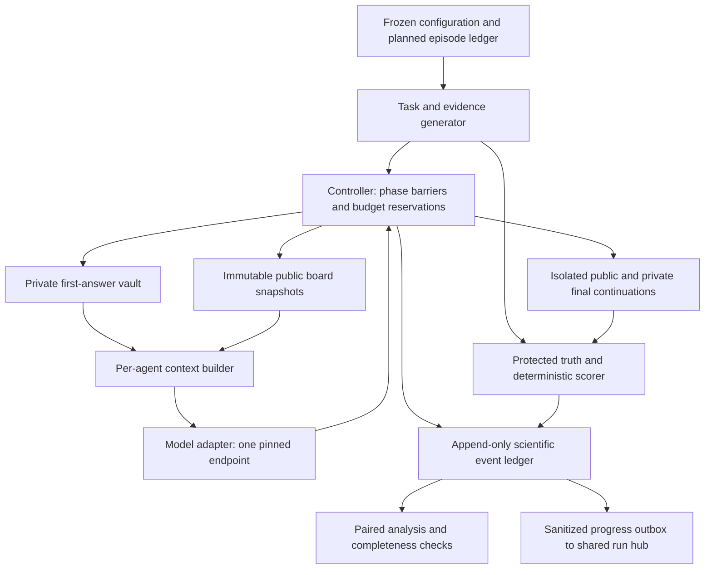

# SOC-07: keep the first judgment private, but allow revision

<!-- experiment-evidence:start -->
## Evidence metadata

Assessed 2026-10-04 by vishesh/codex-pi-review; source `9781739c` ([registry](../../../../experiments/evidence-metadata.json), [rubric](../../../../experiments/EVIDENCE-METADATA.md)). Scores describe evidence for the stated claim, not a probability of truth.

- **evidence_confidence:** **0/4** — Untested efficacy question: keeping first judgments private improves team decisions without suppressing valid correction. Basis: Only a plan, implementation and S0 pre-review are committed at this cutoff. No completed model evidence is available; illustrative 960-world confirmation remains closed. Five actors, repeated answers and calls are not independent observations.
- **sample_size_summary:** Planned: 12 qualification worlds; separate 24-world replay and 24-world live pilots, 2 repeats each; 192 and 240 episodes.
<!-- experiment-evidence:end -->

**Working experiment plan for human review · 3 October 2026 · dmarz/soc07-plan.**

> **Execution amendment A1, 4 October 2026 UTC (dmarz/soc07-private).** dmarz asked for the development study to be built and run. Sections 1 to 10 below are the original plan and are unchanged. [Section 11](#11-execution-amendments-4-october-2026-utc) records what was built, every deviation from this plan and why. In short: scripted S0 and exploratory S1 only, on the Anthropic model `claude-haiku-4-5-20251001` instead of Qwen (no fleet server has a GPU), a USD 40 enforced cap, cross-researcher review waived by dmarz with dmarz/fleet-monitor as the reviewer, and S2 closed. Sentences below saying that nothing calls a model or reserves a server describe the plan as written on 3 October.

Start with five agents solving small fictional decisions with objectively correct answers. Have every agent form an independent first judgment, then compare **keeping those judgments private** with **publishing them before discussion**. Give both groups the same facts, answer opportunities and resource ceilings. The useful result is better final decisions while retaining the ability to accept valid corrections.

This is a draft for [SOC-07 on the question dashboard](https://swarm-research.pages.dev/#/questions?topic=llm-agent-swarms&id=SOC-07), not an accepted hypothesis, preregistration or executed experiment. The small development study below is the recommended starting scope. The larger confirmation is a costed planning example whose sample size must be checked after the pilot. Nothing in this package calls a model, reserves a server or deploys a website.

| Start here | What it contains |
| --- | --- |
| This plan | Question, treatments, exact schedule, tasks, runs, architecture, analysis and implementation order |
| [design.json](design.json) | Proposed parameters and stage counts; execution disabled; unresolved launch fields are explicit |
| [check_plan.py](check_plan.py) | Offline arithmetic and consistency checks; no provider, network or hub integration |

## 1. What we want to learn

**Working prediction:** delaying publication of agents' first choices improves the team's final accuracy because early recommendations exert less pressure on later reasoning. A useful protocol should preserve a correct minority's evidence **and** let an incorrect minority change its answer. An instruction never to revise may reduce changes while worsening decisions.

The primary question is a protocol comparison: **PRIVATE versus PUBLIC**, on one fixed model, one task generator and an equally weighted mixture of the three evidence regimes below. It is not a claim about human psychology or access to a model's hidden beliefs.

Separate three possible findings:

- **Useful independence:** fewer correct-to-wrong changes, retained wrong-to-correct changes, and higher final accuracy.
- **Anchoring:** fewer changes in both directions; initially wrong judgments persist.
- **No useful effect:** private recording adds little, public discussion helps just as much, or independent voting is preferable.

### What the existing research changes

Private first answers are not themselves new. Choi et al.'s debate baseline already starts with independent answers; their results also caution that following a majority can help. SEPAL keeps actor–critic pairs separate until final fusion, changing several mechanisms together. Barrera-Lemarchand et al. already use private initial judgments, public deliberation and private final re-answering with permission to revise. The potential contribution here is the controlled disclosure comparison and its correction tradeoff at matched resource ceilings. [[choi-2025-debate]] [[ren-2026-sepal]] [[barrera-lemarchand-2026-wisdom]]

Shehata's trace-based measure is not a separately elicited private choice. We will measure explicit recorded answers and their changes, not interpret an emitted reasoning trace as inner belief. [[shehata-2026-bystander]]

I used Vishesh's [general experiment guide](../../../../tooling/agent-experiments/GUIDE.md), [harness guide](../../../../tooling/agent-experiments/HARNESS.md), [protocol template](../../../../tooling/agent-experiments/templates/protocol.md), the experimental-design sections of his [SEO-poisoning design](../../../vishesh/notes/seo-poisoning/experimental-design.md), and his [SOC-07 review](../../../vishesh/notes/atlas-review/candidate-review.md). His review specifically asks for equal answer opportunities, a no-extra-computation control, and separate harmful/useful revision rates. [VX-35](../../../vishesh/notes/atlas-review/extension-bank.md#vx-35) motivates fixing evidence access: changing search behavior is a separate future experiment.

The plan adopts his paired worlds, protected truth, staged development, full cost accounting and failure denominators. It does **not** adopt the SEO scenario, reward schemes, or treat published recognition percentages and architecture rankings as universal validation thresholds. The source check for this plan covered the relevant primary methods, not independent reproduction of their results.

## 2. Five live-team protocols, with one primary comparison

An **agent** is one isolated model conversation. A **team episode** is five agents completing one task under one protocol. A **world** is one independently generated decision problem; repetitions of it are not new worlds.

| ID | First pass | What peers see before discussion | Revision | Purpose |
| --- | --- | --- | --- | --- |
| **PRIVATE** | Choice, confidence, evidence IDs and brief justification, stored privately | The shared factual packet; no peers' first choices | Explicitly allowed | Candidate protocol |
| **PUBLIC** | Exactly the same initial artifact as PRIVATE | The same facts plus peers' first choices and confidence | Explicitly allowed | Primary control: early disclosure |
| **NEVER** | Same initial artifact as PRIVATE | Same factual packet as PRIVATE | Told to keep the initial choice | Diagnose stubbornness; measure compliance |
| **PREPARE** | Evidence inventory and uncertainties, without choosing or ranking options | Same factual packet as PRIVATE | First choice may occur during discussion | Controls for a preparatory call; a different preparation task |
| **VOTE** | Same initial artifact as PRIVATE | No peer facts or messages | Allowed during solitary review | Independent ensemble with the same call/output allowances |

NEVER retains the same final action space; the harness must not force its answers. PREPARE must not receive an extra hidden initial-answer probe. Its initial-to-final revision rates are **undefined**.

PRIVATE/PUBLIC have identical first-answer opportunities. PREPARE matches call and token allowances, but fact listing is not semantically identical to choosing. VOTE changes access to information as well as interaction; it answers whether communication buys anything in this distributed-information task, not whether a single solver with all facts would do better.

Generate each agent's initial artifact once, before applying PRIVATE/PUBLIC/NEVER/VOTE overlays; clone it into isolated continuations. This gives those arms identical observed starting judgments, including initial mistakes. PREPARE generates its separate inventory. Do not show the future visibility rule during this shared initial call. Thus this first study tests **when an already-generated judgment is disclosed**, not the effect of anticipating public accountability while forming it. A fresh run with advance notice is an optional later study.

## 3. The exact episode schedule

Use one discussion round for the first slice. This is a deliberately shallow team protocol; it cannot establish behavior after prolonged debate.

| Step | Action | Visibility and allowance |
| --- | --- | --- |
| 0. Initialize | Generate task, evidence allocation, labels and display order; clear all conversation state | Truth and expected answer stay with evaluator |
| 1. Prepare | All five agents independently emit their first-pass record; wait for the whole team | One call per agent, at most 256 output tokens; no agent sees a peer yet |
| 2. Release evidence | Controller publishes the union of permitted factual records, in the same order across communicating arms | Deterministic delivery, no model call; PUBLIC additionally releases peers' initial choices/confidence |
| 3. Discuss | Each agent reads its own record and the frozen board, then emits a short evidence-citing message and optional current recommendation | One call per agent, 256 tokens; publish all five messages only after all calls finish |
| 4. Freeze | Save each agent's context with that completed discussion board | No further exchanges; no last-speaker advantage |
| 5a. Public final | Ask for the answer to be included in the team's final vote | One isolated continuation, 64 tokens |
| 5b. Private final | Independently ask for a confidential evaluator-only answer | A second continuation from the **same Step 4 snapshot**, 64 tokens; never sees 5a |
| 6. Score | Deterministic majority of public finals; score individual outputs and transitions | No model judge or model-based final synthesizer |

For VOTE, Steps 2–3 supply only the agent's original facts and a solitary review prompt. Its review output stays private. The two final elicitation branches still use the same caps. Peers never receive its initial, review or final answers before all decisions are complete.

PRIVATE, PUBLIC and VOTE receive: “Your first answer is provisional. Retain it or revise it according to the available evidence.” NEVER instead receives: “Keep the choice recorded in your first answer, even if later information suggests another choice.” This intentionally strong diagnostic instruction appears only **after** the common first pass. PREPARE's initial instruction is: “List available evidence and uncertainties. Do not choose, rank, recommend, or imply a preferred option.” Its discussion instruction is: “Form a provisional choice from the available evidence; you may revise it before your final response.” Audit premature-choice leakage as an outcome; do not regenerate until the answer looks compliant.

The controller supplies the factual packet directly from the fixture. It must not strip facts from a model-written summary using another model. Only PUBLIC exposes initial `choice` and `confidence`; the controller never publishes the initial justification record in any arm. Agents may quote or paraphrase their own justification during discussion, and discussion messages may contain new recommendations in all communicating arms. “Private” therefore means **initial judgments withheld until discussion**, not semantic secrecy or permanently anonymous reasoning.

Initial record example: `{"choice":"A","confidence":0.7,"evidence_ids":["e03","e07"],"justification":"Brief evidence summary"}`. Final record: `{"choice":"B","confidence":0.8}`. `choice` permits A, B or ABSTAIN. Confidence is a reported number, not a calibrated probability unless separately shown to be calibrated. Missing/invalid fields remain invalid; no silent repair.

## 4. Tasks that can distinguish independence from stubbornness

Use a synthetic **two-option supplier decision**. This is fictional procurement with no real company names or external tools. Both options have an estimated cost and delivery time; a later timestamped audit may update either. The rule is explicit: choose the lowest-cost option among those meeting the delivery deadline, using the latest authorized record for each value. Generate integer values, exactly one correct choice, and no cost ties. Half the worlds have A as the correct displayed answer and half B, up to integer rounding within balanced blocks.

Proposed fixture parameters: costs 20–100 units; delivery 1–10 days; deadline 5 days; final feasible cost gap sampled evenly from 1–3, 4–10 and 11–20 units where both are feasible. Half the worlds instead distinguish the options through feasibility. Reject infeasible/ambiguous generator draws **before any model response**, using a fixed sampling rule recorded in the generator. These are design choices to validate in S0, not an existing benchmark.

| Regime | Private evidence allocation | What the shared packet reveals | What it diagnoses |
| --- | --- | --- | --- |
| **Clean** | Everyone has current records consistent with the correct choice | Redundant truthful evidence | Does private recording damage easy cooperation? |
| **Informed minority** | One of five agents has the decisive current audit; four see older records favoring the other choice | Everyone gets the current audit before discussion | Can a well-informed minority survive early, now-unsupported majority recommendations? |
| **Correctable minority** | Four agents have the current audit; one sees older records favoring the other choice | Everyone gets the current audit before discussion | Does the initially disadvantaged agent accept a valid correction? |

The initial private evidence is deliberately incomplete in some cases; the evaluator knows the complete current state. Facts needed to infer the answer may enter agent contexts, but the evaluator's answer key never does.

The informed role is defined by evidence allocation **before** observing answers. Do not select only episodes in which the minority answered correctly or the majority became wrong. Realized initial correctness and disagreement are reported manipulation checks. Equalize regime counts and rotate the special role across agents; balance label and display-order permutations across task blocks. Repeats change policy sampling and counterbalanced presentation, not the underlying truth. Store the correct canonical supplier identity per world and the separate per-repeat A/B mapping; always score through that mapping. Use independent keyed randomness streams, not one mutable random-number stream shared across treatments.

For a simple concrete fixture, old records say A costs 40 and arrives in 3 days, while B costs 50 and arrives in 4 days. A current authorized audit changes A's arrival to 8 days; the deadline is 5 days, so B is correct. In the informed-minority condition only one agent initially has that audit. After the release all communicating arms receive the audit. The question is whether early A recommendations still interfere with making the correct switch. Include the mirrored direction and cost-based cases so “always reverse the initial answer” cannot win.

## 5. Two studies, not one confused comparison

**Controlled replay (development diagnostic).** One focal model agent receives four scripted peer streams. Incoming message bytes and their order are identical across arms. In the pressure fixtures, three peers recommend the wrong option without supporting current evidence and one cites the correct audit; correction fixtures reverse that balance. Clean fixtures recommend the correct option. Facts and recommendations are separately marked in the board. The same scenario includes a correct-answer rationale available to the focal agent; no claim of organic peer behavior follows from scripted pressure.

Unlike the live table, replay PUBLIC changes only whether the **focal agent's own** initial record is posted and described as public. It does not add extra incoming peer votes: all arms receive the same scripted peer information. PRIVATE/PUBLIC in replay therefore tests disclosure/audience framing, because the scripts do not respond to what the focal agent publishes. It **cannot** estimate the reciprocal social effect of public initial votes. PRIVATE/PREPARE estimates the initial-answer preparation package under fixed exposure. This replay study helps debug and interpret mechanisms; it is not the primary live-team result.

**Live teams (primary study).** Five model agents produce the actual discussion. Pair the underlying world, initial artifacts, factual packet, labels and exogenous ordering across arms. Let downstream messages differ: that is part of the treatment effect. Apply one protocol to the whole team episode. No communication or shared writable state crosses episodes.

An independent full-information solver appears in engineering qualification to check that the problem is solvable. It is not a cost-matched scientific baseline at that small sample size. If the later question is “why use a swarm instead of one solver with all evidence?”, add that comparator to a separately powered study.

## 6. Runs and parameters

### Stage sequence and allocation

| Stage | Worlds and repeats | Arms | Model agents per episode | Episodes | Purpose |
| --- | --- | --- | --- | --- | --- |
| **S0** | 60 offline fixtures, 20/regime, plus fault injections | All five in scripted form | 0 | No LLM episodes | Verify generator, scorer, access boundaries and accounting |
| **S1-Q** | 12 new development worlds, 4/regime, 1 repeat | Full-information single solver | 1 | 12 | Check basic model competence and output format |
| **S1-R** | 24 new worlds, 8/regime, 2 repeats | PRIVATE, PUBLIC, NEVER, PREPARE | 1 focal + 4 scripted peers | 192 | Controlled replay diagnostic |
| **S1-L** | 24 different worlds, 8/regime, 2 repeats | All five | 5 | 240 | Estimate live effects, failures, discordance and cost |
| **S2-L** | **Illustration:** 960 unopened worlds, 320/regime, 1 repeat | PRIVATE, PUBLIC | 5 | 1,920 | Confirmation after sample-size simulation and full freeze |
| **S3** | Separately frozen fresh worlds; size chosen for its question | Selected contrasts | New population or setting | Not allocated yet | Replication, not a way to rescue S2 |

Run S1-Q first, then S1-R, then S1-L. Keep each stage's worlds separate. These are proposed runs; none has executed. S1 has **60 distinct task worlds** in total, not 444 independent observations. The two pilot repetitions measure instability within a task. S2 prioritizes fresh task worlds over additional seeds. Statistical generalization remains to this generator, not to all reasoning tasks.

### Model and controller defaults

| Parameter | Proposed first value | Reason / constraint |
| --- | --- | --- |
| Model | `Qwen/Qwen3-8B`, revision `b968826d9c46dd6066d109eabc6255188de91218` | Modest open-weight starting model; competence must be checked |
| Precision | BF16, no quantization | Freeze a different setting explicitly if hardware requires it |
| Thinking mode | `enable_thinking=false` | Explicit short outputs; no hidden-reasoning interpretation |
| Sampling | temperature 0.7; top-p 0.8; top-k 20; min-p 0; presence penalty 0 | Non-thinking defaults from the [official model card](https://huggingface.co/Qwen/Qwen3-8B) |
| Context | 8,192-token configured window; at most 4,096 input tokens/request | Reject overflow; never silently truncate a decisive fact |
| Output | 256 initial + 256 discussion + 64 public final + 64 private final | 640 tokens/agent, 3,200/team; S1-Q uses one 128-token final |
| Communication | Complete public board; one synchronous round | Same factual access, no search or learned routing |
| Team size | 5 throughout S1-L and S2-L | An informed minority of one is possible |
| Tools and memory | No tools; no persistent or cross-episode memory | Isolate initial-answer disclosure |
| Parallelism | At most 5 in-flight requests; interleave randomized arm order within blocks | Freeze serving/batching behavior; record actual scheduling |
| Timeouts | 60 seconds/request, 600 seconds/episode after dispatch | Proposed engineering limits; verify hardware fit during S1 |
| Retries | 0 automatic retries; 0 output-repair calls | A retry cannot quietly replace an unfavorable result |
| Aggregation | At least 3 of 5 valid public finals agree | Otherwise team failure; never drop abstainers from denominator |
| Seeds | Development 730071; holdout 730072; bootstrap 730073 | Named SHA-256-derived streams; see configuration |

The revision above was read from Hugging Face's model metadata on 3 October 2026; it is a proposed pin, not a claim the weights are installed. The runtime container, dependency lock, tokenizer and rendered chat-template hashes remain to be captured during implementation. No fallback model is allowed within a study. The deliberately short output caps are study constraints, not a claim to reproduce the model's maximum benchmark performance; raise them only through a development amendment if outputs truncate.

### Cost accounting

| Stage | Per-arm allocated calls | Actual unique calls after shared initial generation | Allocated output-token ceiling | Unique output-token ceiling |
| --- | --- | --- | --- | --- |
| S1-Q | 12 | 12 | 1,536 | 1,536 |
| S1-R | 768 | 672 | 122,880 | 98,304 |
| S1-L | 4,800 | 4,080 | 768,000 | 583,680 |
| S2-L illustration | 38,400 | 33,600 | 6,144,000 | 4,915,200 |

“Allocated” counts each arm as though deployed alone, including its first pass. “Unique” counts the actual shared first-pass requests only once. These are ceilings and request allocations, not measured tokens, money or compute equality. Count all input tokens too: at the worst-case 4,096/request cap, multiply unique calls by 4,096 for the input ceiling. The public arm reads more text, so report its actual consumption and latency. Do not add useless padding to manufacture equality.

No dollar or GPU-hour estimate is asserted before a serving benchmark. Before even S1-Q, the operator must set an enforceable qualification/development money or compute-hour ceiling alongside the request/token allocations above. S1 measures time, input/output usage and throughput to inform a separate S2 budget. The configuration cannot launch anything and deliberately has no approved spend. There are no judge, retrieval or synthesis calls hidden outside this accounting. Monitoring probes must be budgeted separately if later added.

For latency comparisons and the 600-second public-decision deadline, attribute shared first-pass duration to every arm plus that arm's own downstream time through public-final collection. Exclude its wait for another arm's turn; record that queue time separately. Schedule public finals first, then private finals from their saved independent contexts. Reserve primary and auxiliary phase budgets separately; private probes cannot consume resources reserved for the public decision. A private-final timeout cannot invalidate a public decision already delivered on time. Cap auxiliary private collection at a further 60 seconds with five simultaneous requests; report its cost and missingness separately. Reused artifacts are pre-treatment only. Never cache a discussion or final answer across arms.

## 7. Architecture to build



The model receives only text built by the context builder. It has no filesystem, vault, evaluator or hub handle. The initial vault is write-once: only the controller, owner-agent context and evaluator may read an agent's private record. Peer visibility is an explicit allowlist; do not publish guessable hashes of binary choices as commitment receipts. The evaluator is outside agent-accessible storage. If tools are later introduced, enforce that separation with process/filesystem permissions, not just a Python class boundary.

Start a real experiment from [the existing worker template](../../../../templates/experiment-worker/README.md) after its research gates pass. A distributed **worker is a job runner**, not one of the five scientific agents. One queued job should contain a paired task/repeat block, with arms executed in randomized order. Keep at most one manifest version in a worker process.

| Component | Reuse | SOC-07 work needed |
| --- | --- | --- |
| Study scaffold | Worker template, `design.yaml`, preregistration and coordinator conventions | Adapt its simulator contract to the four-phase model sequence |
| Hashing and replay | Toolkit `contracts.py`, planned ledger and event-validation patterns | Extend schemas with phase, visibility, attempts, token use and SOC-07 outputs |
| Task generator/scorer | General deterministic-fixture pattern | Implement latest-record decision task; independently cross-check unique answers |
| Vault/board/context | Architecture guidance | Implement and test actual per-agent access and synchronous release |
| Provider adapter | No working provider in the toolkit's toy harness | Implement requests, token/time reservations, strict parsing and usage reconciliation |
| Worker recovery | Queue scaffold | Durable checkpoints, deduplication and exact manifest verification |
| Analysis | Pairing conventions | Reconcile every planned episode, including failed/missing ones; do not use a done-only export |
| Run hub | Existing `swarm_report` contract from agentops | Durable sanitized outbox; keep scientific truth in the local immutable ledger |

The template's present S2 guard freezes only its design/preregistration files; it is not enough for this study. Freeze and verify code, prompts, scorer, generator, model, tokenizer, dependencies and splits too. Existing S1 prerequisites are not a complete validity gate. Do not assume a coordinator dry-run is offline; some paths contact the hub. S3 is a separately added stage, not currently supplied by the template.

Proposed future source layout: `experiments/<accepted-id>/src/{generate,contexts,protocol,adapter,score,analyze}.py`, `prompts/`, `schemas/`, `manifests/`, and `results/`. Large raw data belong in the repository's ignored `data/` or approved storage. These paths describe future implementation; those files do not exist in this plan.

Each event records manifest hash, stage, world ID, repeat, arm, agent, phase, snapshot hash, prompt hash, response/validity, seed, timestamps and usage. Task truth keys use stage/world, never repeat. Policy seeds also include arm/agent/phase; the shared initial seed excludes arm. Preserve full seed inputs and stable canonical serialization. Example scientific ID: `soc07-s1l-w0007-r01-a-private`; retries/resumption retain that identity with separate attempt lineage. A hub block can be `soc07/s1l/w0007-r01/m<manifest12>`. Only a real registered experiment ID is used for actual reporting.

Routine hub telemetry includes progress, aggregate cost, validity and sanitized failure categories. It excludes answer keys, individual commitments, private machine addresses and credentials. Hub delivery failure must not erase a completed scientific record. Reconcile planned IDs, terminal outcomes and reporting acknowledgements; the hub's display status is not the scientific denominator.

## 8. Outcomes and analysis

**Primary endpoint:** a correct public team decision by the deadline, divided by **all assigned live-team episodes**. PRIVATE minus PUBLIC is positive when private initial judgments help. The target mixture is one-third of each regime, even if realized numbers of usable answers differ.

| Measure | Numerator / denominator | Interpretation |
| --- | --- | --- |
| Team success | Correct majority decisions / all assigned team episodes | Primary operational accuracy |
| Harmful revision | Initially correct to valid wrong / initially correct records | Preservation; report invalid final losses separately |
| Useful revision | Initially valid wrong to final correct / initially valid wrong records | Correction; abstention is separately categorized |
| Transition burden | Each transition count / all assigned agent decisions | Shows counts without conditioning away failures |
| Private/public mismatch | Different valid choices / agents with both finals valid | Elicited disagreement, alongside coverage |
| Private-vote success | Majority of private finals correct / all assigned episodes | Secondary; never substitute for primary public decision |
| Individual success | Correct finals / all assigned agent decisions | Includes initial-status and regime breakdowns |
| Process/cost | Validity, abstention, stale-evidence citations, deadline failures, actual input/output tokens, wall time | Explains tradeoffs and instrumentation failures |

Compute revision rates only where an actual initial answer exists. Report public-final and private-final transitions separately, including starting-state counts and invalid/abstaining endings. PRIVATE/PUBLIC/NEVER/VOTE share a pre-treatment initial record, which makes their starting-state comparisons interpretable. A different initial composition in PREPARE must not be imputed away.

Freeze the planned ledger before execution. Every assigned episode receives exactly one terminal execution status (completed, interrupted, or incomplete), a separate decision outcome (correct, wrong, no majority, or unavailable), and zero or more per-agent failure flags (invalid response, refusal, timeout, exhaustion, infrastructure failure). A team may succeed despite a member failing. A and B are the only winning votes; ABSTAIN never counts toward the three-vote threshold. Defined noncompletion is zero for operational success. Missing substantive scores remain null, with best/worst-case bounds; do not pretend an ungraded answer was semantically wrong. Retain partially failed teams with the original three-vote threshold.

If an initial or discussion call fails, that participant makes no further calls in that arm and receives no final vote. Its permitted fixture facts still enter the shared factual packet: exogenous evidence delivery must not depend on model completion. Use the fixed `record unavailable` placeholder for a missing PUBLIC initial vote and `message unavailable` for a failed discussion turn; never expose malformed raw output to peers. An invalid common initial record terminates that participant in all four arms sharing it, including NEVER, which has no valid choice to preserve. PREPARE's separate preparation may succeed or fail independently. If only a public-final call fails, still collect its independent private branch; neither final branch conditions on the other's result. Preserve unused allocations and actual consumption separately.

The default has no automatic retries. Resume from an existing completed request only when its durable ID and output are known; an uncertain in-flight request becomes an auditable failure. A later rerun is an additional attempt or separately labeled robustness result, never a replacement that deletes the original outcome. An infrastructure outage triggers an operational pause and documented amendment, not a new easier task.

For team success, average paired arm differences within each world over repetitions, then average worlds within each regime and weight the three regimes equally. Use a stratified world-cluster bootstrap with 10,000 resamples, retaining arms, agents and repetitions together. Show regime-specific intervals and denominators. For S2's one repetition, also report paired binary discordance and an appropriate paired-score/exact sensitivity interval. Validate interval behavior by simulation before freezing it; bootstrap intervals can be unreliable with few pilot worlds. Agent votes and messages are never independent replicates.

Conditional revision rates use pooled transition counts divided by pooled eligible initial-answer counts **within each regime**, rather than an average of world-level ratios. Retain zero-eligible worlds in the assigned ledger and bootstrap; they contribute zero to both counts. The useful-correction noninferiority guard specifically targets the **designated initially disadvantaged agent in the correctable-minority regime**, conditional on that shared pre-treatment answer being valid and wrong, and uses its public final. Subtract the two arms' pooled rates, with the shared eligible denominator. A zero denominator, or bootstrap samples with inadequate eligibility to support the declared interval method, makes that guard unresolved. Report all-agent and private-final correction rates as separate diagnostics. This conditional population and the all-assigned team population must not be conflated.

Only PRIVATE/PUBLIC is the confirmatory primary contrast. Pilot comparisons and replay effects are descriptive. Prespecified secondary inferential claims use Holm correction within their declared family; exploratory results receive that label. Model identity is a fixed selected condition, not a random sample of all models. No claims about people, consciousness, real organizational decisions or long-lived autonomous swarms follow from this test.

### Sample size: why 960 is an illustration

For independent paired binary outcomes, an approximate planning formula is

`n ≈ (1.96 × sqrt(discordance) + 0.8416 × sqrt(discordance − delta²))² / delta²`.

At discordance 0.20 and a 5 percentage-point difference, this gives about 626 paired worlds. Separately, a one-sided 2.5% noninferiority test with true difference zero, discordance 0.10 and a 5-point margin needs roughly 314 worlds **per regime** for 80% marginal power under a normal approximation. Hence the convenient starting illustration of 320 worlds/regime, 960 total. These assumptions are not measured evidence and do not establish 80% power for the combined decision rule.

After S1, simulate the actual stratified paired binary outcomes, initial-answer eligibility, failures, token-cost variability and intended intervals over plausible discordance/variance ranges, including pilot uncertainty. Size for the joint superiority-and-correction decision, not just the overall contrast. Two independent 80%-powered guardrails jointly pass only about 64% of the time. Requiring an observed gain of at least 5 points also passes only about half the time when the true gain is exactly 5 points, regardless of a large sample. Evaluate the full rule at true gains of 5, 8 and 10 points; an 80% joint adoption target must specify a true gain above the 5-point practical threshold. Conditional useful-revision eligibility may require more worlds than either illustration. Freeze the maximum required size and its cost before opening S2. If that does not fit the agreed budget, report an exploratory or precision-limited result, or narrow the claim; do not declare the smaller sample powered. Do not top up S2 because an interim effect looks promising.

### Decision rules proposed for review

1. **Evidence for a useful disclosure protocol:** PRIVATE's overall estimated gain is at least 5 percentage points and its two-sided 95% interval excludes zero.
2. **Retained correction and clean performance:** one-sided 97.5% lower bounds for PRIVATE minus PUBLIC exceed −5 points for clean-team success, correctable-minority team success, and useful individual correction in the designated minority population defined above. Also show the informed-minority harmful-revision difference. If eligibility is too sparse or an interval is too wide, correction is unresolved.
3. **Efficiency:** the upper 95% world-bootstrap bound for the ratio of total input-plus-output tokens per deployed PRIVATE episode to PUBLIC is at most 1.10. Count the common first pass in both. Treat this as a tokenizer-specific resource check, alongside latency and compute, not universal FLOP equality.
4. **Stubbornness is a failed explanation of usefulness:** if NEVER merely lowers both types of revision, that does not support selective independence. If PRIVATE behaves the same way, narrow or drop the original claim.
5. **Inconclusive is allowed:** an interval spanning benefit and harm is not evidence of equivalence. A robust harm to correction, no worthwhile accuracy gain, or gains explained by cost/invalidity warrant redesign or rejection.

The 5-point effects/margins and 10% token allowance are proposed practical thresholds, not facts supplied by literature. A 5-point noninferiority margin tolerates up to five additional failures per hundred relevant tasks or decisions; it does not establish absence of harm. Confirm these tolerances in human review before registration. S2 tests PRIVATE versus PUBLIC only: it cannot establish superiority to independent voting, a full-information single solver or every other architecture. Such adoption claims need their own confirmatory comparator.

## 9. Build order and release gates

| Step | Concrete work | Done when |
| --- | --- | --- |
| 1. Offline fixture | Task generator, independent exact solver, role/label permutations | 60 fixtures solve uniquely; balanced allocation; oracle succeeds on all |
| 2. Visibility controller | Private vault, public board, stage barriers, final forks | Canary private fields and truth never reach forbidden contexts; PUBLIC reveals only allowed fields |
| 3. Failure/accounting harness | Planned ledger, strict parser, budget reservations, durable state | Injected timeout, malformed output, overflow, crash and duplicate dispatch remain counted exactly once |
| 4. Model qualification | Pinned adapter, complete rendered prompts, S1-Q | At least 10/12 full-information answers correct and at least 11/12 valid; otherwise fix engineering/difficulty before study |
| 5. Development studies | S1-R then S1-L with fixed allocations | Costs and denominators reconciled; no task selection on observed conformity |
| 6. Freeze confirmation | Reviewed question, full manifest, power simulation, analysis code, budget | All launch requirements resolved, S2 sample fixed, holdout still unopened |
| 7. Execute and analyze | S2 only under its manifest | All planned IDs accounted for; complete operational and sensitivity analyses |

During S0, include a scripted always-correct solver, an evidence-following updater, an unconditionally stubborn policy and a majority follower. They verify that the scorer distinguishes correction from corruption; they are not evidence that LLMs behave that way. Fork the same context twice as private/private on offline fixtures, and reserve a separately counted development probe if model sampling instability needs measurement. Do not interpret public/private differences without considering that ordinary resampling can also change answers.

During S1, inspect every rendered context for overflow and all malformed outputs. Require zero detected truth/private-field leaks; investigate rather than discard any affected run. Require at least 95% parse-valid outputs and less than 5% budget/timeout failures before treating effect estimates as useful. Report initial disagreement and initially-wrong opportunity counts by regime. If a regime offers almost no relevant opportunities, revise the generator only on development data and restart the pilot under a new version. No universal minimum conformity rate is imposed, and agents are never prompted to reproduce a hoped-for result.

Before actual collection, complete the repository research gates. At the source snapshot used here, `surveys/llm-agent-swarms.md` is complete but its dmarz review is still `revise`; there is no accepted SOC-07 hypothesis. This note therefore remains in researcher working material. [AGENTS.md](../../../../AGENTS.md) requires: “The hypothesis is `accepted` or later” for an experiment. The plan is fully drafted now; those status changes and cross-researcher review are launch requirements, not claims that this document has already passed them.

When execution is actually chosen, create the formal experiment, copy the worker scaffold, claim the intended compute resource through agentops, and register/report the run using its reporting guide. Release the compute claim after the run. Do not publish private infrastructure details in the public repository. No such claim or registration is made by this planning task.

A sensible S3 order is: reproduce on a second model family; then test advance disclosure of the visibility policy; then extend to two discussion rounds or a less transparent task family. Change one major dimension at a time and freeze each follow-up on new worlds. Defer heterogeneous teams, learned rewards, tool use, online search, memory and adversarial agents until the initial comparison is interpretable.

## 10. Check and review this package

From the repository root:

```sh
python3 researchers/dmarz/notes/soc07-private-judgments/check_plan.py
python3 scripts/lab.py check
python3 .flightdeck/fd.py check --strict .
```

The first command checks planning arithmetic only. It is not a simulator or an experiment runner. The machine-readable settings intentionally keep runtime and spending requirements unresolved. Formal preregistration must capture the exact prompts, full access manifest, source/data/model hashes, statistical simulation, schedule, stop rules, accountable operator and public timestamp before S2.

Primary-source methods consulted: [Shehata](https://arxiv.org/html/2605.10698), [Choi et al.](https://arxiv.org/html/2508.17536), [SEPAL](https://arxiv.org/html/2609.39645), and [Barrera-Lemarchand et al., Methods pp. 19–20](https://arxiv.org/pdf/2609.22497). The first three are catalogued on SOC-07; the fourth makes the novelty boundary substantially narrower. Their reported findings were not reproduced in this task.

## 11. Execution amendments (4 October 2026 UTC)

Written by dmarz/soc07-private before any model output. This section is the dated amendment record that [design.json](design.json) (`amendments`) and [execution.json](execution.json) refer to. Status: **exploratory**. There is still no accepted SOC-07 hypothesis and no reviewed survey, so nothing here is a registered experiment and no result may be cited as reviewed evidence.

### What was authorized

- dmarz asked for this study to be shipped and operated by one agent, dmarz/soc07-private, with one reviewer, dmarz/fleet-monitor. Cross-researcher review by vishesh and shadow is **waived by dmarz** for this study: [launch/review-waiver.md](launch/review-waiver.md). Nobody outside dmarz's own agents has approved it.
- Stages: S0 (scripted, zero model calls), then S1-Q, S1-R and S1-L. **S2 (the 960-world confirmation) and S3 are closed.** The holdout root 730072 is never used by the code.
- Paid stages cannot start without `launch/s1-approval.json`, which is committed only after the reviewer's explicit go and pins the runtime fingerprint, the pre-run assessment and the waiver by hash ([src/launch.py](src/launch.py)).

### A1. Model and provider

| Plan | What runs | Why |
| --- | --- | --- |
| `Qwen/Qwen3-8B`, pinned revision, BF16, local serving | `claude-haiku-4-5-20251001` through the Anthropic Messages API, behind one adapter ([src/adapter.py](src/adapter.py)) | No fleet server has a GPU. This is the model id and provider pattern the sybil-scale-api and discussion v3 studies used the same night. |
| temperature 0.7, top-p 0.8, top-k 20, min-p 0, presence penalty 0 | temperature 0.7 only | The API rejects temperature together with top-p on this model; top-k was a Qwen model-card default; min-p and presence penalty do not exist on the API. |
| `enable_thinking=false` | thinking not requested | Same intent: short explicit outputs. |
| Seeded policy sampling | No seed is sent | The API has no seed. Policy seeds are still derived per call and recorded; they drive only the scripted policies. Repeats therefore differ by provider sampling and by the counterbalanced A/B mapping. |
| Free-text JSON, strict parser | Provider structured output with one fixed JSON schema per phase, then the same strict parser | Same contract as tonight's other API studies. It makes malformed JSON rare, so the 95% parse-validity gate is weaker evidence of format competence than it would be with Qwen. Out-of-range values, truncation at the token cap and refusals are still invalid. No repair call exists. |
| Weights revision, dtype, tokenizer hash, chat-template hash, runtime image digest | Not available for a hosted model | The dated model snapshot id is the only pin. The adapter fails a call whose response names a different model. |
| 8,192-token window, at most 4,096 input tokens per request | 4,096-token cap on **reported** input tokens, plus a 16,384-byte limit before dispatch | The provider's tokenizer is not available offline. A response whose reported input exceeds 4,096 tokens is a failure and its output is discarded; an over-limit request is refused before dispatch. Nothing is truncated. |
| Tokens and GPU hours | Reported tokens and dollars at USD 1 (input) and USD 5 (output) per million tokens | Hosted pricing. |

Qwen3-8B stays as a later replication on its own fresh worlds. **No fallback model exists inside this study.**

**Launch manifest.** The model id, the reasoning allowance (off, or a fixed token budget added to every call), the per-call output caps, the prices and the qualification set are one block, `launch_manifest` in [execution.json](execution.json). They are stamped on every hub run (`model`, `reasoning_tokens`, `output_caps`, `launch_manifest`), in the journal header and in `summary.json`. Manifest m1 is Haiku 4.5, no reasoning allowance, the plan's caps (256 / 256 / 64 / 64, qualification 128), qualification set 0.

**If S1-Q fails competence.** Fewer than 10 of 12 correct, or fewer than 11 of 12 valid, is a competence failure of manifest m1. Nothing further runs under m1: no S1-R, no S1-L, no prompt tuning against the 12 seen worlds. The post-run review records which worlds failed and how. The only permitted next step is a dated amendment that changes the launch manifest (a stronger model, a bounded reasoning allowance, or both) and moves to a new qualification set, which generates 12 fresh worlds with their own 12-call cap; then S0 again, a new reviewer approval and a fresh S1-Q. That switch changes configuration only, not code. It is a change of the studied model, not a fallback inside one study: results never mix models. A provider or infrastructure failure during S1-Q is not a competence result; it is repaired and qualified again on a new set in the same way.

### A2. Retries

The plan's rule stands for answers: zero automatic retries, zero repair calls, and a failed call is an auditable failure. One transport rule is added: a request that the provider rejects with HTTP 429 (rate limit) or 529 (overloaded) is sent again, at most twice, with waits of 2 and 6 seconds (or the provider's retry-after, capped at 20 seconds). In those two cases the provider states that the model did not run, so no answer exists to be replaced. All attempts and waits share the one 60-second request budget. Every attempt is counted in the ledger against a per-stage attempt cap (planned calls plus 5%). Timeouts, connection errors, 5xx other than 529, truncation, refusal and invalid output are never retried.

### A3. Budget and stopping

- Enforced cap: **USD 40** for the whole study, inside dmarz's USD 500 allowance, split USD 30 for the public-decision path (first pass, discussion, public final) and USD 10 for the auxiliary private final. The two pools also have separate call caps, so a private probe can never use a call or a dollar reserved for the public decision.
- Hard `max_calls`: S1-Q 12, S1-R 672 (480 + 192 auxiliary), S1-L 4,080 (2,880 + 1,200 auxiliary). These equal the plan's unique-call table and are checked against the generated manifest before a stage starts.
- Before each request the worst-case cost is reserved in a durable ledger; after the response the reservation is replaced by the billed amount. A call with an unknown outcome keeps its full reservation.
- A stage halts (no new calls; unfinished episodes are recorded as interrupted or incomplete) on: an authentication, permission or malformed-request error, a low credit balance, a response from a different model, unexpected cache usage, a billed amount above its reservation, a detected truth leak, exhaustion of the public-path budget, or five consecutive provider failures. A stage attempt is never resumed or re-queued automatically; a new attempt is a new batch with its own review note.

### A4. Other deviations from sections 1 to 10

| # | Plan | Built | Reason |
| --- | --- | --- | --- |
| 1 | Accepted hypothesis and cross-researcher review before collection (section 9) | Neither exists; review waived by dmarz | Owner decision. The study stays in researcher notes and every result is labelled exploratory. |
| 2 | Code under `experiments/<accepted-id>/src/`, prompts in `prompts/`, YAML from the worker template | Code under this note's `src/`, prompts in `src/prompts.py`, JSON configuration | No accepted experiment id exists. JSON avoids a YAML dependency on the server. |
| 3 | One queued job per paired world/repeat block | One hub run per stage; blocks run in manifest order inside it, arms in a recorded random order | Same shape as tonight's other studies; one run per server. Hub reporting is per block. |
| 4 | Resume from durable completed requests | No resume at all | Simpler and safe: an interrupted attempt is reconciled and preserved, never continued. |
| 5 | Replay: "three peers wrong and one cites the audit; correction fixtures reverse that" | The focal agent is never the special-role agent. Its four scripted peers are the three other agents of its own role plus the special one, each speaking only from its own records. | This is the reading under which the scripted balance equals the regime's evidence allocation (3 wrong + 1 right under pressure, 3 right + 1 wrong under correction, 4 right in clean). |
| 6 | PRIVATE, NEVER and PREPARE: no statement about visibility is specified | One sentence states that first answers (or inventories) have not been shared; PUBLIC states that they have and lists choice and confidence | Without it an agent in PRIVATE cannot know whether peers saw its answer. The sentence appears only after the common first pass. |
| 7 | Discussion output: "short evidence-citing message and optional current recommendation" | JSON with `message`, `evidence_ids` and `recommendation` (A, B, ABSTAIN or NONE) | Makes the board's facts and recommendations separately marked, as section 5 asks. |
| 8 | Clean regime: "everyone has current records" | Every clean world also contains one later audit that all five agents hold; it changes the answer in half of the clean worlds | Keeps the task surface the same across regimes, so "an audit exists" does not identify a regime. |
| 9 | Feasibility worlds | The option that misses the deadline is always the cheaper one | Otherwise feasibility would not decide anything. |
| 10 | 600-second episode deadline | Recorded and scored, but it cannot bind: three barriers of at most 60 seconds plus the first pass | Kept as a check, not a mechanism. |
| 11 | Hub receives sanitized telemetry only; the scientific record stays local | Hub metrics, messages and images carry aggregates only. The compressed episode file and event journal are also uploaded as team-private artifacts | The fleet expires on 5 October; the hub is the only backed-up store. The public site serves images only. |
| 12 | Stale-evidence citations as a process measure | Counted on the first answer and the discussion message: citing the superseded estimate without the audit | Operational definition. |
| 13 | PREPARE premature-choice audit | A fixed word-pattern check on the inventory text, reported as a rate | Deterministic, no model judge. It is a screen, not a proof of absence. |

### A5. Launch manifest m2 (4 October 2026 UTC, dmarz/orbital-orchestrator)

S1-Q under m1 failed competence: 7 of 12 correct against a gate of 10, all 12 valid (attempt s1q-a1, hub run `soc07-private-judgments/51b1204c`, [post-mortem](reviews/s1q-post.md)). dmarz then instructed the operator to "use a strong model that's great". Following the rule in A1, manifest m2 changes configuration only:

| Field | m1 | m2 | Why |
| --- | --- | --- | --- |
| Model | `claude-haiku-4-5-20251001` | `claude-sonnet-4-6` | The stronger model the market-split study ran on the same night. Newer Sonnet models (5, 5.5) reject any temperature and reason by default unless the request turns it off, which this adapter cannot express without a code change and which would consume the 64- to 256-token caps. Sonnet 4.6 accepts temperature 0.7 and does not reason unless asked, so the plan's sampling and "thinking off" intent are kept exactly. |
| Reasoning allowance | off | off | The plan's `enable_thinking=false`. A reasoning budget was the other permitted change; it was not needed to keep the design intact and is held back for a later amendment if m2 also fails. |
| Temperature, output caps | 0.7; 256 / 256 / 64 / 64, qualification 128 | unchanged | |
| Prices | USD 1 / 5 per million | USD 3 / 15 per million | Sonnet 4.6 list price. |
| Qualification set | 0 | 1 | Twelve fresh worlds with their own 12-call cap (`budget.stages["s1q.1"]`); the m1 worlds are not reused as evidence and no prompt was tuned against them. |

The USD 40 study cap and its 30 / 10 split are unchanged; the expected spend rises about threefold to roughly USD 21 (an estimate, not a measurement). The go for m2 is dmarz's direct instruction, recorded in `execution.json` (`review.reviewer`) and in the new approval record; dmarz/fleet-monitor reviewed m1 only and its review does not cover m2. (Correction 2026-10-04 ~07:20 UTC: an earlier version of this sentence said fleet-monitor had gone offline with halcyon; it had not.) Test-only changes: the self-test now reads the live manifest's model, prices and qualification-set namespace instead of m1 literals, and the one-cent sanity bound on a single call's worst-case reservation scales with the manifest's price. The m1 block is kept in `execution.json` as `launch_manifest_history`. Results under m1 and m2 are never pooled.

### What S0 checks

`python3 src/worker.py --stage s0 --attempt <name>` (or the hub run with `stage=s0`) executes 60 fixtures, 20 per regime, under four scripted policies in all five arms (1,200 team episodes), the controlled replay (240 focal episodes), the single-solver qualification (60), and nine fault runs: invalid first answer, invalid discussion and final outputs, truncation, refusal, timeout, overflow, public and auxiliary budget exhaustion, leaked truth, duplicate dispatch and a controller crash. Outcomes are compared with values fixed in [src/s0.py](src/s0.py) before running. `python3 src/selftest.py` runs the unit tests and the whole of S0 offline.

## Question

When five agents each form a first answer alone, does keeping those first answers private until after one discussion round give better final team decisions than publishing them before the discussion, while still letting a wrong minority accept a valid correction?

## Setup

Fictional two-option supplier decisions with one correct answer: choose the lowest-cost option that meets a 5-day delivery deadline, using the latest record for each value. Five agents, one discussion round, no tools, no memory. Three evidence regimes: clean (everyone has current records), informed minority (one of five holds the decisive audit) and correctable minority (four of five hold it). Arms: PRIVATE, PUBLIC, NEVER (told to keep the first choice), PREPARE (lists evidence instead of choosing) and VOTE (no communication). Model: `claude-haiku-4-5-20251001`, temperature 0.7, output caps 256 / 256 / 64 / 64 tokens. Exploratory; review waived by dmarz.

## Protocol

S0: 60 scripted fixtures and fault injections, no model. S1-Q: 12 worlds, one full-information solver, gate of at least 10 correct and 11 valid. S1-R: 24 worlds x 2 repeats, one model agent with four scripted peers, four arms, 672 calls. S1-L: 24 other worlds x 2 repeats, five model agents, five arms, 4,080 calls. The first pass is generated once per world and repeat and cloned into PRIVATE, PUBLIC, NEVER and VOTE. Every phase is a barrier; public and private final answers are two forks of the same frozen context. Zero answer retries, zero repair calls. Enforced cap USD 40. Sections 2 to 6 and 11 above give the detail.

## Metrics

Primary: correct public team decision (at least 3 of 5 valid final votes for the right option) over all assigned episodes, PRIVATE minus PUBLIC, regimes weighted equally, with a world-cluster bootstrap interval. Also: harmful (correct to wrong) and useful (wrong to correct) revisions over their eligible first answers, private-versus-public final mismatch, private-vote success, individual success, validity, abstention, stale citations, tokens, dollars and latency. On the hub: `private_minus_public` is that primary difference (0 by construction in scripted S0, absent in S1-Q); `failures` counts failed S0 checks, or failed calls plus unfinished episodes in S1; `gate_passed` is the stage's validity gate, not a scientific result. S1 has 24 worlds per study: every estimate is descriptive.

