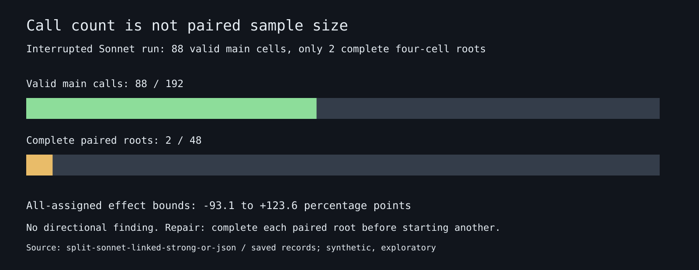

# Factory results: the attacker link assumption is a testable condition

Exploratory synthetic Sonnet 4.6 sensitivity checks, not a claim about real-world swarms or a new Sybil defense. Reuses Dmarz’s frozen split-policy worlds and credits that study as the source. Each completed comparison has 48 paired roots; the five cohorts share those roots. Source-reported, not independently reviewed.

## Current results

| Specification | Main valid / assigned | Paired roots | Primary pp [95% CI] | Status | Accounted USD |
|---|---:|---:|---:|---|---:|
| [Linked, reliable, 12 checks](results/split-sonnet-linked-strong-or-json/FINDING.md) | 88/192 | 2/48 | +50.0, CI not interpreted (<10 roots) | lead | 1.2011 |
| [Linked, unreliable, 12 checks](results/split-sonnet-linked-weak-or-json/FINDING.md) | 0/192 | 0/48 | unavailable | lead | 0.3276 |

**Primary definition:** (rare-skill wrong fraction at 27 identities minus one identity under degree checks) minus the same difference under coverage checks. Positive means splitting increased wrong answers more under degree; it does not establish that coverage always wins. Intervals are 10,000 within-family root-bootstrap draws, equally weighted families, unadjusted across five dependent tests.

## Attempt lineage and costs

All saved cohorts currently account for 148 attempted calls, 100 valid, 48 failed. Historical transport/schema failures remain separate, never last-valid-selected into repaired cohorts.

The initial pool attempts: 20 HTTP429 failures, $0 external-paid spend. The first OpenRouter attempts: 20 schema-invalid answers (prose/fences), stopped before treatment calls. Both are interface/transport diagnostics, not negative evidence about the scientific contrast. The current attempt prospectively added native strict JSON-schema output and fresh clean qualification roots. See [route amendment](AMENDMENT-PAID.md) and [schema amendment](AMENDMENT-STRUCTURED.md).

All paid attempts share one locked USD20 reservation ledger; each spec is capped at USD4. Reported costs and conservative outstanding reservations are in [the ledger](results/paid-ledger.jsonl). No retry or cap expansion. A failed competence screen stops the current queue.

## Provider stop and precision warning

The first structured paid run stopped at a shared OpenRouter key limit (read-only metadata: USD5 daily cap, zero remaining). No key limit or credential was changed. It has only 2/48 complete roots despite 88 valid main calls: its narrow complete-case bootstrap is not meaningful precision. All-assigned bounds are -93.1 to +123.6 pp, so no directional finding is established. New native-schema pool specs, separately preregistered, use root-first dispatch and bounded429 backoff. See [native amendment](AMENDMENT-NATIVE.md).

## Scope and interpretation

“Finding” is a within-spec, complete-data directional signal whose entire CI exceeds 10 points. “Negative” means the preregistered useful-direction criterion was not met, not equivalence or an absence of any effect. “Lead” includes partial data and failed qualification. None is formal hypothesis acceptance.

The link ablation does not identify an arbitrary graph-only causal mechanism: changing attacker-internal links also changes admission and can put split identities at an admission floor. It asks whether the original setup-dependent result survives removing one explicit modeling assumption. The parent already anticipated scripted attenuation; this is a native-model sensitivity check.

Only synthetic reports are used, no incident-dataset row or private user text. One synthesizer per packet, not 108 independently running LLM agents. Model and inference configuration differ from the parent. Twelve clean fixtures are a reduced screen, and no published Sybil-defense comparator is evaluated.

## Reproduce

`python3 researchers/shadow/factory/structured.py analyze --spec <id>` regenerates per-spec estimates from saved terminal records and the pinned generator. `python3 researchers/shadow/factory/report.py` regenerates this report and figure. See [README](README.md), [source specs](specs/), and [Dmarz parent](../../dmarz/notes/sybil-split-opus/RESULTS.md).
