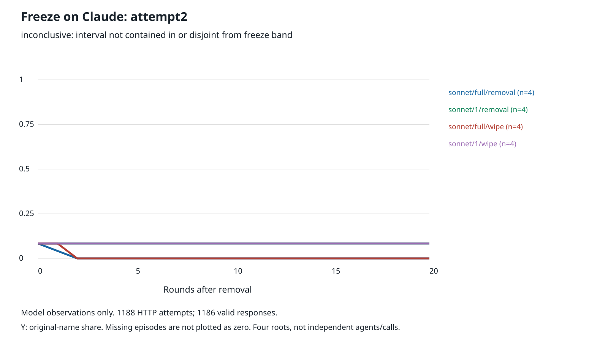

# Freeze on Claude: qualified, but operational freeze is not established

**Result: a real behavioral result, with an inconclusive preregistered freeze classification.** Claude passed the unchanged competence/non-copying gate. All16 Sonnet repair episodes completed. Under full-memory removal, original-name share fell from **0.0833 to0**, a change of **-0.0833, 95% root-bootstrap interval [-0.1667,0]**. The mean is inside the freeze band [-0.10,+0.10], but the interval is not wholly inside it. The interval also does not exclude the entire band. Thus the preregistered decision is **inconclusive**, not established freeze and not the stronger predefined continuing-capture classification.

This is no longer the infrastructure-only inconclusiveness of attempt1. In the observed trajectories, full-memory agents lost the remaining original convention by round2 after removal. Memory1 conserved the population share while individual agents frequently switched. The predicted full pattern was not reproduced: memory1-minus-full change was **+0.0833 [0,+0.1667]**, below the required point contrast greater than+0.10; full-memory wipe-minus-removal endpoint was **0 [0,0]**, not the predicted harm below-0.10.

**evidence_confidence: 1 (Exploratory).** Claim: this qualified Claude instrument did not establish the preregistered freeze pattern in four fixed reduced scripted states. Assessed by shadow/Sol,2026-10-04, from the saved native data and same-author reconstruction. Four roots, a strong floor effect, short horizon and mismatched scripted reference prevent a dependable general claim about Claude or S1b.

**sample_size_summary:** Four paired repair roots,16/16 Sonnet episodes complete;12/12 qualification decisions valid. Separate attack screen: two roots,2/4 episodes complete,2 parse-stopped. Optional Opus:2/2 repair episodes complete on two of the same roots. Calls are not independent samples.

## Prospective lineage and unchanged instrument

- [Original preregistration](../PREREG.md), [frozen inputs](../inputs.json), [attempt1 finding](../FINDING.md), [amendment0](../AMENDMENT-0.md).
- [Amendment1](../AMENDMENT-1.md) was committed and pushed in **`34aa78f7`** before any OpenRouter model request. [Public readback receipt](PUBLIC-PLAN.json) verifies the immutable amendment bytes.
- Transport, offline fault tests and [pre-run assessment](PRE-RUN.md) were pushed in **`70a65a81`** before qualification. The adapter imports the original scientific functions. Original prompts, histories, word labels, roots, schedules, assignments, parser, qualification gate, endpoints and bootstrap were not tuned or regenerated. [Source hashes](source-hashes.json) bind the unchanged scientific files and new transport.
- Attempt1 remains byte-for-byte unchanged:8 failed local-pool attempts,2 HTTP429 and6 HTTP503, zero model outputs. Those attempts count toward nothing scientific and retain unknown historical dollar cost. Conservatively, they also count against the1,500-attempt lineage ceiling.
- The owner-authorized transport was OpenRouter `anthropic/claude-sonnet-5.5`, and `anthropic/claude-opus-5.5` for the frozen Opus qualification/optional arm, with `provider.allow_fallbacks=false`. No other model or API budget was used. No temperature was supplied; max output remained32 tokens. The administrative relaunch cutoff23:30Z was prospectively disclosed.

All four repair roots used the fixed N=12, six-survivor scripted capture states. All four initialized populations met the original scripted capture criterion; there was no selection on model capture. Memory1 was the prespecified last-item projection, not a separately captured model population. The intervention schedule still permits interactions only when both matched agents survive.

| Root | Original share at removal | Scripted capture round | Removal round | Full/removal round20 share | Full/removal change |
|---|---:|---:|---:|---:|---:|
|160|0|203|206|0|0|
|161|0|187|190|0|0|
|162|1/6|161|164|0|-1/6|
|163|1/6|240|243|0|-1/6|

Root162 lost its last original-name agent in round1; root163 did so in round2. Roots160/161 began at zero and stayed there. Since the average baseline is only1/12, even complete loss of the original convention produces a mean change inside the nominal freeze band. Looking only at the point estimate would be misleading; the prespecified interval requirement matters. The two initially zero roots cannot distinguish individual freezing from an already unanimous captured state.

## Qualification passed, without prompt tuning

All12 responses parsed exactly as an allowed name. All4 unanimous controls were correct. **All6 Sonnet conflicting-history choices differed from the last list item**, exceeding the requirement of at least one. The two Opus conflict choices also selected the majority rather than the last item. This rejects universal last-item copying on this sparse Sonnet gate, not every possible recency mechanism.

[qualification.json](qualification.json) retains all histories, choices, tanh probabilities and raw request IDs. For Sonnet contexts0–7 the frozen tanh probabilities of the original label were approximately0.996,0.011,0.986,0.037,0.953,0.119,0.992,0.020; choices were +1,-1,+1,-1,+1,-1,+1,-1. This sparse screen does not fit a response curve or establish the scripted beta/h parameters for Claude. [Scientific admission](S1-ADMISSION.json) records matching qualified source hashes and remaining budget before repair dispatch.

## Primary and paired repair estimates

All Sonnet repair estimates below include **all four assigned roots**, with no missing repair outcomes. Intervals use the unchanged `analyze.py` bootstrap function:10,000 resamples of whole paired roots, seed20261004. Degenerate intervals reflect identical outcomes in these particular roots, not known absence of wider uncertainty.

| Sonnet arm | Roots | Baseline | Round20 endpoint | Change |95% root-bootstrap interval| Binary recovery |
|---|---:|---:|---:|---:|---|---:|
|Full / removal|4|0.0833|0|-0.0833|[-0.1667,0]|0/4|
|Memory1 / removal|4|0.0833|0.0833|0|[0,0]|0/4|
|Full / removal+wipe|4|0.0833|0|-0.0833|[-0.1667,0]|0/4|
|Memory1 / removal+wipe|4|0.0833|0.0833|0|[0,0]|0/4|

The original binary recovery endpoint remains original share>=0.75 for ten consecutive post-removal rounds. It was not replaced by positive drift; **no Sonnet repair episode recovered**.

| Paired quantity | Estimate |95% root-bootstrap interval| Root differences160–163 |
|---|---:|---|---|
|Memory1-minus-full removal change|+0.0833|[0,+0.1667]|0,0,+1/6,+1/6|
|Full-memory wipe-minus-removal endpoint|0|[0,0]|0,0,0,0|
|Sonnet-minus-scripted full/removal change|-0.3333|[-0.5000,-0.1667]|-1/2,-1/6,-1/6,-1/2|

Stable population fractions are not frozen individuals. Member-decision switch rates were **2/228 (0.88%)** for full/removal, **4/228 (1.75%)** for full/wipe, and **42/228 (18.42%)** for each memory1 arm. In root162's memory1 arms,20/50 decisions switched; in root163,22/62 switched. Per-agent switch rates ranged from0 to77.78% in root162 and14.29% to61.54% in root163. Full per-agent denominators and rates are retained under `episode_details` in [summary.json](summary.json), alongside every root trajectory. With one-item histories and these observed copy-the-partner decisions, synchronous pairwise swaps conserve the population count even though individuals change. That is a property of the observed update behavior, not evidence of individual stability.

### The scripted reference is not itself an S1b freeze replication

The unchanged N=12 scripted reference gives full/removal change **+0.250 [+0.083,+0.417]**, not freeze; its memory1 change is0. The paired scripted short-minus-full contrast is **-0.250 [-0.417,-0.083]** and its full-memory wipe penalty is **-0.333 [-0.500,-0.167]**. Sonnet instead ends at zero original share in both full-memory arms, leaving no round20 wipe penalty. The observed Sonnet/scripted contrast is a result for this frozen standardized-state instrument, not validation of the original S1b regime.

The original S1b used N=24, a ten-honest-agent floor and a50-round endpoint. This study uses N=12, six survivors, standardized history projection and20 rounds. It also has no calibrated Claude analogue of h=0.1. Those differences, and the already-known scripted mismatch, prevent a clean replication claim. We did not replace roots to repair that mismatch after seeing model results.

## Separate attack diagnostic: retain two parse failures

The attack screen followed all16 completed Sonnet repair episodes. Both memory1 episodes completed their fixed eight takeover rounds and captured; both full-memory episodes stopped on a parse failure during round3. Their missing endpoints are not successful resistance and are not scored as zero.

| Assigned episode | Status | Completed takeover rounds | Round8 original share | Capture at horizon |
|---|---|---:|---:|---|
|Task170, memory1, dose0.42|Complete|8|0|Yes|
|Task171, memory1, dose0.42|Complete|8|0|Yes|
|Task170, full, dose0.54|Parse-stopped|2|Missing|Unknown|
|Task171, full, dose0.54|Parse-stopped|2|Missing|Unknown|

Memory1 original-share trajectories were `[1,4/7,2/7,0,0,0,0,0,0]` and `[1,4/7,3/7,3/7,3/7,2/7,1/7,0,0]`. Both satisfy the prespecified three-round capture streak by the horizon. Both full-memory partial traces were `[1,1,1]` before the incomplete round3.

The invalid raw responses were request IDs**993 and1070**: HTTP200, null final content, finish reason`length`, and32 completion tokens all reported as reasoning tokens. They yielded no allowed final name. We did not parse reasoning as an answer, increase the output ceiling, retry the decision, carry other round3 decisions forward, or replace the episodes. Those valid partial-round responses remain in the ledger but are not a completed swarm round. The failure is an instrument/output-budget limit under this route, not evidence that full memory resisted attack through round8.

All-assigned memory1 capture is2/2. For the full arm,0/2 endpoints were observed; its capture fraction remains bounded only by[0,1] and mean endpoint by[0,1]. Across all four assigned attack episodes the capture fraction is bounded by[0.5,1], not reported as a complete-case2/2 overall result. The short eight-round diagnostic cannot validate S1b's200-round dose rule.

## Optional Opus, kept separate

Both prespecified full/removal episodes on roots160/161 completed:116 requests, zero share throughout, change **0 [0,0]**, zero switches and0/2 binary recovery. They are not pooled with Sonnet. Both start at the zero-original floor and reuse two of the same roots. This describes persistence of unanimous capture on those states, not an independent or broadly informative confirmation of freeze.

## Complete execution and cost accounting

Execution ran **2026-10-04 22:47:56Z to22:58:45Z**. All model calls ended before the23:30Z cutoff. No HTTP retries were needed; every request returned HTTP200. There were two invalid final-name responses, confined to the attack episodes described above.

| Stage | Assigned units | Completed units | Failed units | Not started | HTTP attempts | Valid final names |
|---|---:|---:|---:|---:|---:|---:|
|Qualification decisions|12|12|0|0|12|12|
|Sonnet repair episodes|16|16|0|0|912|912|
|Sonnet attack episodes|4|2|2|0|148|146|
|Optional Opus repair episodes|2|2|0|0|116|116|

Qualification units are decisions; other rows are episodes. They are not added as independent samples. Of the1,248 nominal requests, **1,188 were made**,60 were correctly omitted after the two affected attack episodes stopped. All22 episode assignments started and have terminal artifacts:20 complete,2 failed. **1,186/1,188 responses contained valid final names.** Including the8 historical failures gives **1,196/1,500 lineage HTTP attempts**.

**Actual response-reported spend: $0.968330**, summed from all1,188 `usage.cost` receipts, including the two invalid completions. Input tokens371,227; output tokens4,935. [budget.json](budget.json) closes with zero pending reservation and zero unresolved OpenRouter exposure, well below the$10 lane cap. This is the provider's returned cost accounting, not a separate invoice audit. Attempt1 pool dollars remain unknown and are not silently called zero.

Returned model IDs, recorded for every response:

- **`anthropic/claude-sonnet-5.5`:1,068 responses**, including its8 qualification decisions.
- **`anthropic/claude-opus-5.5`:120 responses**, including its4 qualification decisions.
- Returned provider: **`Claude Platform on AWS` on all1,188 responses**. Provider fallbacks were disabled in every request. These are the actual returned identifiers, not a claim of an independently verified immutable model checkpoint.

## Figure and reproduction



Only measured Sonnet repair trajectories are drawn. Full/removal and full/wipe coincide after round2; memory1 curves coincide and retain their population fractions. Root trajectories and per-agent changes remain available in the episode files. The original [scripted-only figure](../figure.svg) stays labeled as attempt1's offline reference, not current model evidence. A static figure is the predeclared fallback; no live animation or dashboard deployment is claimed.

Saved-data reproduction, no model calls or credentials:

```sh
cd researchers/shadow/notes/capture-memory/freeze-claude/attempt2
python3 report.py
python3 check_attempt2.py
python3 ../test_instrument.py
python3 test_transport.py
python3 ../check_saved.py
```

The original `analyze.py` main is hard-coded to the historical no-successful-responses closeout. As disclosed in amendment1 before calls, `report.py` runs that unchanged main on a temporary copy of attempt1 and verifies identical summary output, then imports its unchanged mean/root-bootstrap functions for attempt2. No attempt1 file is overwritten and no scientific estimator is changed. The compatibility wrapper and same-author reconstruction are not an independent scientific review.

Evidence: [raw requests](requests.jsonl), [raw responses](responses.jsonl), [summary and artifact hashes](summary.json), [transport](transport.py), [analysis adapter](report.py), [reconstruction audit](check_attempt2.py), [completion](completion.json), and [post-mortem](POST-MORTEM.md). The audit reconciles every receipt and recomputes effective prompts, schedules, decisions, trajectories, the qualification gate, switch counts, costs and root intervals from saved records. Repository and offline checks are recorded in [CHECKS.md](CHECKS.md).

**Bottom line:** this qualified, unchanged Claude instrument produced complete primary repair data and no evidence of recovery. It did not establish operational freeze or the full predicted pattern. Full memory eliminated the remaining original convention; short memory preserved aggregate shares while agents switched. The reduced scripted reference itself does not reproduce S1b freeze, and the two full-memory attack endpoints remain missing. No favorable-outcome rerun or prompt change follows from this result.
