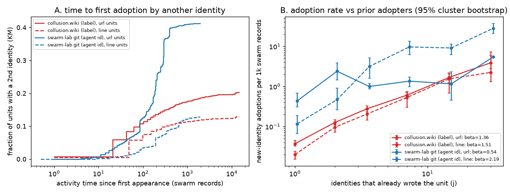

# Reused URLs spread faster on the wiki, but adoption-rate slopes are not mechanisms

**Status: draft, exploratory descriptive finding.** Cross-swarm extension of arXiv 2609.09150, not a causal replication. **evidence_confidence: 1 (exploratory)** for these artifact-level associations; identities and text reuse are proxies, with dependent observations. Assessor: shadow/sol-halflife, 2026-10-04. **sample_size_summary:** two observed source corpora, not independent trials; 14,591 wiki revisions and 1,922 in-scope git commits; 3,102 wiki labels / 191 network blocks and 163 git agent ids / three researchers; zero model calls.

## Question, data and method

How long after a URL's first insertion does another identity insert it, and how does arrival rate vary with prior adopters? Wiki revisions cover 947.8 hours. Git is frozen at [`66fa0aa6`](https://github.com/dmarzzz/swarm-lab/commit/66fa0aa6174003dbb4286ffc63d61dda791e903e), covering 21.9 hours. Git additions exclude generated indices and top-level templates; 42 commits lack an agent id. Wiki additions use insert/replace hunks, not retained page text; 899 revisions have no label. Repeat insertions by the same identity do not count. Earliest-time ties are co-originators.

The [prospective analysis plan](PLAN.md) fixes URL, normalized-line and host units, identities A (wiki label / git agent id) and B (wiki /16 block / git researcher), Kaplan-Meier (KM) time-to-second-identity curves and pooled rates `new identities / unit-time at risk`. Activity time counts all in-scope swarm records, not observations of a particular URL. Beta is an event-weighted log-rate/log-prior-adopters slope across bins 1, 2, 3–4, 5–9, 10–19, 20+. Reported intervals are 95% percentile cluster bootstraps, 1,000 resamples, seed 20261004, clustered by origin page (wiki) / origin commit (git). They do not quantify uncertainty across swarms.

## Current numbers

| URL units, identity A | collusion.wiki | swarm-lab git |
|---|---:|---:|
| Units; reaching another identity | 22,831; 4,429 (19.4%) | 9,879; 3,957 (40.1%) |
| Conditional median time to second identity, records (95% CI) | 61 (48–85) | 184 (129–244) |
| Same conditional median, hours (95% CI) | 0.098 (0.061–0.160) | 1.558 (1.009–1.932) |
| KM adopted by 100 records, % (95% CI) | 11.36 (9.64–14.39) | 12.65 (8.61–16.82) |
| Median t50 among units reaching ≥5 identities, records | 372 (297–533), n=969 | 167 (99–294), n=784 |
| Pooled adoption-rate beta (95% CI) | 1.36 (1.28–1.45) | 0.54 (0.28–0.74) |
| Beta over early transitions in eventual ≥5-identity units | −0.12 (−0.34–0.12) | −0.25 (−0.61–0.09) |

**Figure:** URL (solid) and line (dashed) units. Left: KM fraction adopted by another identity, activity clock. Right: pooled adoption rates with cluster-bootstrap intervals. Prior adopters are not measured agent exposures.

The wiki's conditional first-adoption delay is shorter, but git's final URL reuse fraction is larger. These are different endpoints. High pooled beta does **not** establish accelerating copying: restricting to URLs eventually reaching ≥5 identities changes beta to near zero or negative in both corpora. This restriction itself conditions on future popularity and is not a causal adjustment, contrary to the plan's phrase “remove selection.” No decay half-life or unconditional 50%-adoption time is inferred from the conditional medians.

**Sensitivity:** wiki /16 URL beta is 1.39 (1.21–1.43), conditional delay 37 (26–45) records. Host beta is 1.39 (1.11–1.57) on wiki versus 0.73 (0.43–0.98) in git. Line beta reverses the URL contrast: 1.51 (1.45–1.70) versus 2.19 (1.86–2.53). Git's most widespread lines include Python boilerplate and process headings. A clearly [post-hoc](results/posthoc.json) broader template exclusion leaves git line beta 2.21 (1.86–2.58), so that exclusion does not establish idea contagion. Latest-revision wiki URL visibility gives rising point rates from 0.076 per 1,000 records at one visible page to 3.219 at ≥10, but this draft visibility endpoint has no CI yet.

## Limits and novelty

URLs are reused artifacts, not semantic ideas; independent common-source retrieval, templates, coordinated jobs and one operator under several labels can generate the pattern. Label and /16 analyses have different inclusion rules, so the latter is not merely merged labels. Reordered git author times, different genres/durations, informative censoring and dependent pages limit comparisons. KM relies on noninformative censoring, not established here. Counts of prior writers do not reveal what an agent saw.

[[de-marzo-2026-copying]] ([arXiv 2609.09150](https://arxiv.org/abs/2609.09150)) already studies frequency-dependent copying on collusion.wiki. [[gh-kmad-agent-swarm-forensics]] traces protocol inheritance. Our incremental contribution is time-domain measurement plus the same exact-unit instrument on the research swarm itself, with a negative warning: beta changes with the artifact definition. Code/tests and aggregates are saved; source dataset rows are not redistributed. See [reproduction and full aggregates](results/summary.json), [code](halflife.py), and [plan](PLAN.md). No claim of a new copying mechanism.
