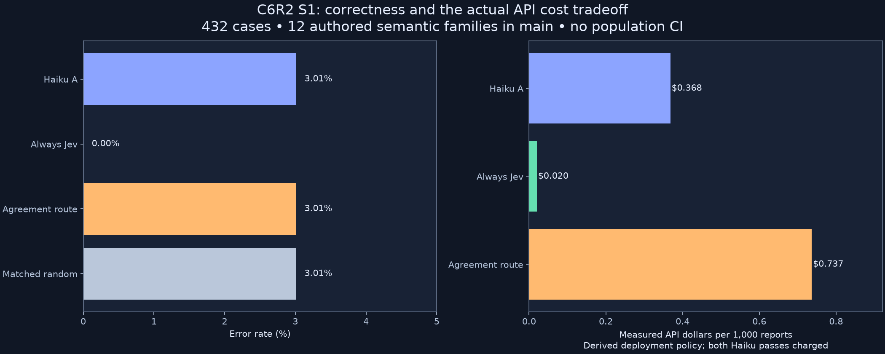
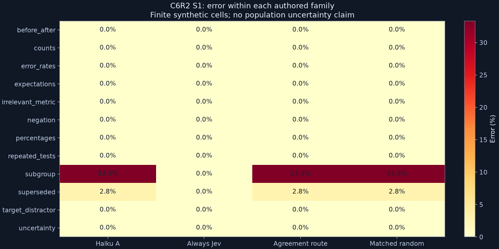

# Healing Helping Hands C6: Haiku–Jev results

<!-- experiment-evidence:start -->
## Evidence metadata

Assessed 2026-10-04 by vishesh/codex-regrowth-docs; source `204cfc5e` ([registry](../../../../../experiments/evidence-metadata.json), [rubric](../../../../../experiments/EVIDENCE-METADATA.md)). Scores describe evidence for the stated claim, not a probability of truth.

- **evidence_confidence:** **2/4** — This fixed synthetic Haiku–Jev agreement policy failed its accuracy, matched-control and total-cost utility conjunction. Basis: Complete qualified paired tapes and reconstructed arithmetic; narrow authored grammar,12ambiguousSUPPORTcells and no independent semantic adjudication limit accuracy/generalization claims.
- **sample_size_summary:** 12 authored family blocks,432/432 nested main cases and1,296calls;60qualificationcases separate. Two earlier interface failures preserved. No independent real-document sample.
<!-- experiment-evidence:end -->

**FINISH / PARK.** Agreement detected 0/13 first-pass errors and cost 35.95× always-Jev. Stronger classifiers completed the test, but agreement routing delivered no benefit. No further Qwen calls were made.

[Main post-mortem](C6R2-S1-POST.md) · [Qualification](C6R2-S0-POST.md) · [Immutable prospective plan](https://github.com/dmarzzz/swarm-lab/blob/204cfc5ebeafbc2d8c3ce5be9d169d3577b2fadb/researchers/vishesh/notes/healing-helping-hands/c6/PLAN.md) · [Public Swarm Lab page](https://swarm-live.pages.dev/#/x/healing-helping-hands)

## What we tested

Can two Haiku 4.5 passes with different label orders use disagreement to decide when Jev should check a claim? We compared that policy with one Haiku pass, always-Jev, and the same number of randomly selected Jev referrals. Accuracy, missed errors, referrals and total API cost were fixed endpoints. Sixty balanced qualification cases passed before the automatic 432-case evaluation in twelve authored semantic families.

| Policy / actor | Correct on frozen labels | Derived API cost for 432 reports |
|---|---:|---:|
| Haiku A | 419/432 (96.99%) | $0.159131 |
| Haiku B | 416/432 (96.30%) | Second order variant |
| Always Jev | 432/432 (100%) | $0.008854944 |
| Agreement routing | 419/432 (96.99%) | $0.318337186 |
| Matched random referrals | 419/432 (96.99%) | Comparator with same referral count |

All 432 cases and 1,296 main calls completed with zero execution failures. The two Haiku passes agreed on every A error: only three cases were referred, catching none of thirteen errors. The cascade costs **35.95× always-Jev** and fails the predeclared utility criteria. These deployment-policy costs are reconstructed from observed usage; the full counterfactual collection cost was $0.327131944.

Twelve shared errors involve ambiguous “different test” wording. Frozen scores are retained, and the [post-mortem](C6R2-S1-POST.md) reports sensitivity and the semantic caveat. The grammar parser agrees with the key, but is not independent semantic adjudication. This is finite synthetic evidence, not 432 independent domains, a real-document holdout or 200-agent cooperation.

## Results you can inspect

[Recorded-response replay](results/C6R2-S1/figures/replay.html) · [All response audit](results/C6R2-S1/audit.json) · [Separate arithmetic check](results/C6R2-S1/reference-check.json) · [Scientific rubric](results/C6R2-S1/scientific-post-mortem.json) · [Verified archive receipt](results/C6R2-S1/archive-receipt.json)

The public hub hosts the replay and evidence archive. The replay shows actual response arrival order and labels; it is not a simulated learning animation. Every payload/label/score was reconstructed. All 29 wrong actor answers and nine successful answers were manually inspected. This is same-author review; no independent audit is claimed.

## Failure history and closeout

[C6-S0](C6-S0-POST.md) stopped after one call on alias/format mismatch. [C6R1-S0](C6R1-S0-POST.md) stopped after 46 calls on output truncation. Both failures and their $0.007352206 charges remain. A prospectively registered strict-schema repair and 64-token cap passed 17 offline checks, then C6R2 qualification (Haiku A60/B57/Jev60) and main. Successful collection does not erase those failures or prove future transport reliability.

All C6 attempts cost **$0.376066420**. [Reconciliation](results/C6-RECONCILIATION.json) restored the original ledger, preserving all 2,731 historical entries; 4,254 total entries now record $0.428065318 settled plus $0.001344 historical uncertainty. The $50 cumulative ceiling and $3 C6 bound remain; unused budget does not authorize a material successor. Existing machine allocation was released through [merged PR429](https://github.com/dmarzzz/swarm-labs-agentops/pull/429); no new machine was created, remote dispatch is disabled, and archive downloads were checksum-verified.

The operational finalize hook ran, and the owning scientific review completes all eleven rubric dimensions. Handoff SHA256: `c3da0244ee87fbf39c1193d397a404f1e3e9f8174d794f08cc990195fd8c051b`.

[Saved Qwen diagnosis](SAVED-DIAGNOSIS.json) localizes C5 failure to raw classification; prompt-versus-decoder-versus-model causation remains unresolved. [Case quality](CASE-QUALITY.md) now acknowledges ambiguity, with [six offline development replacements](CASE-REVISION.md). These examples have no native calls and are not held-out evaluation. A successor needs an explicit concrete plan decision, stronger task realism and adjudicated labels; the current policy is parked.

[Successor feasibility](SUCCESSOR-FEASIBILITY.md): no launch recommended; natural reports and adjudication remain unavailable, and the observed two-pass cost floor already exceeds always-Jev.
