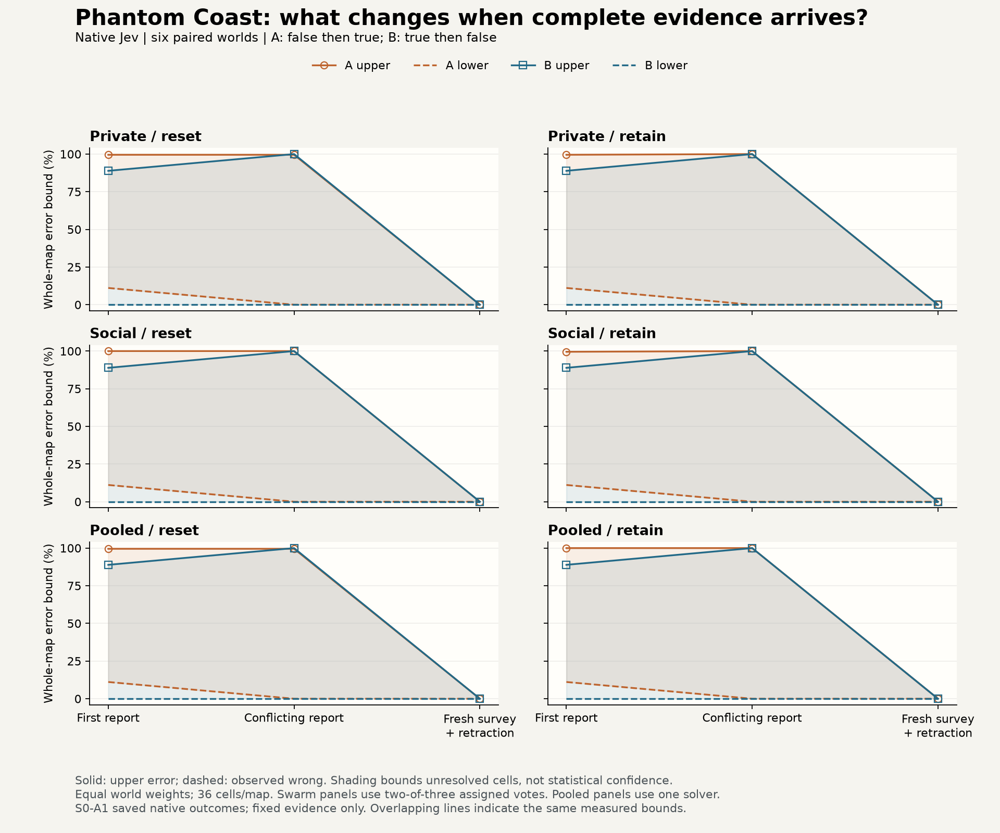

# Phantom Coast: complete evidence erased the history difference

Native exploratory PC-1L, 2026-10-04 UTC. **Qualification passed; the six-world pilot completed; no residual history effect was observed.** [Live experiment and replays](https://swarm-live.pages.dev/#/x/phantom-coast). This is a measured null in a synthetic fixed-evidence contract, not evidence about adaptive exploration or all swarms.

Q0 produced 18 valid maps and 648/648 correct cells. S0 produced all 522 assigned valid maps without transport/schema failures, retries, substitutions or unstarted assignments. At the complete-evidence endpoint, all 186 individual maps were correct (6,696/6,696 cells), including 144 swarm-actor maps, 24 pooled maps and 18 clean-control maps. The 48 strict-majority swarm maps also had zero error and zero unresolved cells.

## What happened

History A began with false water reports for four true land cells; its swarm maps initially missed those four cells, giving an observed-error lower bound of 4/36 = 11.11%. History B began with true land reports and had zero observed error at that point. Most unobserved cells remained UNKNOWN. After the contradictory report, observed wrong counts fell to zero but nearly the entire map was unresolved: across swarm conditions the upper error bound was 99.54–100%. That is uncertainty, not successful mapping. After the fresh full survey and explicit retraction, every endpoint map resolved correctly.

| Independent world | Maximum final swarm error upper bound | Maximum final pooled error upper bound | Social-by-retention history interaction |
|---|---:|---:|---:|
| 206 | 0% | 0% | [0, 0] |
| 207 | 0% | 0% | [0, 0] |
| 208 | 0% | 0% | [0, 0] |
| 209 | 0% | 0% | [0, 0] |
| 210 | 0% | 0% | [0, 0] |
| 211 | 0% | 0% | [0, 0] |

All 24 final paired history comparisons (six worlds × four communication/state conditions) had disagreement [0,0]. The six-world mean interaction was [0,0]. There is no statistical confidence claim: these intervals bound missing data and collapse because all endpoint cells are observed and correct. Eighteen final-reset groups each contained four byte-identical requests across history/communication; each group produced one distinct map, so no reset output variation was detected in those 72 calls. This does not guarantee deterministic provider behavior.

The deterministic latest-valid-observation baseline also had zero error at every endpoint (186 recorded endpoint packets). A single pooled solver reached the same final accuracy with one-third the calls of a corresponding three-actor swarm trajectory. Because every actor received the same facts, this comparator measures redundant interpretation, not the benefit of combining distributed sensors. No endpoint accuracy benefit of communication or extra actors appeared here.

## Cost and execution

| S0 condition | Map requests | Input tokens | Output tokens | API cost USD |
|---|---:|---:|---:|---:|
| Private/reset swarm | 108 | 735,554 | 156,784 | 0.030893268 |
| Private/retain swarm | 108 | 749,092 | 156,784 | 0.031461864 |
| Social/reset swarm | 108 | 778,284 | 156,780 | 0.032687928 |
| Social/retain swarm | 108 | 834,348 | 156,783 | 0.035042616 |
| Pooled/reset | 36 | 245,185 | 52,262 | 0.010297770 |
| Pooled/retain | 36 | 249,696 | 52,260 | 0.010487232 |
| Clean | 18 | 141,102 | 26,406 | 0.005926284 |

S0 cost $0.156796962; Q0 cost $0.005926284; **cumulative API cost $0.162723246** across 540 map requests / 19,440 typed cell decisions. Total input/output tokens: 3,874,363 / 784,465. Actual and conservatively accounted cost agree; there are no unresolved reservations. The $4 API cap and $5 total authorization were never reset. No new server was provisioned or infrastructure charge initiated; existing fleet overhead is not a measured study-specific cloud invoice.

S0 dispatch ran from 04:14:33 to the final request at 04:26:16 UTC, within its 60-minute limit. Median provider request latency was 0.229 seconds; maximum 0.959 seconds. Those values exclude local record persistence, analysis, rendering and hub uploads, which account for most wall time. No time/failure/budget stop was triggered.

## Evaluation against the plan

- **Design and dispatch:** PC-1L, assessments and immutable plan registration preceded the corresponding calls. Q0 and S0 used source `1ba879ac84a54b82f21c0f597760cfebaf43f3bf`, the same qualified model snapshot and one cumulative ledger. The public page displayed the expected plan and each run's specific TLDR.
- **Controls and accounting:** Q0 and S0 clean maps passed; all expected assignments and request hashes reconciled. A separate same-author reference calculation reproduced majority maps, whole-map bounds and per-world interactions. Land, exposed-region and outside-region bounds, token usage and reset checks are in [the audit](results/S0-A1-audit.json). This is not independent researcher review.
- **Measurement:** initial false reports visibly affected maps; contradictory evidence mostly produced UNKNOWN; the final survey resolved all errors. Primary endpoint is a valid null/ceiling result, not a failed run. No rerun was launched to make a dramatic effect appear.
- **Visualization:** actual-record native PNG/GIF artifacts are delivered; Q0 has 18 frames, S0 a disclosed stride-nine sample of 59 frames. All 522 S0 records remain intact. The final native PNG shows only the last actor; the new cohort figure covers every world/arm/step. Original PNG range separators had a missing-font glyph. A post-run ASCII label repair is committed for future rendering; frozen run originals remain unchanged. [Visual audit](results/VISUAL-AUDIT.json).
- **Process:** formal survey/hypothesis/independent-review gates remain incomplete; execution was explicitly scoped exploratory work. The centralized SETUP requirement arrived during the session, after Q0; its missing pre-S0 index is recorded retrospectively in [SETUP.md](SETUP.md). This documentation gap is not relabeled a prospective pass. Public registration itself was present before both runs.
- **Delivery and cleanup:** 20 hub artifacts across the two runs matched local SHA-256 hashes at readback. The budget ledger was backed up, workers exited, the temporary runtime credential was removed and the exclusive sim-dmarz-5 claim was released via merged fleet PR128. The preexisting server remains available to its owner. [Delivery](results/DELIVERY.json), [cleanup](results/CLEANUP.json).

## Practical conclusion and next design

For this contract, acquiring and correctly marking complete fresh evidence was sufficient. Resetting maps, social discussion and tripling actor calls did not improve the final outcome. A deterministic reconstruction rule is the cheapest adequate baseline. This result supports retaining that baseline in future designs; it does not establish that discussion is generally useless.

The final intervention combines **fresh complete evidence and explicit retraction**, so this study cannot distinguish their separate causal contributions. The worlds vary geometry but share one small logical template. The prompts explicitly instruct actors how to treat peers and withdrawals, observations are noiseless, and no actor chooses what to inspect. These limits make a broad misinformation-resistance claim unwarranted.

The next useful design would separate incomplete evidence from interpretation. Before another launch, freeze a new plan with (1) independently crossed fresh-evidence coverage and explicit retraction, (2) genuine terrain changes plus matched random corruption, and (3) actual observation choices under a fixed twelve-inspection budget, compared with uniform and uncertainty/coverage policies. An audit must replace one ordinary inspection, not add free information. Record actual target choices and replay matched acquired packets to separate selection from interpretation. Qualify action validity and clean inference first on disjoint tasks; require a manipulation check without requiring a harmful effect. Complete independent review and fresh stage admission before proceeding. These are recommendations, not a registered or authorized PC-2 run; no holdout seeds were opened.

## Evidence and reproduction

[Q0 summary](results/Q0-A1-summary.json), [S0 summary](results/S0-A1-summary.json), [Q0 post-mortem](reviews/Q0-A1-POST.md), [S0 post-mortem](reviews/S0-A1-POST.md), [prospective S0 assessment](reviews/S0-A1-PRE.md). Full sanitized provider maps/probabilities, actual requests, timing and usage are in each hub run's `records.json`; raw HTTP secrets are never included. Hash inventories are in DELIVERY.json. These are recorded native outcomes, unlike the historical offline fixture viewer.

Run `python researchers/vishesh/notes/phantom-coast/src/audit_saved.py <downloaded-S0-directory> <audit.json>` to recompute the audit. Run `python researchers/vishesh/notes/phantom-coast/src/plot_saved.py <summary.json> <figure.png>` with matplotlib to rebuild the descriptive PNG/SVG. No provider calls occur in either command. Frozen native source and run configs remain attached to the original immutable plan and run artifacts.
