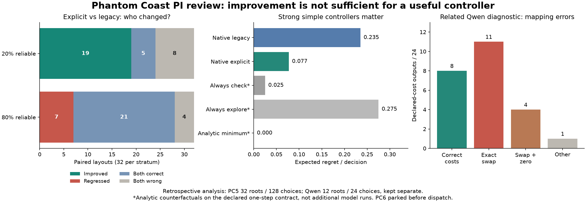

# PC6 PI review: parked before native dispatch

The saved-data review is complete. **No PC6 native attempt was launched.** The prospective 48-choice plan and implementation are retained, but both native admission and dispatch now reject `pc6_parked_no_decision_value` before credentials or allocation. No new machine, claim, model call or spend occurred.

[PI post-mortem](reviews/PI-POST.md) | [setup and handoff](SETUP.md) | [recomputed evidence](results/prior-analysis.json) | [paired layouts](results/paired-layouts.json) | [original prospective plan, not executed](PLAN.md)



PC5 remains a valid narrow result: explicit instructions improved expected regret, but worsened reliable-source decisions. The new paired audit finds 19 improvements and zero regressions in the unreliable stratum; zero improvements and seven regressions in the reliable stratum. All 128 outcomes on 32 paired layouts were valid. At equal stratum weights, expected regret is .23515625 legacy, .07734375 explicit, .025 always-check, and zero for the exact analytic controller. Simple-policy numbers are counterfactual calculations on this declared contract, not fresh model runs.

Dmarz's separate Qwen attempt002 contains 24 choices on 12 layouts: eight correct cost pairs, eleven exact swaps, four swapped/zeroed pairs and one other. All fourteen suboptimal choices have reversed cost order; 23/24 choices select the minimum of their own declared numbers. This is evidence about written costs and decisions, not hidden reasoning or a proven cause of the TypeSafe errors. Cohorts stay separate.

The proposed table supplies the analytic calculation itself. Passing would establish minimum selection only; failing would stop the model route. Both outcomes currently leave the same practical choice—use the analytic policy. A further screen therefore lacks enough decision value. Do not run PC6 or the old 768-choice proposal merely because budget remains.

Practical change: [simple_policy.py](src/simple_policy.py) implements the exact one-step rule, with finite input validation and deterministic ties. This does not claim realistic calibration or solve exploration/swarm problems. Reopen only around a concrete task whose evidence acquisition, calibration or interaction uncertainty makes the simple controller insufficient, with meaningful controls and outcome-dependent decisions specified first.

Reproduce from repository root (offline, zero model calls):

```sh
python3 researchers/vishesh/notes/phantom-coast/pc6/reporting/analyze_prior.py
python3 -m unittest discover -s researchers/vishesh/notes/phantom-coast/pc6/tests -q
python3 researchers/vishesh/notes/phantom-coast/pc6/reporting/plot_prior.py
```

Plotting needs matplotlib. Saved PC5 decisions/worlds are byte-identical to the original audit hashes; the original full trace was re-audited before this portable extraction. Qwen compressed source rows remain in their owner directory. Ten checks pass, including no-dispatch enforcement. This is a same-operator retrospective analysis and offline code update, not an independent replication.

Cumulative known API USD .845052138; conservative exposure .857148138 includes nine historical unresolved charges .012096. Original USD5 total authority is unchanged. The prior closed ledger and released allocation remain authoritative; no new ledger was opened.
