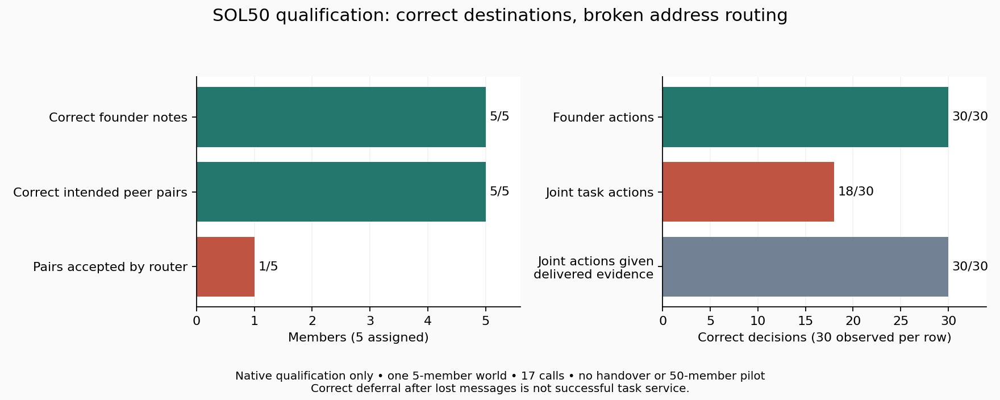

# SOL50: qualification closed, address repair prepared

<!-- experiment-evidence:start -->
## Evidence metadata

Assessed 2026-10-04 by vishesh/codex-theseus; source `3a8f5616` ([registry](../../../../../../experiments/evidence-metadata.json), [rubric](../../../../../../experiments/EVIDENCE-METADATA.md)). Scores describe evidence for the stated claim, not a probability of truth.

- **evidence_confidence:** **1/4** — In one five-member qualification world, correct intended peer selections were dropped by an address mismatch; cultural survival remains untested. Basis: 17 native calls, exact saved-request replay, no provider errors. Founder5/5 notes and30/30 actions; router accepted1/5 correct peer pairs. Joint18/30 task decisions; all30 matched the evidence actually delivered. No handover or50-member expansion.
- **sample_size_summary:** One five-member qualification world;17 native calls,60 nested observed decisions,10 nominal downstream calls unstarted; five founders replayed without recollection. Not17 independent samples.
<!-- experiment-evidence:end -->

The50-member pilot has **not run**. [Scientific post-mortem](RESULTS-SOL50.md), [aggregate audit](QUALIFICATION-AUDIT.json), [quality review](QUALIFICATION-QUALITY.json), [cost/resource closeout](CLOSEOUT.json), and [verified aggregate uploads](UPLOAD-RECEIPTS.json).

17 GPT-6 Sol calls completed across Q1 and its exact-response continuation. Five founders learned correctly, but a roster/router address mismatch suppressed8/10 intended consultation edges. Native handover and full turnover remain unobserved.39 offline checks now cover explicit current-address resolution and retirement rejection. Raw traces remain private; no retry or main expansion followed.

**DECISION NEEDED:** [fresh Q2 qualification](address-repair/PLAN.md), maximum30 calls/USD0.80 within the retainedUSD60 total. The material address-interface change needs an owner decision before reallocation or dispatch.

Validate with `python -m unittest discover -s researchers/vishesh/notes/swarm-of-theseus/execution-diagnostic/sol50 -p "test_*.py"`. Current offline source is the proposed Q2 repair; frozen Q1 and Q1C sources are recorded in the audit. Public registration continues to identify the executed Q1C plan revision.
